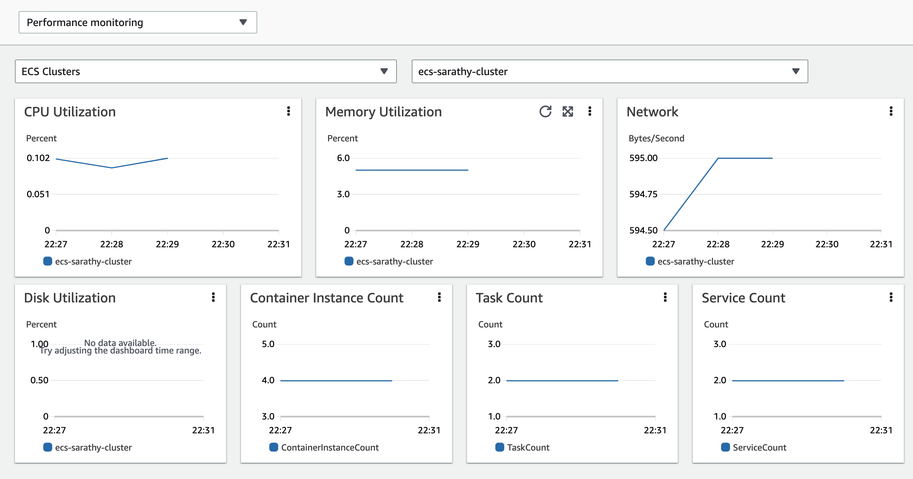
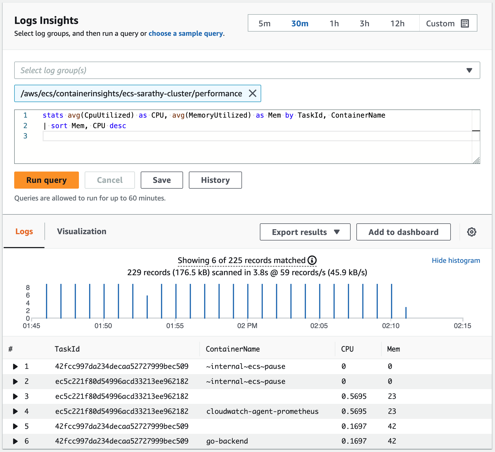

# 使用Container Insights收集系统指标
系统指标涉及低级别的资源，包括服务器上的物理组件，如CPU、内存、磁盘和网络接口。使用[CloudWatch Container Insights](https://docs.aws.amazon.com/AmazonCloudWatch/latest/monitoring/ContainerInsights.html)来收集、汇总和总结部署到Amazon ECS的容器化应用程序的系统指标。Container Insights还提供诊断信息，如容器重启失败，以帮助隔离问题并快速解决。它适用于部署在EC2和Fargate上的Amazon ECS集群。

Container Insights使用[嵌入式指标格式](https://docs.aws.amazon.com/AmazonCloudWatch/latest/monitoring/CloudWatch_Embedded_Metric_Format.html)收集数据作为性能日志事件。这些性能日志事件是使用结构化JSON模式的条目，使得高基数数据能够大规模地摄取和存储。CloudWatch从这些数据中创建集群、节点、服务和任务级别的聚合指标作为CloudWatch指标。

:::note
	要使Container Insights指标出现在CloudWatch中，您必须在您的Amazon ECS集群上启用Container Insights。这可以在账户级别或单个集群级别完成。要在账户级别启用，请使用以下AWS CLI命令：

    ```
    aws ecs put-account-setting --name "containerInsights" --value "enabled
    ```

    要在单个集群级别启用，请使用以下AWS CLI命令：

    ```
    aws ecs update-cluster-settings --cluster $CLUSTER_NAME --settings name=containerInsights,value=enabled
    ```
:::

## 收集集群级别和服务级别的指标
默认情况下，CloudWatch Container Insights收集任务、服务和集群级别的指标。Amazon ECS代理为EC2容器实例上的每个任务收集这些指标（适用于EC2上的ECS和Fargate上的ECS），并将它们作为性能日志事件发送到CloudWatch。您不需要在集群上部署任何代理。从中提取指标的这些日志事件被收集在名为*/aws/ecs/containerinsights/$CLUSTER_NAME/performance*的CloudWatch日志组下。从这些事件中提取的完整指标列表[在此处记录](https://docs.aws.amazon.com/AmazonCloudWatch/latest/monitoring/Container-Insights-metrics-ECS.html)。Container Insights收集的指标可以在CloudWatch控制台中的预构建仪表板中轻松查看，通过从导航页面选择*Container Insights*，然后从下拉列表中选择*性能监控*。它们也可以在CloudWatch控制台的*指标*部分查看。



:::note
    如果您在Amazon EC2实例上使用Amazon ECS，并且希望从Container Insights收集网络和存储指标，请使用包含Amazon ECS代理版本1.29的AMI启动该实例。
:::

:::warning
    Container Insights收集的指标作为自定义指标收费。有关CloudWatch定价的更多信息，请参见[Amazon CloudWatch定价](https://aws.amazon.com/cloudwatch/pricing/)
:::

## 收集实例级别的指标
将CloudWatch代理部署到托管在EC2上的Amazon ECS集群，允许您从集群中收集实例级别的指标。该代理作为守护进程服务部署，并从集群中的每个EC2容器实例发送实例级别的指标作为性能日志事件。从这些事件中提取的实例级别指标的完整列表[在此处记录](https://docs.aws.amazon.com/AmazonCloudWatch/latest/monitoring/Container-Insights-metrics-ECS.html)

:::info
    将CloudWatch代理部署到Amazon ECS集群以收集实例级别指标的步骤记录在[Amazon CloudWatch用户指南](https://docs.aws.amazon.com/AmazonCloudWatch/latest/monitoring/deploy-container-insights-ECS-instancelevel.html)中。请注意，此选项不适用于托管在Fargate上的Amazon ECS集群。
:::
    
## 使用Logs Insights分析性能日志事件
Container Insights通过使用嵌入式指标格式的性能日志事件收集指标。每个日志事件可能包含在系统资源（如CPU和内存）或ECS资源（如任务和服务）上观察到的性能数据。Container Insights从Amazon ECS在集群、服务、任务和容器级别收集的性能日志事件的示例[在此处列出](https://docs.aws.amazon.com/AmazonCloudWatch/latest/monitoring/Container-Insights-reference-performance-logs-ECS.html)。CloudWatch仅基于这些日志事件中的部分性能数据生成指标。但您可以使用这些日志事件通过CloudWatch Logs Insights查询对性能数据进行更深入的分析。

运行Logs Insights查询的用户界面在CloudWatch控制台中通过从导航页面选择*Logs Insights*可用。当您选择一个日志组时，CloudWatch Logs Insights会自动检测日志组中性能日志事件的字段，并在右侧窗格中的*已发现*字段中显示它们。查询执行的结果显示为该日志组中日志事件随时间的条形图。此条形图显示了与您的查询和时间范围匹配的日志组中事件的分布。



:::info
    这是一个示例Logs Insights查询，用于显示CPU和内存使用情况的容器级别指标。
    
    ```
    stats avg(CpuUtilized) as CPU, avg(MemoryUtilized) as Mem by TaskId, ContainerName | sort Mem, CPU desc
    ```
:::