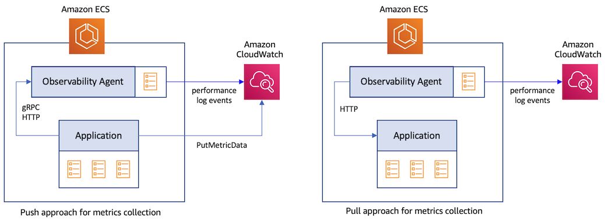

# 使用Container Insights收集服务指标
服务指标是通过在代码中添加检测来捕获的应用程序级别指标。这些指标可以通过两种不同的方法从应用程序中捕获。

1. 推送方法：应用程序直接将指标数据发送到目的地。例如，使用CloudWatch PutMetricData API，应用程序可以将指标数据点发布到CloudWatch。应用程序还可以使用OpenTelemetry协议（OTLP）通过gRPC或HTTP将数据发送到代理，如OpenTelemetry Collector。后者随后将指标数据发送到最终目的地。
2. 拉取方法：应用程序在HTTP端点上以预定义格式公开指标数据。然后，有权访问此端点的代理会抓取数据并将其发送到目的地。



## CloudWatch Container Insights对Prometheus的监控
[Prometheus](https://prometheus.io/docs/introduction/overview/)是一个流行的开源系统监控和警报工具包。它已成为从容器化应用程序中使用拉取方法收集指标的事实标准。要使用Prometheus捕获指标，您必须首先使用Prometheus[客户端库](https://prometheus.io/docs/instrumenting/clientlibs/)检测应用程序代码，该库支持所有主要编程语言。应用程序通常通过HTTP公开指标，供Prometheus服务器读取。
当Prometheus服务器抓取应用程序的HTTP端点时，客户端库会将所有跟踪指标的当前状态发送到服务器。服务器可以将指标存储在它管理的本地存储中，也可以将指标数据发送到远程目的地，如CloudWatch。

[CloudWatch Container Insights对Prometheus的监控](https://docs.aws.amazon.com/AmazonCloudWatch/latest/monitoring/ContainerInsights-Prometheus.html)使您能够在Amazon ECS集群中利用Prometheus的功能。它适用于部署在EC2和Fargate上的Amazon ECS集群。CloudWatch代理可以用作Prometheus服务器的替代品，减少提高可观察性所需的监控工具数量。它自动发现从部署到Amazon ECS的容器化应用程序中的Prometheus指标，并将指标数据作为性能日志事件发送到CloudWatch。

:::info
    在Amazon ECS集群上部署带有Prometheus指标收集功能的CloudWatch代理的步骤记录在[Amazon CloudWatch用户指南](https://docs.aws.amazon.com/AmazonCloudWatch/latest/monitoring/ContainerInsights-Prometheus-install-ECS.html)中。
:::
:::warning
    Container Insights对Prometheus监控收集的指标作为自定义指标收费。有关CloudWatch定价的更多信息，请参见[Amazon CloudWatch定价](https://aws.amazon.com/cloudwatch/pricing/)。
:::
### Amazon ECS集群上的目标自动发现
CloudWatch代理支持Prometheus文档中[scrape_config](https://prometheus.io/docs/prometheus/latest/configuration/configuration/#scrape_config)部分下的标准Prometheus抓取配置。Prometheus支持使用数十种支持的[服务发现机制](https://prometheus.io/docs/prometheus/latest/configuration/configuration/#scrape_config)之一进行静态和动态发现抓取目标。由于Amazon ECS没有任何内置的服务发现机制，代理依赖于Prometheus对基于文件的目标发现的支持。要为代理设置基于文件的目标发现，代理需要两个[配置参数](https://docs.aws.amazon.com/AmazonCloudWatch/latest/monitoring/ContainerInsights-Prometheus-Setup-configure-ECS.html)，这两个参数都在用于启动代理的任务定义中定义。您可以自定义这些参数以对代理收集的指标进行细粒度控制。

第一个参数包含Prometheus全局配置，如下所示：

```
global:
  scrape_interval: 30s
  scrape_timeout: 10s
scrape_configs:
  - job_name: cwagent_ecs_auto_sd
    sample_limit: 10000
    file_sd_configs:
      - files: [ "/tmp/cwagent_ecs_auto_sd.yaml" ] 
```

第二个参数包含帮助代理发现抓取目标的配置。代理定期向Amazon ECS进行API调用，以检索与配置的*ecs_service_discovery*部分中定义的任务定义模式匹配的正在运行的ECS任务的元数据。所有发现的目标都写入结果文件*/tmp/cwagent_ecs_auto_sd.yaml*中，该文件位于挂载到CloudWatch代理容器的文件系统上。下面的示例配置将导致代理从所有以前缀*BackendTask*命名的任务中抓取指标。有关Amazon ECS集群中目标自动发现的详细信息，请参阅[详细指南](https://docs.aws.amazon.com/AmazonCloudWatch/latest/monitoring/ContainerInsights-Prometheus-Setup-autodiscovery-ecs.html)。

```
{
   "logs":{
      "metrics_collected":{
         "prometheus":{
            "log_group_name":"/aws/ecs/containerinsights/{ClusterName}/prometheus"
            "prometheus_config_path":"env:PROMETHEUS_CONFIG_CONTENT",
            "ecs_service_discovery":{
               "sd_frequency":"1m",
               "sd_result_file":"/tmp/cwagent_ecs_auto_sd.yaml",
               "task_definition_list":[
                  {
                     "sd_job_name":"backends",
                     "sd_metrics_ports":"3000",
                     "sd_task_definition_arn_pattern":".*:task-definition/BackendTask:[0-9]+",
                     "sd_metrics_path":"/metrics"
                  }
               ]
            },
            "emf_processor":{
               "metric_declaration":[
                  {
                     "source_labels":[
                        "job"
                     ],
                     "label_matcher":"^backends$",
                     "dimensions":[
                        [
                           "ClusterName",
                           "TaskGroup"
                        ]
                     ],
                     "metric_selectors":[
                        "^http_requests_total$"
                     ]
                  }
               ]
            }
         }
      },
      "force_flush_interval":5
   }
}
```

### 将Prometheus指标导入CloudWatch
代理收集的指标根据配置的*metric_declaration*部分中指定的过滤规则作为性能日志事件发送到CloudWatch。此部分还用于指定要生成的带有嵌入式指标格式的日志数组。上面的示例配置将仅为名为*http_requests_total*且带有标签*job:backends*的指标生成日志事件，如下所示。使用此数据，CloudWatch将在CloudWatch命名空间*ECS/ContainerInsights/Prometheus*下创建指标*http_requests_total*，并带有维度*ClusterName*和*TaskGroup*。
```
{
   "CloudWatchMetrics":[
      {
         "Metrics":[
            {
               "Name":"http_requests_total"
            }
         ],
         "Dimensions":[
            [
               "ClusterName",
               "TaskGroup"
            ]
         ],
         "Namespace":"ECS/ContainerInsights/Prometheus"
      }
   ],
   "ClusterName":"ecs-sarathy-cluster",
   "LaunchType":"EC2",
   "StartedBy":"ecs-svc/4964126209508453538",
   "TaskDefinitionFamily":"BackendAlarmTask",
   "TaskGroup":"service:BackendService",
   "TaskRevision":"4",
   "Timestamp":"1678226606712",
   "Version":"0",
   "container_name":"go-backend",
   "exported_job":"storebackend",
   "http_requests_total":36,
   "instance":"10.10.100.191:3000",
   "job":"backends",
   "path":"/popular/category",
   "prom_metric_type":"counter"
}
```