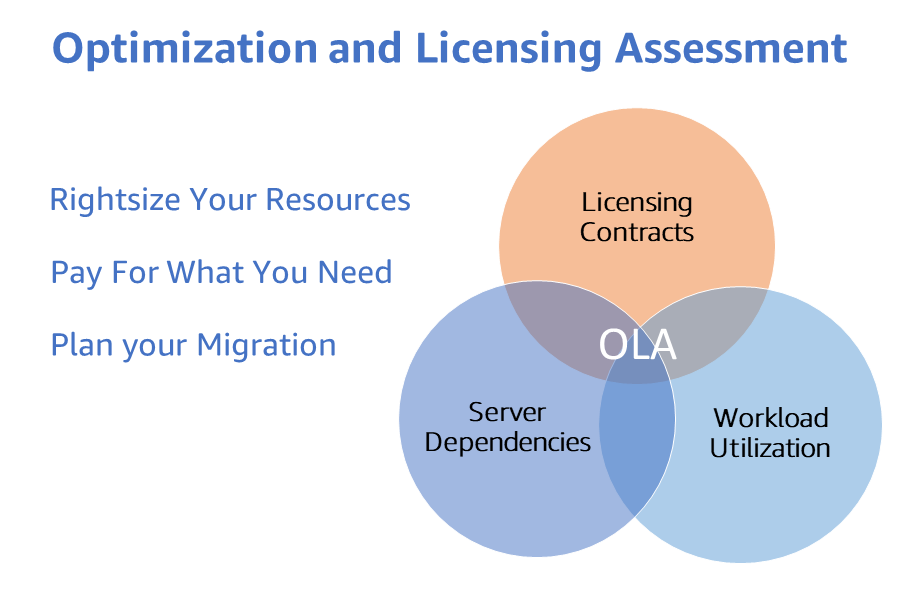
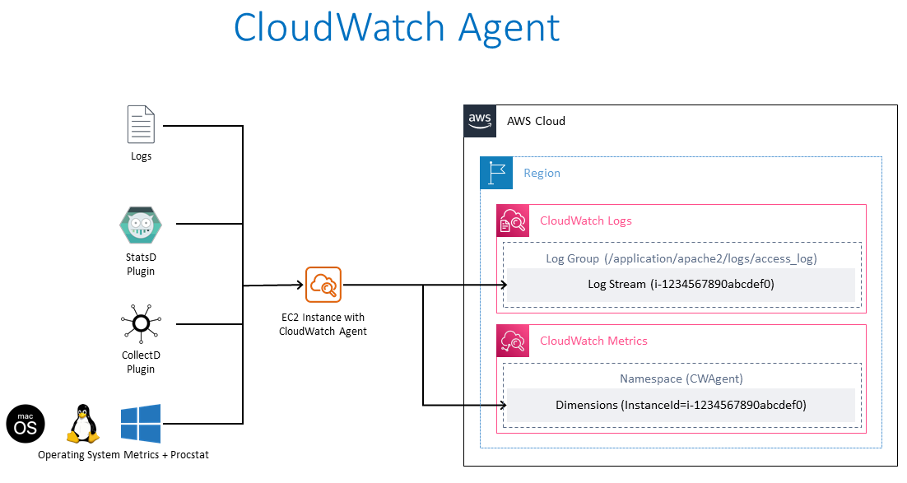
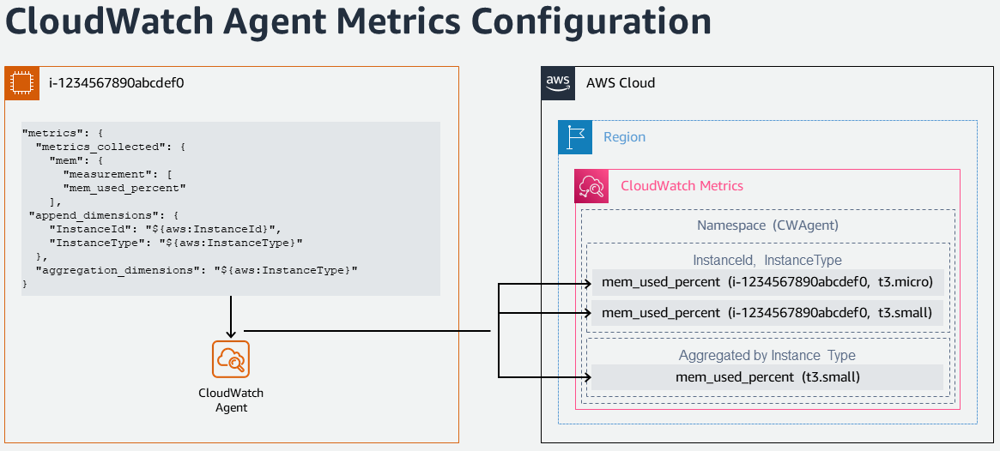
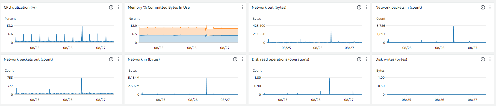

# OLA 适用于现有 EC2 工作负载

## AWS OLA 计划

[AWS Optimization and Licensing Assessment (AWS OLA)](https://aws.amazon.com/optimization-and-licensing-assessment/) 为客户提供将工作负载迁移到云并对资源进行成本优化的最佳方法。该免费项目旨在帮助客户分析新的和现有的工作负载，评估其本地和云环境以优化资源分配、第三方许可和应用程序依赖关系，从而提高资源效率并可能在计算成本上节省开支。

通过在此过程中收集的数据，AWS OLA 计划会生成一份综合报告，帮助客户基于实际资源使用情况、现有许可证权益以及灵活的许可选项，做出明智的上云和迁移决策，并发掘潜在的成本节省。

参与 AWS OLA 计划的好处包括：

- 使用工具驱动的发现方法，获得计算资源的深入洞察，从而为工作负载**合理分配资源**，并帮助选出最适合的 Amazon Elastic Compute Cloud (Amazon EC2)、Amazon Relational Database Service (Amazon RDS) 或 VMware Cloud on AWS 实例大小类型。
- 通过优化云基础设施实现**降低成本**，这是关键目标之一。
- 模拟不同的许可场景，包括内置许可或自带许可实例，为灵活管理季节性工作负载和快速实验提供支持，从而**探索优化的许可选项**并降低不必要的许可成本。



## AWS OLA 适用于 EEC2 工作负载

AWS OLA（优化和许可评估）聚焦于为现有 EC2 工作负载提供成本优化，被称为“**AWS OLA for EEC2**”——即面向**现有 EC2 工作负载**的优化和许可评估。

AWS OLA for EEC2 利用 [AWS Compute Optimizer](https://aws.amazon.com/compute-optimizer/) 为已注册 [AWS 企业支持](https://aws.amazon.com/premiumsupport/plans/enterprise/)计划的客户提供 EC2 规格调整建议。该过程是一种自助式体验：AWS OLA 团队将为客户准备优化报告，AWS 帐户团队再向客户展示这些方案，用于优化 EC2 规格和成本。此外，AWS OLA 还可以提供针对 Microsoft SQL Server 的优化策略，包括在 BYOL（自带许可）和内置许可实例上运行的 Microsoft SQL Server。该评估还会提出一些辅助策略来减少 Microsoft SQL Server 成本：1）对 SQL Server on EC2 实例采用更低的 CPU 配置 2）将非生产服务器上运行的收费 SQL 版本 (Enterprise/Standard) 降级为免费 SQL Developer 版本。

通过收集客户 AWS 帐号的环境参数（包括从 Amazon CloudWatch 和 CloudWatch Agent 获取的内存和 CPU 利用率指标），AWS OLA 团队会将汇总数据整理并生成推荐方案，以 PPT 和 Excel 报告形式提供给 AWS TAM 和客户团队，之后可向客户展示。评估报告帮助客户优化现有 EC2 成本，并发现工作负载的许可优化策略。

## AWS OLA for EEC2 评估

任何拥有企业支持的 AWS 客户都可使用免费提供的 EC2 工作负载 OLA 评估来优化现有 Amazon EC2 实例（Linux 和 Windows）的成本。若有需要，请联系您的 AWS 帐户团队以执行该评估。

## 使用 Amazon CloudWatch 内存指标进行更精准的规格调整

AWS OLA for EEC2 会提供 EC2 规格调整报告，而 [Amazon CloudWatch](https://aws.amazon.com/cloudwatch/) 提供的内存利用率指标能进一步提升规格调整的精准度。通过在 OLA 过程中鼓励并收集 EC2 内存指标，客户可获得更具影响力的资源优化建议，并深入了解各自工作负载的资源使用情况。这有助于在保证系统性能的同时控制成本。

默认情况下，Amazon EC2 实例会向 CloudWatch 发送多种指标，但并不包含内存利用率指标。通过查看 EC2 的内存利用率指标，可以避免实例配置过低影响性能，或因过度配置造成浪费。对于内存占用高的应用（如大数据分析、内存数据库、实时流式处理），监控 EC2 内存利用率尤为重要。



### 从 EC2 实例收集内存指标

以下是采集 EC2 实例内存指标的主要操作步骤：

- 在 AWS Identity and Access Management (IAM) 中创建角色，授予以下权限：
  - [Amazon Systems Manager](https://aws.amazon.com/systems-manager/) 管理 EC2 实例，如果想用 Systems Manager 管理这些实例，需要安装 [AWS Systems Manager Agent (SSM Agent)](https://docs.aws.amazon.com/systems-manager/latest/userguide/ssm-agent.html)，支持远程执行命令。
  - 使用 CloudWatch Agent 配置向 [Systems Manager Parameter Store](https://aws.amazon.com/systems-manager/features/#Parameter_Store) 读写配置文件（可选）。
  - 允许 [CloudWatch Agent](https://docs.aws.amazon.com/AmazonCloudWatch/latest/monitoring/Install-CloudWatch-Agent.html) 将数据（指标和日志）写入 Amazon CloudWatch。
- 启动 EC2 实例并分配上述 IAM 角色。参考附录 [1] 中的信任策略，以及附录 [2] 中的 AmazonSSMManagedInstanceCore、CloudWatchAgentAdminPolicy 和 CloudWatchAgentServerPolicy（含 JSON 权限）。
- 为需要的 EC2 实例（Windows 或 Linux）[安装 CloudWatch Agent](https://docs.aws.amazon.com/AmazonCloudWatch/latest/monitoring/installing-cloudwatch-agent-commandline.html)，可手动操作或使用 [Systems Manager Run Command](https://docs.aws.amazon.com/AmazonCloudWatch/latest/monitoring/installing-cloudwatch-agent-ssm.html)。
- 配置 CloudWatch Agent 采集内存指标并写入 Amazon CloudWatch。



- 在 CloudWatch 控制台中查看 [指标](https://docs.aws.amazon.com/AmazonCloudWatch/latest/monitoring/viewing_metrics_with_cloudwatch.html)和[日志](https://docs.aws.amazon.com/AmazonCloudWatch/latest/logs/AnalyzingLogData.html)。
- 使用 CloudWatch Logs Insights 分析日志数据。



### 在大规模 EC2 实例中收集内存指标

若要在多个 EC2 实例上安装并配置 CloudWatch Agent 以向 CloudWatch 发送指标与日志，可执行以下步骤：

- 连接到任意 EC2 实例（Windows 或 Linux），运行一次 CloudWatch Agent 配置向导以生成监控配置文件：
  - 配置 CPU、内存、磁盘等常见主机指标。
  - 如需监控自定义日志文件（如 IIS 日志、Apache 日志），可进行配置。
  - 如需监控 Windows 事件日志，也可进行配置。
  - 若多台实例需要相同配置，可将该配置文件保存在 Systems Manager Parameter Store 中。
- 使用 Systems Manager Run Command 将 CloudWatch Agent 配置应用到其他实例。可使用 [AmazonCloudWatch-ManageAgent](https://docs.aws.amazon.com/prescriptive-guidance/latest/implementing-logging-monitoring-cloudwatch/create-store-cloudwatch-configurations.html#store-cloudwatch-configuration-s3) 系统管理命令文档，一次性更新多台实例的 CloudWatch 配置。

### 自动化从 EC2 实例采集内存指标

若要在大规模环境中自动化并编排监控数据的采集（指标和日志），可使用 [AWS CloudFormation](https://aws.amazon.com/cloudformation/) 完成以下操作：

- 创建允许 Systems Manager 自动化在 EC2 上执行 runbook 的 IAM 执行角色。
- 设置 IAM 角色，使 CloudWatch Agent 获得写入 CloudWatch 的权限。
- 编写自定义的 [Systems Manager Runbook](https://docs.aws.amazon.com/systems-manager/latest/userguide/automation-documents.html)，以在 EC2 实例上安装并配置 CloudWatch Agent。可参考附录 [3]，其中展示了一个示例 runbook，用于安装 CloudWatch Agent 并根据默认或 Systems Manager Parameter Store 参数配置 CloudWatch Agent。
- 将 CloudWatch Agent 配置文件上传到 Systems Manager Parameter Store。

### 参考资料

- [Collect Metrics and Logs from Amazon EC2 instances with the CloudWatch Agent](https://www.youtube.com/watch?v=vAnIhIwE5hY)
- [Setup memory metrics for Amazon EC2 instances using AWS Systems Manager](https://aws.amazon.com/blogs/mt/setup-memory-metrics-for-amazon-ec2-instances-using-aws-systems-manager/)

### 附录

[1] **Trust Policy** for Amazon EC2 to assume the role

```json
{
  "Version": "2012-10-17",
  "Statement": [
    {
      "Effect": "Allow",
      "Action": ["sts:AssumeRole"],
      "Principal": {
        "Service": ["ec2.amazonaws.com"]
      }
    }
  ]
}
```

[2] [AmazonSSMManagedInstanceCore](https://docs.aws.amazon.com/aws-managed-policy/latest/reference/AmazonSSMManagedInstanceCore.html) - AWS Managed Policy for Amazon EC2 Role to enable AWS Systems Manager service core functionality.

```json
{
  "Version": "2012-10-17",
  "Statement": [
    {
      "Effect": "Allow",
      "Action": [
        "ssm:DescribeAssociation",
        "ssm:GetDeployablePatchSnapshotForInstance",
        "ssm:GetDocument",
        "ssm:DescribeDocument",
        "ssm:GetManifest",
        "ssm:GetParameter",
        "ssm:GetParameters",
        "ssm:ListAssociations",
        "ssm:ListInstanceAssociations",
        "ssm:PutInventory",
        "ssm:PutComplianceItems",
        "ssm:PutConfigurePackageResult",
        "ssm:UpdateAssociationStatus",
        "ssm:UpdateInstanceAssociationStatus",
        "ssm:UpdateInstanceInformation"
      ],
      "Resource": "*"
    },
    {
      "Effect": "Allow",
      "Action": [
        "ssmmessages:CreateControlChannel",
        "ssmmessages:CreateDataChannel",
        "ssmmessages:OpenControlChannel",
        "ssmmessages:OpenDataChannel"
      ],
      "Resource": "*"
    },
    {
      "Effect": "Allow",
      "Action": [
        "ec2messages:AcknowledgeMessage",
        "ec2messages:DeleteMessage",
        "ec2messages:FailMessage",
        "ec2messages:GetEndpoint",
        "ec2messages:GetMessages",
        "ec2messages:SendReply"
      ],
      "Resource": "*"
    }
  ]
}
```

[CloudWatchAgentAdminPolicy](https://docs.aws.amazon.com/aws-managed-policy/latest/reference/CloudWatchAgentAdminPolicy.html) - Amazon Managed Policy with full permissions required to use AmazonCloudWatchAgent

```json
{
  "Version": "2012-10-17",
  "Statement": [
    {
      "Sid": "CWACloudWatchPermissions",
      "Effect": "Allow",
      "Action": [
        "cloudwatch:PutMetricData",
        "ec2:DescribeTags",
        "logs:PutLogEvents",
        "logs:PutRetentionPolicy",
        "logs:DescribeLogStreams",
        "logs:DescribeLogGroups",
        "logs:CreateLogStream",
        "logs:CreateLogGroup",
        "xray:PutTraceSegments",
        "xray:PutTelemetryRecords",
        "xray:GetSamplingRules",
        "xray:GetSamplingTargets",
        "xray:GetSamplingStatisticSummaries"
      ],
      "Resource": "*"
    },
    {
      "Sid": "CWASSMPermissions",
      "Effect": "Allow",
      "Action": ["ssm:GetParameter", "ssm:PutParameter"],
      "Resource": "arn:aws:ssm:*:*:parameter/AmazonCloudWatch-*"
    }
  ]
}
```

[CloudWatchAgentServerPolicy](https://docs.aws.amazon.com/aws-managed-policy/latest/reference/CloudWatchAgentServerPolicy.html) - Amazon Managed Policy with full permissions required to use AmazonCloudWatchAgent on servers

```json
{
  "Version": "2012-10-17",
  "Statement": [
    {
      "Sid": "CWACloudWatchServerPermissions",
      "Effect": "Allow",
      "Action": [
        "cloudwatch:PutMetricData",
        "ec2:DescribeVolumes",
        "ec2:DescribeTags",
        "logs:PutLogEvents",
        "logs:PutRetentionPolicy",
        "logs:DescribeLogStreams",
        "logs:DescribeLogGroups",
        "logs:CreateLogStream",
        "logs:CreateLogGroup",
        "xray:PutTraceSegments",
        "xray:PutTelemetryRecords",
        "xray:GetSamplingRules",
        "xray:GetSamplingTargets",
        "xray:GetSamplingStatisticSummaries"
      ],
      "Resource": "*"
    },
    {
      "Sid": "CWASSMServerPermissions",
      "Effect": "Allow",
      "Action": ["ssm:GetParameter"],
      "Resource": "arn:aws:ssm:*:*:parameter/AmazonCloudWatch-*"
    }
  ]
}
```

[3] An example custom runbook document that can be used to install CloudWatch Agent and configure CloudWatch Agent either with the default metrics or with a parameter in Amazon Systems Manager Parameter Store

```
#-------------------------------------------------
# Composite document and State Manager association to install and configure the Amazon CloudWatch agent
#-------------------------------------------------
InstallAndConfigureCloudWatchAgent:
Type: AWS::SSM::Document
Properties:
    Content:
    schemaVersion: '2.2'
    description: The InstallAndManageCloudWatch command document installs the Amazon CloudWatch agent and manages the configuration of the agent for Amazon EC2 instances.
    parameters:
        action:
        description: The action CloudWatch Agent should take.
        type: String
        default: configure
        allowedValues:
        - configure
        - configure (append)
        - configure (remove)
        - start
        - status
        - stop
        mode:
        description: Controls platform-specific default behavior such as whether to include
            EC2 Metadata in metrics.
        type: String
        default: ec2
        allowedValues:
        - ec2
        - onPremise
        - auto
        optionalConfigurationSource:
        description: Only for 'configure' related actions. Use 'ssm' to apply a ssm parameter
            as config. Use 'default' to apply default config for amazon-cloudwatch-agent.
            Use 'all' with 'configure (remove)' to clean all configs for amazon-cloudwatch-agent.
        type: String
        allowedValues:
        - ssm
        - default
        - all
        default: ssm
        optionalConfigurationLocation:
        description: Only for 'configure' related actions. Only needed when Optional Configuration
            Source is set to 'ssm'. The value should be a ssm parameter name.
        type: String
        default: ''
        allowedPattern: '[a-zA-Z0-9-"~:_@./^(*)!<>?=+]*$'
        optionalRestart:
        description: Only for 'configure' related actions. If 'yes', restarts the agent
            to use the new configuration. Otherwise the new config will only apply on the
            next agent restart.
        type: String
        default: 'yes'
        allowedValues:
        - 'yes'
        - 'no'
    mainSteps:
    - inputs:
        documentParameters:
            name: AmazonCloudWatchAgent
            action: Install
        documentType: SSMDocument
        documentPath: AWS-ConfigureAWSPackage
        name: installCWAgent
        action: aws:runDocument
    - inputs:
        documentParameters:
            mode: '{{mode}}'
            optionalRestart: '{{optionalRestart}}'
            optionalConfigurationSource: '{{optionalConfigurationSource}}'
            optionalConfigurationLocation: '{{optionalConfigurationLocation}}'
            action: '{{action}}'
        documentType: SSMDocument
        documentPath: AmazonCloudWatch-ManageAgent
        name: manageCWAgent
        action: aws:runDocument
    DocumentFormat: YAML
    DocumentType: Command
    TargetType: /AWS::EC2::Instance

CloudWatchAgentAssociation:
Type: AWS::SSM::Association
Properties:
    AssociationName: InstallCloudWatchAgent
    Name: !Ref InstallAndConfigureCloudWatchAgent
    ScheduleExpression: rate(7 days)
    Targets:
    - Key: tag:Platform
    Values:
    - Linux
    WaitForSuccessTimeoutSeconds: 300
```
