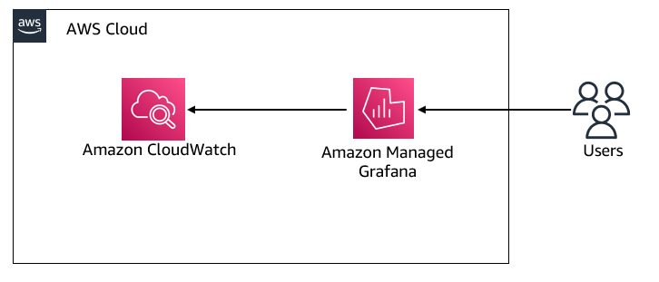
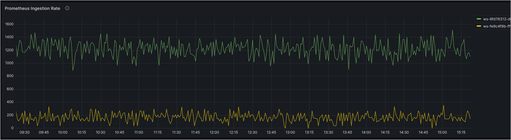
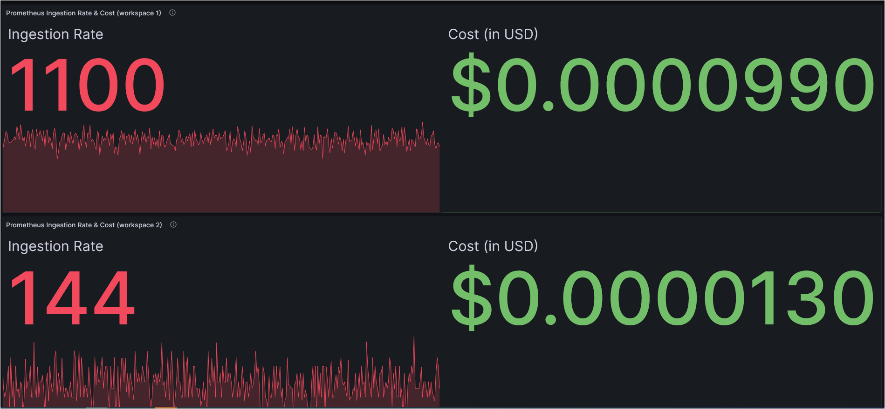
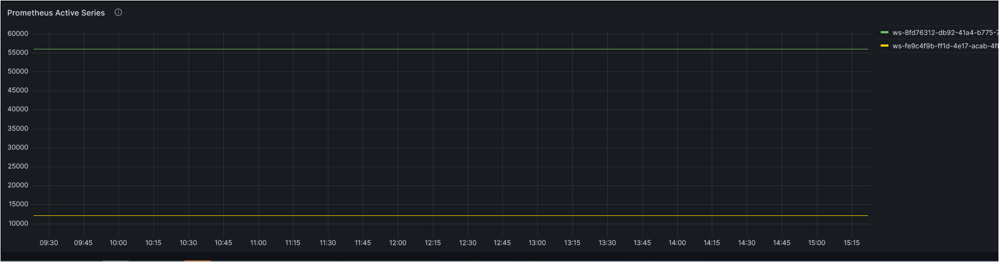

# 实时成本监控

Amazon Managed Service for Prometheus是一个无服务器的、兼容Prometheus的容器指标监控服务，它使大规模安全监控容器环境变得更加简单。Amazon Managed Service for Prometheus的定价模型基于摄入的指标样本、处理的查询样本和存储的指标。您可以在[这里][pricing]找到最新的定价详情。

作为一项托管服务，Amazon Managed Service for Prometheus会随着工作负载的增减自动扩展运营指标的摄入、存储和查询。我们的一些客户请求我们提供如何实时跟踪`指标样本摄入率`及其成本的指导。让我们来探讨如何实现这一目标。

### 解决方案
Amazon Managed Service for Prometheus [向Amazon CloudWatch提供使用指标][vendedmetrics]。这些指标可以帮助您更好地了解Amazon Managed Service for Prometheus工作空间的情况。这些指标可以在CloudWatch的`AWS/Usage`和`AWS/Prometheus`命名空间中找到，这些[指标][AMPMetrics]可以在CloudWatch中免费使用。您随时可以创建CloudWatch仪表板来进一步探索和可视化这些指标。

今天，您将使用Amazon CloudWatch作为Amazon Managed Grafana的数据源，并在Grafana中构建仪表板来可视化这些指标。架构图说明如下：

- Amazon Managed Service for Prometheus向Amazon CloudWatch发布指标

- Amazon CloudWatch作为Amazon Managed Grafana的数据源

- 用户访问在Amazon Managed Grafana中创建的仪表板

### Amazon Managed Grafana仪表板

在Amazon Managed Grafana中创建的仪表板将使您能够可视化：

1. 每个工作空间的Prometheus摄入率  

2. 每个工作空间的Prometheus摄入率和实时成本  
   对于实时成本跟踪，您将使用基于官方[AWS定价文档][pricing]中提到的"前20亿个样本"的"指标摄入层"定价的`数学表达式`。数学运算以数字和时间序列作为输入，并将它们转换为不同的数字和时间序列，请参考此[文档][mathexpression]以进行进一步的自定义以适应您的业务需求。  

3. 每个工作空间的Prometheus活动系列  

Grafana中的仪表板由JSON对象表示，该对象存储其仪表板的元数据。仪表板元数据包括仪表板属性、面板元数据、模板变量、面板查询等。

您可以在<mark>[这里](AmazonPrometheusMetrics.json)</mark>访问上述仪表板的**JSON模板**。

通过上述仪表板，您现在可以识别每个工作空间的摄入率，并基于Amazon Managed Service for Prometheus的指标摄入率监控每个工作空间的实时成本。您可以使用其他Grafana[仪表板面板][panels]来构建适合您需求的可视化效果。

[pricing]: https://aws.amazon.com/prometheus/pricing/
[AMPMetrics]: https://docs.aws.amazon.com/prometheus/latest/userguide/AMP-CW-usage-metrics.html
[vendedmetrics]: https://aws.amazon.com/blogs/mt/introducing-vended-metrics-for-amazon-managed-service-for-prometheus/
[mathexpression]: https://grafana.com/docs/grafana/latest/panels-visualizations/query-transform-data/expression-queries/#math
[panels]: https://docs.aws.amazon.com/grafana/latest/userguide/Grafana-panels.html
