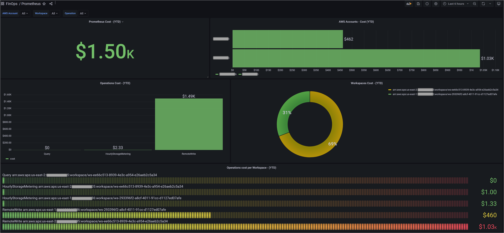

# Amazon Managed Service for Prometheus

Amazon Managed Service for Prometheus 的成本和使用可视化将让您深入了解各个 AWS 账户、AWS 区域、特定 Prometheus 工作空间实例以及 RemoteWrite、Query 和 HourlyStorageMetering 等操作的成本！

要可视化和分析成本和使用数据，您需要创建自定义 Athena 视图。

1. 在继续之前，请确保您已经创建了 CUR（步骤 #1）并部署了[实施概述][cid-implement]中提到的 AWS 确认模板（步骤 #2）。

2. 现在，使用以下查询创建新的 Amazon Athena [视图][view]。此查询获取组织中所有 AWS 账户的 Amazon Managed Service for Prometheus 的成本和使用情况。

        CREATE OR REPLACE VIEW "prometheus_cost" AS 
        SELECT
        line_item_usage_type
        , line_item_resource_id
        , line_item_operation
        , line_item_usage_account_id
        , month
        , year
        , "sum"(line_item_usage_amount) "Usage"
        , "sum"(line_item_unblended_cost) cost
        FROM
        database.tablename #替换为您的数据库和表名
        WHERE ("line_item_product_code" = 'AmazonPrometheus')
        GROUP BY 1, 2, 3, 4, 5, 6

## 创建 Amazon Managed Grafana 仪表板

通过 Amazon Managed Grafana，您可以使用 Grafana 工作空间控制台中的 AWS 数据源配置选项添加 Athena 作为数据源。此功能通过发现现有的 Athena 账户并管理访问 Athena 所需的身份验证凭证的配置，简化了添加 Athena 作为数据源的过程。有关使用 Athena 数据源的先决条件，请参阅[先决条件][Prerequisites]。

以下 **Grafana 仪表板**显示了 AWS 组织中所有 AWS 账户的 Amazon Managed Service for Prometheus 成本和使用情况，以及各个 Prometheus 工作空间实例和 RemoteWrite、Query 和 HourlyStorageMetering 等操作的成本！

Grafana 中的仪表板由 JSON 对象表示，该对象存储其仪表板的元数据。仪表板元数据包括仪表板属性、面板元数据、模板变量、面板查询等。在[此处](AmazonPrometheus.json)访问上述仪表板的 JSON 模板。

通过上述仪表板，您现在可以识别组织中 AWS 账户的 Amazon Managed Service for Prometheus 的成本和使用情况。您可以使用其他 Grafana [仪表板面板][panels]来构建满足您需求的可视化效果。

[Prerequisites]: https://docs.aws.amazon.com/grafana/latest/userguide/Athena-prereq.html
[view]: https://athena-in-action.workshop.aws/30-basics/303-create-view.html
[panels]: https://docs.aws.amazon.com/grafana/latest/userguide/Grafana-panels.html
[cid-implement]: ../../../guides/cost/cost-visualization/cost.md#implementation
