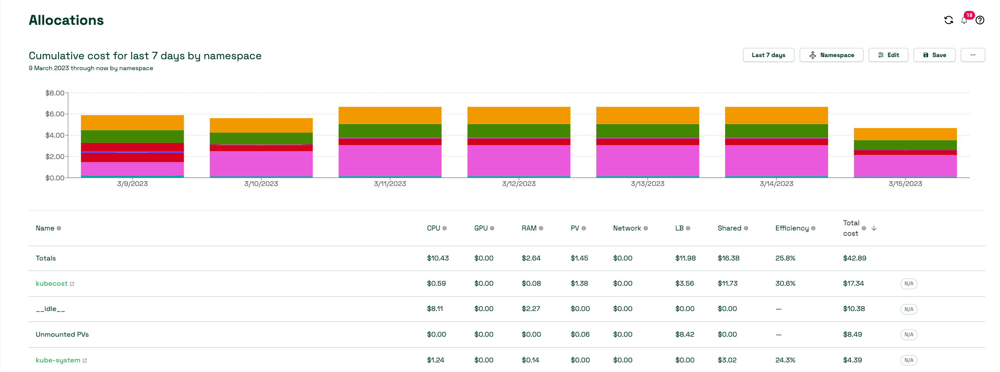
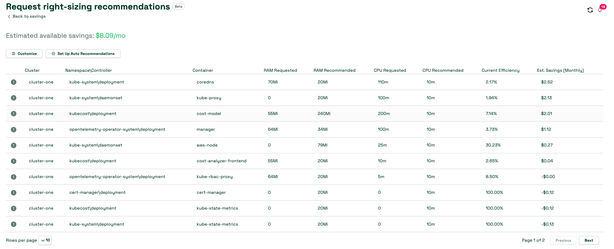

# 使用 Kubecost
Kubecost 为使用 Kubernetes 的环境提供成本可见性和资源效率。总体来说，Amazon EKS 的成本监控通过 Kubecost 部署，并包括 Prometheus（一个开源的监控系统和时间序列数据库）。Kubecost 从 Prometheus 读取指标，进行成本分配计算，并将结果写回 Prometheus。最后，Kubecost 前端从 Prometheus 读取指标并在 UI 中展示。下图展示了其架构：


## 为什么使用 Kubecost
当客户将应用现代化并使用 Amazon EKS 部署工作负载时，通过整合运行应用所需的计算资源来实现效率提升。然而，这种资源效率会导致度量应用成本变得更加困难。您如今可以用以下方式来按租户分配成本：

• 硬多租户（Hard multi-tenancy）— 在专用的 AWS 账户中运行独立的 EKS 集群。  
• 软多租户（Soft multi-tenancy）— 在共享的 EKS 集群中运行多个节点组。  
• 基于消耗的计费（Consumption based billing）— 在共享的 EKS 集群中根据资源消耗来计算成本。

对于硬多租户而言，工作负载部署在独立的 EKS 集群中，不需要额外运行报告就能识别每个租户的支出。  
对于软多租户而言，可使用 Kubernetes 的 [Node Selectors](https://kubernetes.io/docs/concepts/scheduling-eviction/assign-pod-node/#nodeselector) 和 [Node Affinity](https://kubernetes.io/docs/concepts/scheduling-eviction/assign-pod-node/#affinity-and-anti-affinity) 等功能，引导 Kubernetes 调度器将某个租户的工作负载调度到专用节点组。您可以给节点组里的 EC2 实例打上（如产品名或团队名）标签，然后通过 [tags](https://docs.aws.amazon.com/awsaccountbilling/latest/aboutv2/cost-alloc-tags.html) 将成本分配。  
上述两种方法的一个缺点是您可能会有闲置的容量，无法充分利用将工作负载密集绑定到一个集群所产生的成本收益。另外，对于诸如弹性负载均衡器、网络传输费用等共享资源，也需要分摊成本。

在多租户 Kubernetes 集群中，最有效的成本追踪方式是基于工作负载实际消耗的资源来进行分摊。这种模式允许您最大化对 EC2 实例的利用率，因为不同工作负载可以共享节点，从而提高节点的 Pod 密度。但要根据工作负载或命名空间来计算成本是一件挑战性的工作，需要汇总在一个时间范围内所消耗或预留的资源，并结合资源的成本和使用时长得出总体费用。Kubecost 专门解决这一难题。

:::tip
    可在我们的 [One Observability Workshop](https://catalog.workshops.aws/observability/en-US/aws-managed-oss/amp/ingest-kubecost-metrics) 中获得 Kubecost 的实践体验。
:::

## 建议
### 成本分配
Kubecost 的成本分配（Cost Allocation）仪表板可以让您快速查看针对所有 Kubernetes 原生概念（例如命名空间、k8s 标签和服务）的成本分配和优化机会。它也能把成本分配到组织概念，如团队、项目/产品、部门或环境。您可以修改日期范围、筛选器来针对特定工作负载获取洞察并保存报告。要优化 Kubernetes 成本，应关注效率与集群空闲成本。



### 效率
Pod 资源效率定义为在给定时间窗口内的资源利用率与资源请求率之比。它是按成本加权的，可表示如下：
```
(((CPU Usage / CPU Requested) * CPU Cost) + ((RAM Usage / RAM Requested) * RAM Cost)) / (RAM Cost + CPU Cost)
```
其中 CPU Usage = rate(container_cpu_usage_seconds_total)（在该时间窗口内），RAM Usage = avg(container_memory_working_set_bytes)（在该时间窗口内）

由于 AWS 没有明确提供 RAM、CPU 或 GPU 的价格，Kubecost 模型默认回退到用户提供的基础 CPU、GPU 和 RAM 价格比例。默认值基于云提供商的边际资源价格，但可在 Kubecost 中进行自定义。这些基础资源价格（RAM/CPU/GPU）会进行归一化，以确保各组件之和与节点的总价相等。

每个服务团队都应最大化效率，对工作负载进行调整以便达到目标。

### 空闲成本
集群空闲成本定义为已分配资源的成本与这些资源运行所在硬件成本之间的差额。分配值定义为最大值（请求值或使用值）。可表示为：
```
idle_cost = sum(node_cost) - (cpu_allocation_cost + ram_allocation_cost + gpu_allocation_cost)
```
其中 allocation = max(request, usage)

也可以将空闲成本视为 Kubernetes 调度器可以调度 Pod（而不会影响现有工作负载）但目前尚未利用的成本空间。具体可分配给工作负载、集群或节点，具体取决于您的配置方式。

### 网络成本
Kubecost 会尽力将网络传输成本分配给产生这些流量的工作负载。要更精确地测量网络成本，您需要结合 [AWS Cloud Integration](https://docs.kubecost.com/install-and-configure/install/cloud-integration/aws-cloud-integrations) 与 [Network costs daemonset](https://docs.kubecost.com/install-and-configure/advanced-configuration/network-costs-configuration)。

您可参考效率评分和空闲成本来调整工作负载，从而尽可能地充分利用集群。这就引出了下一主题：集群正确规模化。

### 正确地缩放工作负载
Kubecost 基于 Kubernetes 原生指标提供对工作负载的正确容量建议。Kubecost UI 中的节省面板是起步的好地方。




Kubecost 能给出的建议包括：
• 根据对容器请求过度或不足的分析来调整容器请求  
• 调整集群节点数量和尺寸，避免在未用容量上过度支出  
• 缩减、删除或调整那些没有真实流量的 Pod  
• 识别适合使用竞价实例的工作负载  
• 识别未被任何 Pod 使用的卷  

Kubecost 还有一个预发布功能，如果启用 Cluster Controller 组件，可以自动应用容器资源请求方面的建议。自动请求优化可以在整个集群中即时优化资源分配，而无需编写大量 YAML 或复杂的 kubectl 命令。这样可以轻松消除集群中的资源过度分配，从而为正确规模化和其他优化节省成本铺平道路。

### 将 Kubecost 与 Amazon Managed Service for Prometheus 集成
Kubecost 基于开源的 Prometheus 项目作为时间序列数据库，并在 Prometheus 中对数据做后处理来进行成本分配计算。根据集群大小与工作负载规模，如果由单个 Prometheus 实例采集和存储所有指标可能导致过载。在这种情况下，可以使用 Amazon Managed Service for Prometheus（兼容 Prometheus 的托管服务）来可靠地存储指标，并轻松监控 Kubernetes 成本规模化。

您需要为 Kubecost 的服务账户设置 [IAM roles](https://docs.aws.amazon.com/eks/latest/userguide/iam-roles-for-service-accounts.html)。借助集群的 OIDC 提供商，您可将 IAM 权限授予集群中的服务账户。必须为 kubecost-cost-analyzer 和 kubecost-prometheus-server 服务账户分配相应权限，用于发送和检索工作区的指标。在命令行上运行以下命令：

```
eksctl create iamserviceaccount \ 
--name kubecost-cost-analyzer \ 
--namespace kubecost \ 
--cluster <CLUSTER_NAME> \
--region <REGION> \ 
--attach-policy-arn arn:aws:iam::aws:policy/AmazonPrometheusQueryAccess \ 
--attach-policy-arn arn:aws:iam::aws:policy/AmazonPrometheusRemoteWriteAccess \ 
--override-existing-serviceaccounts \ 
--approve 

eksctl create iamserviceaccount \ 
--name kubecost-prometheus-server \ 
--namespace kubecost \ 
--cluster <CLUSTER_NAME> --region <REGION> \ 
--attach-policy-arn arn:aws:iam::aws:policy/AmazonPrometheusQueryAccess \ 
--attach-policy-arn arn:aws:iam::aws:policy/AmazonPrometheusRemoteWriteAccess \ 
--override-existing-serviceaccounts \ 
--approve
```
`CLUSTER_NAME` 为安装 Kubecost 的 Amazon EKS 集群名称，"REGION" 为该集群所在的区域。

完成后，您需要升级 Kubecost helm chart，如下：
```
helm upgrade -i kubecost \
oci://public.ecr.aws/kubecost/cost-analyzer --version <$VERSION> \
--namespace kubecost --create-namespace \
-f https://tinyurl.com/kubecost-amazon-eks \
-f https://tinyurl.com/kubecost-amp \
--set global.amp.prometheusServerEndpoint=${QUERYURL} \
--set global.amp.remoteWriteService=${REMOTEWRITEURL}
```

### 访问 Kubecost UI
Kubecost 提供的 Web 仪表板可通过 kubectl port-forward、Ingress 或负载均衡器进行访问。Kubecost 的企业版支持使用 [SSO/SAML](https://docs.kubecost.com/install-and-configure/advanced-configuration/user-management-oidc) 对仪表板进行访问限制，并可分配不同级别的访问权限，比如限制某团队仅能查看其负责的产品。

在 AWS 环境中，可考虑使用 [AWS Load Balancer Controller](https://docs.aws.amazon.com/eks/latest/userguide/aws-load-balancer-controller.html) 来暴露 Kubecost，并结合 [Amazon Cognito](https://aws.amazon.com/cognito/) 进行身份验证、授权及用户管理。可参见 [如何使用 Application Load Balancer 和 Amazon Cognito 对 Kubernetes Web 应用进行身份验证](https://aws.amazon.com/blogs/containers/how-to-use-application-load-balancer-and-amazon-cognito-to-authenticate-users-for-your-kubernetes-web-apps/) 来了解更多。

### 多集群视图
您的 FinOps 团队希望查看 EKS 集群并向业务负责人提供建议。在大规模运行场景下，逐个登录集群查看建议会变得很繁琐。多集群视图允许您在一个界面中查看所有汇总后的全球性集群成本。Kubecost 对多集群环境提供三种模式：Free、Business 和 Enterprise。在 Free 和 Business 模式下，每个集群都会执行云账单对账。在 Enterprise 模式下，则在一个作为主集群的环境进行云账单对账，并使用共享存储桶保存指标。需要注意，如果要实现无限制的指标保留仅能在 Enterprise 模式中实现。

### 参考资料
• [在 One Observability Workshop 中实践 Kubecost](https://catalog.workshops.aws/observability/en-US/aws-managed-oss/amp/ingest-kubecost-metrics)  
• [博客：将 Kubecost 与 Amazon Managed Service for Prometheus 集成](https://aws.amazon.com/blogs/mt/integrating-kubecost-with-amazon-managed-service-for-prometheus/)
