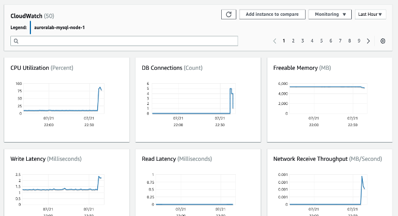
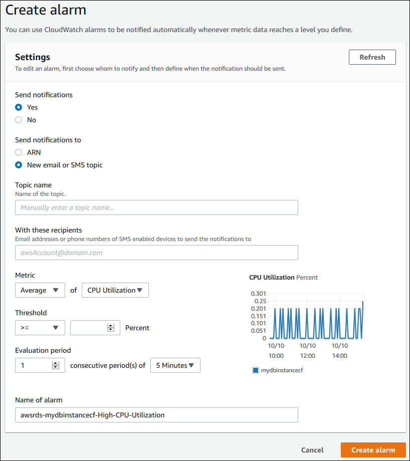
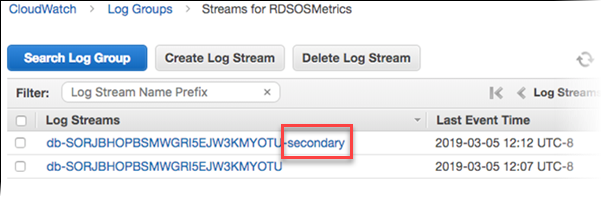
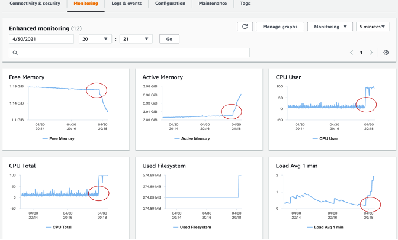
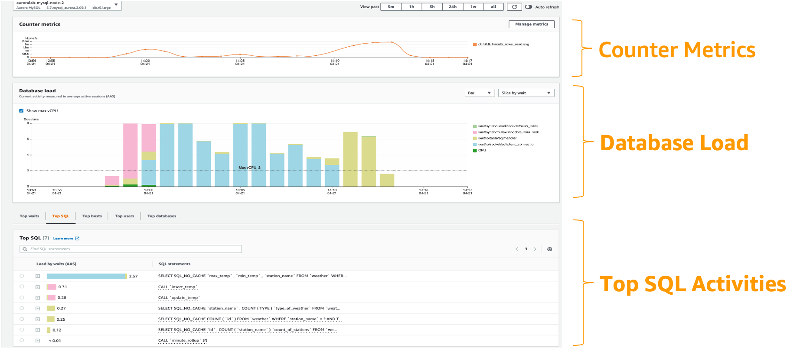
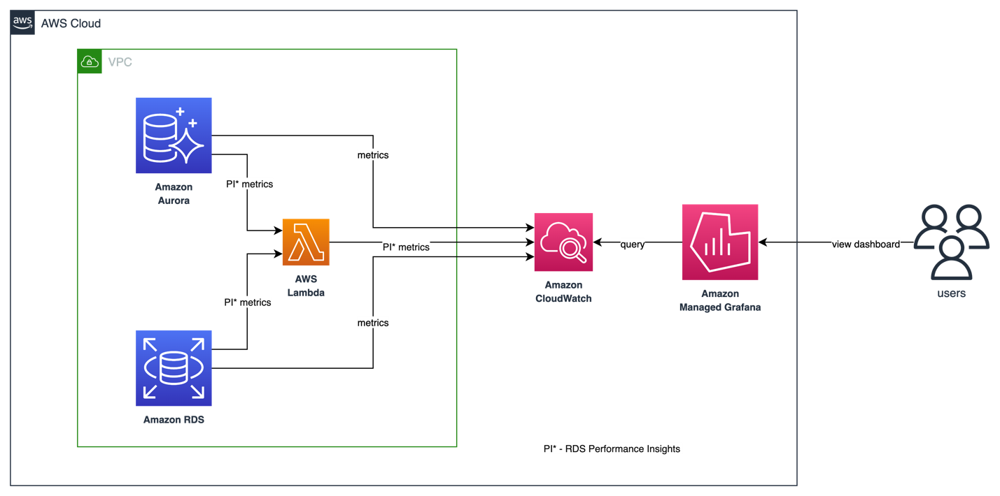
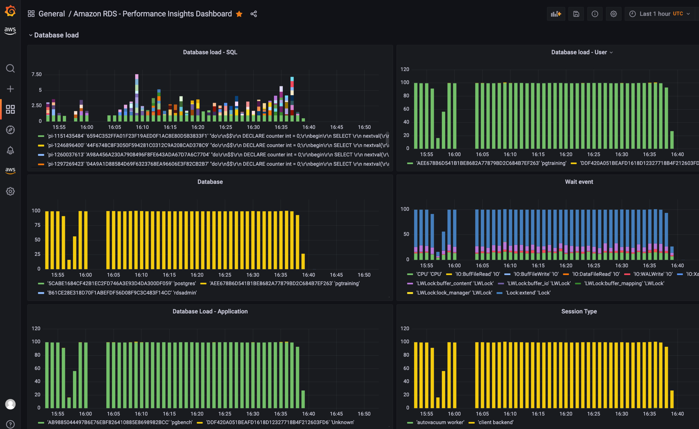
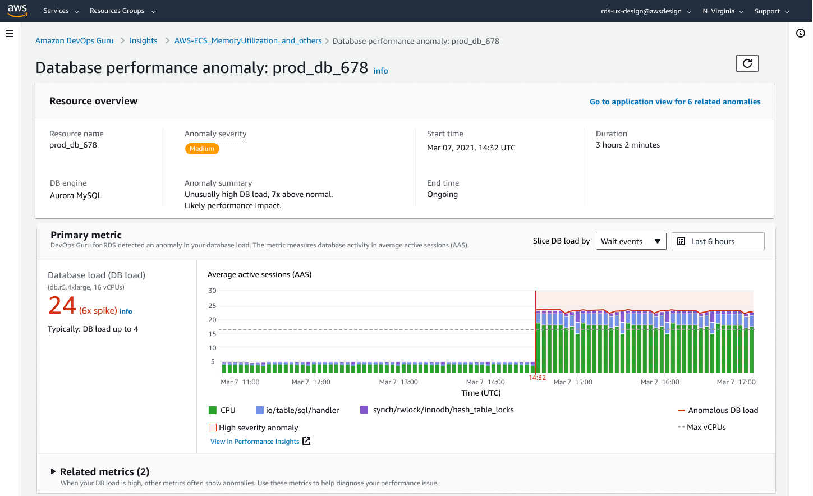
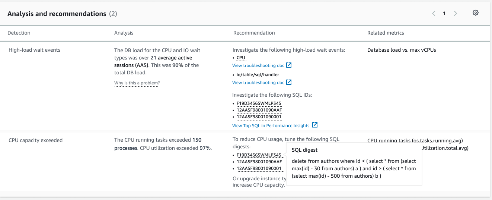

# 监控 Amazon RDS 和 Aurora 数据库

监控是维护 Amazon RDS 和 Aurora 数据库集群的可靠性、可用性和性能的关键部分。AWS 提供了多种工具来监控 Amazon RDS 和 Aurora 数据库资源的健康状况，在问题变得严重之前检测问题,并优化性能以保持一致的用户体验。本指南提供了确保数据库平稳运行的可观察性最佳实践。

## 性能指南

作为最佳实践，您应该从为工作负载建立基准性能开始。当您设置数据库实例并运行典型工作负载时，请在不同的时间间隔(例如一小时、24小时、一周、两周)捕获所有性能指标的平均值、最大值和最小值。这可以让您了解什么是正常的。这有助于对高峰期和非高峰期的运营时间进行比较。然后,您可以使用这些信息来识别性能何时降低到标准水平以下。

## 监控选项

### Amazon CloudWatch 指标

[Amazon CloudWatch](https://docs.aws.amazon.com/AmazonRDS/latest/UserGuide/monitoring-cloudwatch.html) 是监控和管理 [RDS](https://aws.amazon.com/rds/) 和 [Aurora](https://aws.amazon.com/rds/aurora/) 数据库的重要工具。它提供了对数据库性能的宝贵见解,并帮助您快速识别和解决问题。Amazon RDS 和 Aurora 数据库每分钟向 CloudWatch 发送每个活动数据库实例的指标。默认启用监控,指标保留15天。RDS 和 Aurora 在 **AWS/RDS** 命名空间中向 Amazon CloudWatch 发布实例级指标。

使用 CloudWatch 指标,您可以识别数据库性能的趋势或模式,并使用这些信息优化配置并改进应用程序的性能。以下是需要监控的关键指标:

* **CPU 使用率** - 已使用的计算处理能力百分比。
* **数据库连接** - 连接到数据库实例的客户端会话数。如果您在实例性能下降和响应时间增加的同时看到大量用户连接,请考虑限制数据库连接。数据库实例的最佳用户连接数将根据实例类和正在执行的操作的复杂性而变化。要确定数据库连接数,请将数据库实例与参数组关联。
* **可用内存** - 数据库实例上可用的 RAM 大小(以兆字节为单位)。监控选项卡指标中的红线标记在 CPU、内存和存储指标的 75%处。如果实例内存消耗经常超过该线,则表明您应该检查工作负载或升级实例。
* **网络吞吐量** - 每秒进出数据库实例的网络流量速率(以字节为单位)。
* **读/写延迟** - 读取或写入操作的平均时间(以毫秒为单位)。
* **读/写 IOPS** - 每秒平均磁盘读取或写入操作数。
* **可用存储空间** - 数据库实例当前未使用的磁盘空间大小(以兆字节为单位)。如果使用的空间持续处于或超过总磁盘空间的 85%,请调查磁盘空间消耗。看看是否可以从实例中删除数据或将数据归档到其他系统以释放空间。



针对性能相关问题进行故障排除时,第一步是调优最常用和最昂贵的查询。调优它们以查看是否可以降低系统资源压力。有关更多信息,请参阅 [调优查询](https://docs.aws.amazon.com/AmazonRDS/latest/UserGuide/CHAP_BestPractices.html#CHAP_BestPractices.TuningQueries)。

如果您的查询已经调优但问题仍然存在,请考虑升级数据库实例类。您可以将其升级到具有更多资源(CPU、RAM、磁盘空间、网络带宽、I/O 容量)的实例。

然后,您可以设置警报,在这些指标达到临界阈值时发出警报,并尽快采取行动解决任何问题。

有关 CloudWatch 指标的更多信息,请参阅 [Amazon RDS 的 Amazon CloudWatch 指标](https://docs.aws.amazon.com/AmazonRDS/latest/UserGuide/rds-metrics.html) 和 [在 CloudWatch 控制台和 AWS CLI 中查看数据库实例指标](https://docs.aws.amazon.com/AmazonRDS/latest/UserGuide/metrics_dimensions.html)。

#### CloudWatch Logs Insights

[CloudWatch Logs Insights](https://docs.aws.amazon.com/AmazonCloudWatch/latest/logs/AnalyzingLogData.html) 使您能够在 Amazon CloudWatch Logs 中交互式搜索和分析日志数据。您可以执行查询以帮助您更高效和有效地响应操作问题。如果发生问题,您可以使用 CloudWatch Logs Insights 确定潜在原因并验证已部署的修复程序。

要将 RDS 或 Aurora 数据库集群的日志发布到 CloudWatch,请参阅 [将 Amazon RDS 或 Aurora for MySQL 实例的日志发布到 CloudWatch](https://repost.aws/knowledge-center/rds-aurora-mysql-logs-cloudwatch)

有关使用 CloudWatch 监控 RDS 或 Aurora 日志的更多信息,请参阅 [监控 Amazon RDS 日志文件](https://docs.aws.amazon.com/AmazonRDS/latest/UserGuide/USER_LogAccess.html)。


#### CloudWatch 告警

您应该定期监控和告警关键性能指标，以识别数据库集群性能何时降低。使用 [Amazon CloudWatch 告警](https://docs.aws.amazon.com/AmazonCloudWatch/latest/monitoring/AlarmThatSendsEmail.html)，您可以在指定的时间段内监控单个指标。如果指标超过给定阈值，将向 Amazon SNS 主题或 AWS Auto Scaling 策略发送通知。CloudWatch 告警不会仅仅因为处于特定状态就触发操作。相反，状态必须发生变化并在指定的周期内保持。告警仅在告警状态发生变化时触发操作。仅处于告警状态是不够的。

设置 CloudWatch 告警的步骤：

* 导航到 AWS 管理控制台并打开 Amazon RDS 控制台：[https://console.aws.amazon.com/rds/](https://console.aws.amazon.com/rds/)
* 在导航窗格中，选择数据库，然后选择一个数据库实例
* 选择日志和事件

在 CloudWatch 告警部分，选择创建告警。



* 对于发送通知，选择是，对于发送通知至，选择新建电子邮件或 SMS 主题
* 对于主题名称，输入通知的名称，对于收件人，输入以逗号分隔的电子邮件地址和电话号码列表
* 对于指标，选择要设置的告警统计信息和指标
* 对于阈值，指定指标必须大于、小于或等于阈值，并指定阈值值
* 对于评估期间，选择告警的评估期间。对于连续周期数，选择必须达到阈值才能触发告警的周期
* 对于告警名称，输入告警的名称
* 选择创建告警

告警将出现在 CloudWatch 告警部分。

查看此[示例](https://docs.aws.amazon.com/AmazonRDS/latest/UserGuide/multi-az-db-cluster-cloudwatch-alarm.html)，了解如何为多可用区数据库集群副本滞后创建 Amazon CloudWatch 告警。

#### 数据库审计日志

数据库审计日志提供了在 RDS 和 Aurora 数据库上执行的所有操作的详细记录，使您能够监控未经授权的访问、数据更改和其他潜在有害活动。以下是使用数据库审计日志的一些最佳实践：

* 为所有 RDS 和 Aurora 实例启用数据库审计日志，并将其配置为捕获所有相关数据
* 使用集中式日志管理解决方案（如 Amazon CloudWatch Logs 或 Amazon Kinesis Data Streams）来收集和分析数据库审计日志
* 定期监控数据库审计日志以发现可疑活动，并采取行动迅速调查和解决任何问题

有关如何配置数据库审计日志的更多信息，请参阅[配置审计日志以捕获 Amazon RDS 和 Aurora 的数据库活动](https://aws.amazon.com/blogs/database/configuring-an-audit-log-to-capture-database-activities-for-amazon-rds-for-mysql-and-amazon-aurora-with-mysql-compatibility/)。

#### 数据库慢查询和错误日志

慢查询日志帮助您找到数据库中性能较慢的查询，以便您可以调查缓慢的原因并在需要时优化查询。错误日志帮助您找到查询错误，这进一步帮助您发现由这些错误导致的应用程序中的变化。

您可以使用 Amazon CloudWatch Logs Insights（它使您能够在 Amazon CloudWatch Logs 中交互式搜索和分析日志数据）创建 CloudWatch 仪表板来监控慢查询日志和错误日志。

要激活和监控 Amazon RDS 的错误日志、慢查询日志和常规日志，请参阅[管理 RDS MySQL 的慢查询日志和常规日志](https://repost.aws/knowledge-center/rds-mysql-logs)。要为 Aurora PostgreSQL 激活慢查询日志，请参阅[为 PostgreSQL 启用慢查询日志](https://catalog.us-east-1.prod.workshops.aws/workshops/31babd91-aa9a-4415-8ebf-ce0a6556a216/en-US/postgresql-logs/enable-slow-query-log)。

## 性能洞察和操作系统指标

#### 增强监控

[增强监控](https://docs.aws.amazon.com/AmazonRDS/latest/UserGuide/USER_Monitoring.OS.html)使您能够实时获取数据库实例运行的操作系统(OS)的精细指标。

RDS 将增强监控的指标传送到您的 Amazon CloudWatch Logs 帐户。默认情况下,这些指标保存30天,存储在 Amazon CloudWatch 的 **RDSOSMetrics** 日志组中。您可以选择1秒到60秒之间的粒度。您可以从 CloudWatch Logs 在 CloudWatch 中创建自定义指标过滤器,并在 CloudWatch 仪表板上显示图表。



增强监控还包括操作系统级进程列表。目前,增强监控适用于以下数据库引擎:

* MariaDB
* Microsoft SQL Server  
* MySQL
* Oracle
* PostgreSQL

**CloudWatch 和增强监控的区别**
CloudWatch 从数据库实例的虚拟机管理程序收集 CPU 使用率指标。相比之下,增强监控从数据库实例上的代理收集其指标。虚拟机管理程序创建和运行虚拟机(VM)。使用虚拟机管理程序,一个实例可以通过虚拟共享内存和 CPU 来支持多个访客 VM。由于虚拟机管理程序层执行少量工作,您可能会发现 CloudWatch 和增强监控测量值之间存在差异。如果您的数据库实例使用较小的实例类,差异可能会更大。在这种情况下,虚拟机管理程序层可能在单个物理实例上管理更多的虚拟机(VM)。

要了解增强监控提供的所有指标,请参阅[增强监控中的操作系统指标](https://docs.aws.amazon.com/AmazonRDS/latest/UserGuide/USER_Monitoring-Available-OS-Metrics.html)



#### 性能洞察

[Amazon RDS 性能洞察](https://aws.amazon.com/rds/performance-insights/)是一项数据库性能调优和监控功能,可帮助您快速评估数据库的负载,并确定何时以及在何处采取行动。使用性能洞察仪表板,您可以可视化数据库集群上的数据库负载,并按等待、SQL 语句、主机或用户过滤负载。它允许您找出根本原因,而不是追查表象。性能洞察使用轻量级数据收集方法,不会影响应用程序的性能,并且可以轻松查看哪些 SQL 语句导致负载以及原因。

性能洞察提供七天的免费性能历史记录保留期,您可以通过付费将其延长至2年。您可以通过 RDS 管理控制台或 AWS CLI 启用性能洞察。性能洞察还公开了一个公共 API,使客户和第三方能够将性能洞察与其自定义工具集成。

:::note
  目前,RDS 性能洞察仅适用于 Aurora(PostgreSQL 和 MySQL 兼容版)、Amazon RDS for PostgreSQL、MySQL、MariaDB、SQL Server 和 Oracle。
:::

**DBLoad** 是表示数据库活动会话平均数的关键指标。在性能洞察中,此数据作为 **db.load.avg** 指标进行查询。



有关将性能洞察与 Aurora 一起使用的更多信息,请参阅:[使用 Amazon Aurora 上的性能洞察监控数据库负载](https://docs.aws.amazon.com/AmazonRDS/latest/AuroraUserGuide/USER_PerfInsights.html)。

## 开源可观察性工具

#### Amazon Managed Grafana
[Amazon Managed Grafana](https://aws.amazon.com/grafana/) 是一个完全托管的服务，可以轻松地可视化和分析来自 RDS 和 Aurora 数据库的数据。

Amazon CloudWatch 中的 **AWS/RDS 命名空间** 包含适用于在 Amazon RDS 和 Amazon Aurora 上运行的数据库实体的关键指标。要在 Amazon Managed Grafana 中可视化和跟踪 RDS/Aurora 数据库的健康状况和潜在性能问题，我们可以利用 CloudWatch 数据源。



目前，CloudWatch 中只提供基本的性能洞察指标，这不足以分析数据库性能并识别数据库中的瓶颈。为了在 Amazon Managed Grafana 中可视化 RDS 性能洞察指标并实现单一视图可见性，客户可以使用自定义 Lambda 函数来收集所有 RDS 性能洞察指标，并将其发布到自定义 CloudWatch 指标命名空间。一旦这些指标在 Amazon CloudWatch 中可用，您就可以在 Amazon Managed Grafana 中将其可视化。

要部署自定义 Lambda 函数以收集 RDS 性能洞察指标，请克隆以下 GitHub 存储库并运行 install.sh 脚本。

```
$ git clone https://github.com/aws-observability/observability-best-practices.git
$ cd sandbox/monitor-aurora-with-grafana

$ chmod +x install.sh
$ ./install.sh
```

上述脚本使用 AWS CloudFormation 部署自定义 Lambda 函数和 IAM 角色。Lambda 函数每 10 分钟自动触发一次，以调用 RDS 性能洞察 API 并将自定义指标发布到 Amazon CloudWatch 中的 /AuroraMonitoringGrafana/PerformanceInsights 自定义命名空间。



有关自定义 Lambda 函数部署和 Grafana 仪表板的详细分步信息，请参阅 [Amazon Managed Grafana 中的性能洞察](https://aws.amazon.com/blogs/mt/monitoring-amazon-rds-and-amazon-aurora-using-amazon-managed-grafana/)。

通过快速识别数据库中的意外更改并使用告警通知，您可以采取行动以最大限度地减少中断。Amazon Managed Grafana 支持多个通知通道，如 SNS、Slack、PagerDuty 等，您可以向其发送告警通知。[Grafana 告警](https://docs.aws.amazon.com/grafana/latest/userguide/alerts-overview.html)将向您展示如何在 Amazon Managed Grafana 中设置告警的更多信息。

<!-- blank line -->
<figure class="video_container">
  <iframe width="560" height="315" src="https://www.youtube.com/embed/Uj9UJ1mXwEA" title="YouTube video player" frameborder="0" allow="accelerometer; autoplay; clipboard-write; encrypted-media; gyroscope; picture-in-picture; web-share" allowfullscreen></iframe>
</figure>
<!-- blank line -->

## AIOps - 基于机器学习的性能瓶颈检测

#### Amazon DevOps Guru for RDS

使用 [Amazon DevOps Guru for RDS](https://aws.amazon.com/devops-guru/features/devops-guru-for-rds/)，你可以监控数据库的性能瓶颈和操作问题。它使用性能洞察指标，使用机器学习(ML)分析它们以提供特定于数据库的性能问题分析，并推荐纠正措施。DevOps Guru for RDS 可以识别和分析各种与性能相关的数据库问题，例如主机资源过度使用、数据库瓶颈或 SQL 查询的异常行为等。当检测到问题或异常行为时，DevOps Guru for RDS 会在 DevOps Guru 控制台上显示发现结果，并使用 [Amazon EventBridge](https://aws.amazon.com/pm/eventbridge) 或 [Amazon Simple Notification Service (SNS)](https://aws.amazon.com/pm/sns) 发送通知，使 DevOps 或 SRE 团队能够在性能和操作问题影响客户之前采取实时行动。

DevOps Guru for RDS 为数据库指标建立基准线。基准线包括分析一段时间内的数据库性能指标以建立正常行为。然后，Amazon DevOps Guru for RDS 使用 ML 来检测与既定基准线相比的异常。如果您的工作负载模式发生变化，那么 DevOps Guru for RDS 将建立一个新的基准线，用于检测与新正常状态相比的异常。

:::note
    对于新的数据库实例，Amazon DevOps Guru for RDS 最多需要 2 天时间来建立初始基准线，因为它需要分析数据库使用模式并确定什么是正常行为。
:::





有关如何入门的更多信息，请访问 [Amazon DevOps Guru for RDS 使用 ML 检测、诊断和解决 Amazon Aurora 相关问题](https://aws.amazon.com/blogs/aws/new-amazon-devops-guru-for-rds-to-detect-diagnose-and-resolve-amazon-aurora-related-issues-using-ml/)

<!-- blank line -->
<figure class="video_container">
  <iframe width="560" height="315" src="https://www.youtube.com/embed/N3NNYgzYUDA" title="YouTube video player" frameborder="0" allow="accelerometer; autoplay; clipboard-write; encrypted-media; gyroscope; picture-in-picture; web-share" allowfullscreen></iframe>
</figure>
<!-- blank line -->

## Auditing and Governance

####  AWS CloudTrail Logs

[AWS CloudTrail](https://docs.aws.amazon.com/awscloudtrail/latest/userguide/cloudtrail-user-guide.html) provides a record of actions taken by a user, role, or an AWS service in RDS. CloudTrail captures all API calls for RDS as events, including calls from the console and from code calls to RDS API operations. Using the information collected by CloudTrail, you can determine the request that was made to RDS, the IP address from which the request was made, who made the request, when it was made, and additional details. For more information, see [Monitoring Amazon RDS API calls in AWS CloudTrail](https://docs.aws.amazon.com/AmazonRDS/latest/UserGuide/logging-using-cloudtrail.html).

For more information, refer [Monitoring Amazon RDS API calls in AWS CloudTrail](https://docs.aws.amazon.com/AmazonRDS/latest/UserGuide/logging-using-cloudtrail.html).

## References for more information

[Blog - Monitor RDS and Aurora databases with Amazon Managed Grafana](https://aws.amazon.com/blogs/mt/monitoring-amazon-rds-and-amazon-aurora-using-amazon-managed-grafana/)

[Video - Monitor RDS and Aurora databases with Amazon Managed Grafana](https://www.youtube.com/watch?v=Uj9UJ1mXwEA)

[Blog - Monitor RDS and Aurora databases with Amazon CloudWatch](https://aws.amazon.com/blogs/database/creating-an-amazon-cloudwatch-dashboard-to-monitor-amazon-rds-and-amazon-aurora-mysql/)

[Blog - Build proactive database monitoring for Amazon RDS with Amazon CloudWatch Logs, AWS Lambda, and Amazon SNS](https://aws.amazon.com/blogs/database/build-proactive-database-monitoring-for-amazon-rds-with-amazon-cloudwatch-logs-aws-lambda-and-amazon-sns/)

[Official Doc - Amazon Aurora Monitoring Guide](https://docs.aws.amazon.com/AmazonRDS/latest/AuroraUserGuide/MonitoringOverview.html)

[Hands-on Workshop - Observe and Identify SQL Performance Issues in Amazon Aurora](https://catalog.workshops.aws/awsauroramysql/en-US/provisioned/perfobserve)


