# EC2 监控与可观测性

## 简介

持续监控与可观测性提高了敏捷性，改善了客户体验，并降低了云环境的风险。根据维基百科的定义，[可观测性](https://en.wikipedia.org/wiki/Observability) 是衡量系统内部状态如何通过其外部输出的知识推断出来的指标。可观测性这一术语源自控制理论领域，基本上意味着你可以通过了解系统产生的外部信号/输出来推断系统组件的内部状态。

监控与可观测性的区别在于，监控告诉你系统是否正常工作，而可观测性告诉你系统为什么不能正常工作。监控通常是一种被动措施，而可观测性的目标是能够以主动的方式改进你的关键绩效指标（KPI）。除非系统被观测，否则无法控制或优化它。通过收集指标、日志或追踪来检测工作负载，并使用正确的监控和可观测性工具获得有意义的见解和详细上下文，帮助客户控制和优化环境。

AWS 帮助客户从监控转变为可观测性，以便他们能够获得端到端的服务可见性。本文重点介绍 Amazon Elastic Compute Cloud (Amazon EC2) 以及通过 AWS 原生和开源工具在 AWS 云环境中改进服务监控和可观测性的最佳实践。

## Amazon EC2

[Amazon Elastic Compute Cloud](https://aws.amazon.com/ec2/) (Amazon EC2) 是 Amazon Web Services (AWS) 云中的高度可扩展计算平台。Amazon EC2 消除了前期硬件投资的需求，因此客户可以更快地开发和部署应用程序，同时只需为使用的资源付费。EC2 提供的一些关键功能包括称为实例的虚拟计算环境、称为 Amazon Machine Images 的预配置实例模板、各种资源配置（如 CPU、内存、存储和网络容量）作为实例类型。

## 使用 AWS 原生工具进行监控和可观测性

### Amazon CloudWatch

[Amazon CloudWatch](https://aws.amazon.com/cloudwatch/) 是一种监控和管理服务，提供 AWS、混合和本地应用程序及基础设施资源的数据和可操作的见解。CloudWatch 以日志、指标和事件的形式收集监控和操作数据。它还提供了对 AWS 资源、应用程序和在 AWS 及本地服务器上运行的服务的统一视图。CloudWatch 帮助您获得系统范围内的资源利用率、应用程序性能和运行状况的可见性。

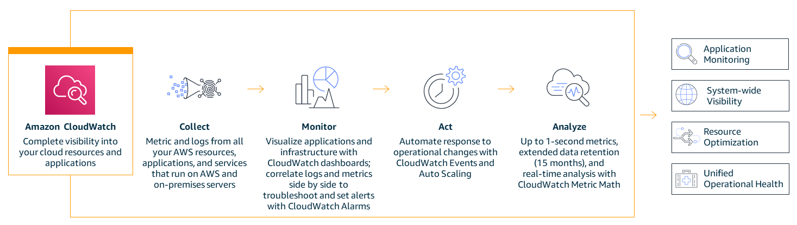

### 统一的 CloudWatch 代理

统一的 CloudWatch 代理是一个基于 MIT 许可证的开源软件，支持大多数使用 x86-64 和 ARM64 架构的操作系统。CloudWatch 代理帮助从 Amazon EC2 实例和混合环境中的本地服务器收集系统级指标，从应用程序或服务中检索自定义指标，并从 Amazon EC2 实例和本地服务器收集日志。

### 在 Amazon EC2 实例上安装 CloudWatch 代理

#### 命令行安装

CloudWatch 代理可以通过 [命令行](https://docs.aws.amazon.com/AmazonCloudWatch/latest/monitoring/installing-cloudwatch-agent-commandline.html) 安装。各种架构和各种操作系统的所需包可供 [下载](https://docs.aws.amazon.com/AmazonCloudWatch/latest/monitoring/download-cloudwatch-agent-commandline.html)。创建必要的 [IAM 角色](https://docs.aws.amazon.com/AmazonCloudWatch/latest/monitoring/create-iam-roles-for-cloudwatch-agent-commandline.html)，该角色提供 CloudWatch 代理从 Amazon EC2 实例读取信息并将其写入 CloudWatch 的权限。创建所需的 IAM 角色后，您可以在所需的 Amazon EC2 实例上 [安装并运行](https://docs.aws.amazon.com/AmazonCloudWatch/latest/monitoring/install-CloudWatch-Agent-commandline-fleet.html) CloudWatch 代理。

:::info
    文档: [使用命令行安装 CloudWatch 代理](https://docs.aws.amazon.com/AmazonCloudWatch/latest/monitoring/installing-cloudwatch-agent-commandline.html)

    AWS 可观测性研讨会: [设置和安装 CloudWatch 代理](https://catalog.workshops.aws/observability/en-US/aws-native/ec2-monitoring/install-ec2)
:::

#### 通过 AWS Systems Manager 安装

CloudWatch 代理也可以通过 [AWS Systems Manager](https://docs.aws.amazon.com/AmazonCloudWatch/latest/monitoring/installing-cloudwatch-agent-ssm.html) 安装。创建必要的 IAM 角色，该角色提供 CloudWatch 代理从 Amazon EC2 实例读取信息并将其写入 CloudWatch 并与 AWS Systems Manager 通信的权限。在 EC2 实例上安装 CloudWatch 代理之前，[安装或更新](https://docs.aws.amazon.com/AmazonCloudWatch/latest/monitoring/download-CloudWatch-Agent-on-EC2-Instance-SSM-first.html#update-SSM-Agent-EC2instance-first) 所需的 EC2 实例上的 SSM 代理。CloudWatch 代理可以通过 AWS Systems Manager 下载。可以创建 JSON 配置文件以指定要收集的指标（包括自定义指标）和日志。创建所需的 IAM 角色和配置文件后，您可以在所需的 Amazon EC2 实例上安装并运行 CloudWatch 代理。

:::info
    文档: [使用 AWS Systems Manager 安装 CloudWatch 代理](https://docs.aws.amazon.com/AmazonCloudWatch/latest/monitoring/installing-cloudwatch-agent-ssm.html)

    AWS 可观测性研讨会: [使用 AWS Systems Manager 快速设置安装 CloudWatch 代理](https://catalog.workshops.aws/observability/en-US/aws-native/ec2-monitoring/install-ec2/ssm-quicksetup)

    相关博客文章: [Amazon CloudWatch 代理与 AWS Systems Manager 集成 – 适用于 Linux 和 Windows 的统一指标和日志收集](https://aws.amazon.com/blogs/aws/new-amazon-cloudwatch-agent-with-aws-systems-manager-integration-unified-metrics-log-collection-for-linux-windows/)

    YouTube 视频: [使用 CloudWatch 代理从 Amazon EC2 实例收集指标和日志](https://www.youtube.com/watch?v=vAnIhIwE5hY)
:::

#### 在混合环境中的本地服务器上安装 CloudWatch 代理

在混合客户环境中，服务器既在本地也在云中。可以采取类似的方法在 Amazon CloudWatch 中实现统一的可观测性。CloudWatch 代理可以直接从 Amazon S3 或通过 AWS Systems Manager 下载。为本地服务器创建一个 IAM 用户以将数据发送到 Amazon CloudWatch。在本地服务器上安装并启动代理。

:::note
    文档: [在本地服务器上安装 CloudWatch 代理](https://docs.aws.amazon.com/AmazonCloudWatch/latest/monitoring/install-CloudWatch-Agent-on-premise.html)
:::

### 使用 Amazon CloudWatch 监控 Amazon EC2 实例

维护 Amazon EC2 实例及其应用程序的可靠性、可用性和性能的一个关键方面是通过 [持续监控](https://catalog.workshops.aws/observability/en-US/aws-native/ec2-monitoring)。在所需的 Amazon EC2 实例上安装了 CloudWatch 代理后，监控实例的健康状况和性能对于维护稳定的环境是必要的。作为基线，建议监控 CPU 使用率、网络使用率、磁盘性能、磁盘读取/写入、内存使用率、磁盘交换使用率、磁盘空间使用率、页面文件使用率以及 EC2 实例的日志收集。

#### 基本监控和详细监控

Amazon CloudWatch 从 Amazon EC2 收集并处理原始数据，将其转换为可读的近实时指标。默认情况下，Amazon EC2 以 5 分钟为间隔将指标数据发送到 CloudWatch 作为基本监控。要以 1 分钟为间隔将实例的指标数据发送到 CloudWatch，可以在实例上启用 [详细监控](https://docs.aws.amazon.com/AWSEC2/latest/UserGuide/using-cloudwatch-new.html)。

#### 自动化和手动监控工具

AWS 提供了两种类型的工具，自动化和手动工具，帮助客户监控其 Amazon EC2 并在出现问题时报告。其中一些工具需要少量配置，少数需要手动干预。[自动化监控工具](https://docs.aws.amazon.com/AWSEC2/latest/UserGuide/monitoring_automated_manual.html#monitoring_automated_tools) 包括 AWS 系统状态检查、实例状态检查、Amazon CloudWatch 告警、Amazon EventBridge、Amazon CloudWatch 日志、CloudWatch 代理、适用于 Microsoft System Center Operations Manager 的 AWS 管理包。[手动监控](https://docs.aws.amazon.com/AWSEC2/latest/UserGuide/monitoring_automated_manual.html#monitoring_manual_tools) 工具包括仪表板，我们将在本文后面的部分中详细讨论。

:::note
    文档: [自动化和手动监控](https://docs.aws.amazon.com/AWSEC2/latest/UserGuide/monitoring_automated_manual.html)
:::

### 使用 CloudWatch 代理从 Amazon EC2 实例获取指标

指标是 CloudWatch 中的基本概念。指标表示发布到 CloudWatch 的时间序列数据点集。将指标视为要监控的变量，数据点表示该变量随时间变化的值。例如，特定 EC2 实例的 CPU 使用率是 Amazon EC2 提供的一个指标。

#### 使用 CloudWatch 代理的默认指标

Amazon CloudWatch 从 Amazon EC2 实例收集指标，可以通过 AWS 管理控制台、AWS CLI 或 API 查看。可用指标是数据点，通过基本监控以 5 分钟为间隔覆盖，或通过详细监控以 1 分钟为间隔覆盖（如果启用）。

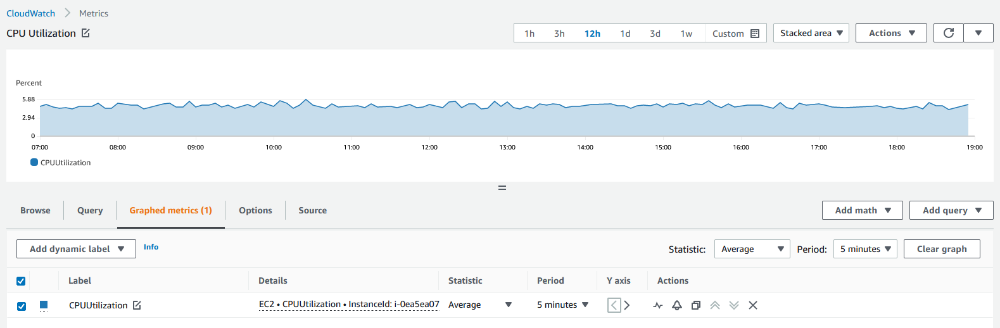

#### 使用 CloudWatch 代理的自定义指标

客户还可以通过 API 或 CLI 发布自己的自定义指标到 CloudWatch，标准分辨率为 1 分钟粒度，或高分辨率粒度为 1 秒间隔。统一的 CloudWatch 代理支持通过 [StatsD](https://docs.aws.amazon.com/AmazonCloudWatch/latest/monitoring/CloudWatch-Agent-custom-metrics-statsd.html) 和 [collectd](https://docs.aws.amazon.com/AmazonCloudWatch/latest/monitoring/CloudWatch-Agent-custom-metrics-collectd.html) 检索自定义指标。

使用 CloudWatch 代理和 StatsD 协议可以从应用程序或服务中检索自定义指标。StatsD 是一种流行的开源解决方案，可以从各种应用程序中收集指标。StatsD 特别适用于检测自己的指标，支持基于 Linux 和 Windows 的服务器。

使用 CloudWatch 代理和 collectd 协议也可以从应用程序或服务中检索自定义指标，collectd 是一种仅支持 Linux 服务器的流行开源解决方案，具有可以从各种应用程序中收集系统统计信息的插件。通过将 CloudWatch 代理已经可以收集的系统指标与 collectd 的额外指标相结合，您可以更好地监控、分析和排除系统和应用程序的故障。

#### 使用 CloudWatch 代理的其他自定义指标

CloudWatch 代理支持从 EC2 实例收集自定义指标。一些流行的示例包括：

- 使用 Elastic Network Adapter (ENA) 的 Linux EC2 实例的网络性能指标。
- 来自 Linux 服务器的 Nvidia GPU 指标。
- 使用 procstat 插件从 Linux 和 Windows 服务器上的单个进程中获取的进程指标。

### 使用 CloudWatch 代理从 Amazon EC2 实例获取日志

Amazon CloudWatch 日志帮助客户使用现有的系统、应用程序和自定义日志文件实时监控和排除系统和应用程序的故障。要从 Amazon EC2 实例和本地服务器收集日志到 CloudWatch，需要安装统一的 CloudWatch 代理。建议使用最新的统一 CloudWatch 代理，因为它可以收集日志和高级指标。它还支持多种操作系统。如果实例使用实例元数据服务版本 2 (IMDSv2)，则需要统一代理。

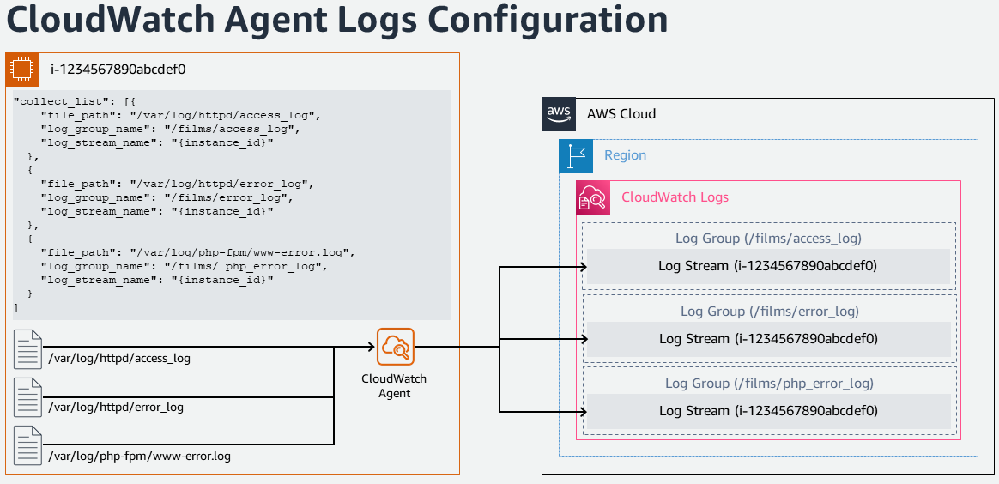

统一的 CloudWatch 代理收集的日志被处理并存储在 Amazon CloudWatch 日志中。可以从 Windows 或 Linux 服务器以及 Amazon EC2 和本地服务器收集日志。CloudWatch 代理配置向导可用于设置定义 CloudWatch 代理设置的配置 JSON 文件。

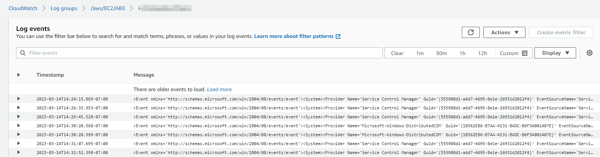

:::note
    AWS 可观测性研讨会: [日志](https://catalog.workshops.aws/observability/en-US/aws-native/logs)
:::

### Amazon EC2 实例事件

事件表示 AWS 环境中的变化。AWS 资源和应用程序在其状态发生变化时生成事件。CloudWatch 事件提供了一个近实时的系统事件流，描述了对 AWS 资源和应用程序的更改。例如，当 EC2 实例的状态从挂起变为运行时，Amazon EC2 会生成一个事件。客户还可以生成自定义应用程序级事件并将其发布到 CloudWatch 事件。

客户可以通过查看状态检查和计划事件来 [监控 Amazon EC2 实例的状态](https://docs.aws.amazon.com/AWSEC2/latest/UserGuide/monitoring-instances-status-check.html)。状态检查提供了 Amazon EC2 执行的自动检查的结果。这些自动检查检测特定问题是否影响了实例。状态检查信息与 Amazon CloudWatch 提供的数据一起，提供了每个实例的详细操作可见性。

#### 用于 Amazon EC2 实例事件的 Amazon EventBridge 规则

Amazon CloudWatch 事件可以使用 Amazon EventBridge 自动化系统事件，以自动响应资源更改或问题等操作。来自 AWS 服务（包括 Amazon EC2）的事件会近实时地传递到 CloudWatch 事件，客户可以创建 EventBridge 规则以在事件匹配规则时采取适当的操作。操作可以是调用 AWS Lambda 函数、调用 Amazon EC2 Run Command、将事件中继到 Amazon Kinesis 数据流、激活 AWS Step Functions 状态机、通知 Amazon SNS 主题、通知 Amazon SQS 队列、将事件传递到内部或外部事件响应应用程序或 SIEM 工具。

:::note
    AWS 可观测性研讨会: [事件响应 - EventBridge 规则](https://catalog.workshops.aws/observability/en-US/aws-native/ec2-monitoring/incident-response/create-eventbridge-rule)
:::

#### 用于 Amazon EC2 实例的 Amazon CloudWatch 告警

Amazon [CloudWatch 告警](https://docs.aws.amazon.com/AmazonCloudWatch/latest/monitoring/AlarmThatSendsEmail.html) 可以在一段时间内监视一个指标，并根据该指标相对于给定阈值的值在一段时间内的变化执行一个或多个操作。告警仅在状态发生变化时调用操作。操作可以是发送到 Amazon Simple Notification Service (Amazon SNS) 主题的通知或 Amazon EC2 Auto Scaling，或采取其他适当的操作，如 [停止、终止、重启或恢复 EC2 实例](https://docs.aws.amazon.com/AmazonCloudWatch/latest/monitoring/UsingAlarmActions.html)。

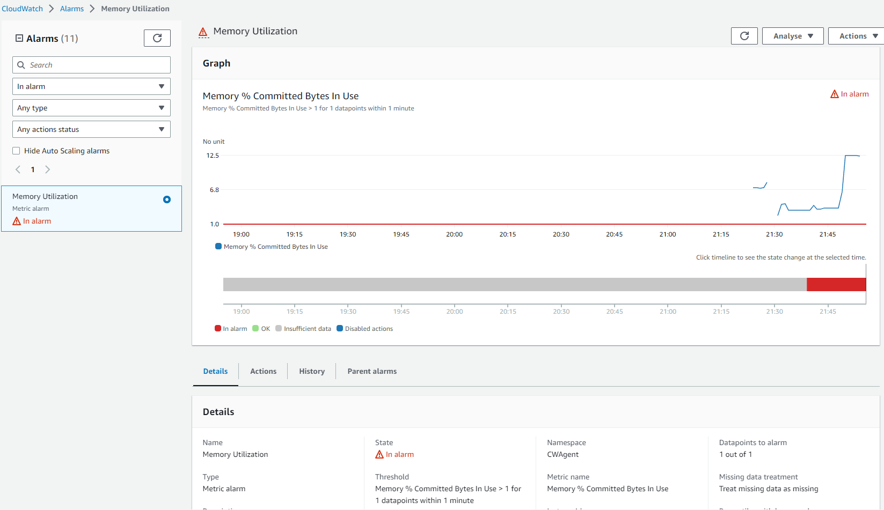

一旦告警触发，电子邮件通知将作为操作发送到 SNS 主题。

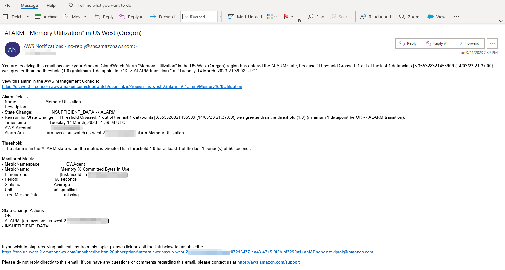

#### 自动扩展实例的监控

Amazon EC2 Auto Scaling 帮助客户确保有正确数量的 Amazon EC2 实例可用于处理应用程序的负载。[Amazon EC2 Auto Scaling 指标](https://docs.aws.amazon.com/autoscaling/ec2/userguide/ec2-auto-scaling-cloudwatch-monitoring.html) 收集有关 Auto Scaling 组的信息，并位于 AWS/AutoScaling 命名空间中。表示自动扩展实例的 CPU 和其他使用数据的 Amazon EC2 实例指标位于 AWS/EC2 命名空间中。

### CloudWatch 中的仪表板

了解 AWS 账户中的资源清单、资源性能和健康检查对于稳定的资源管理非常重要。[Amazon CloudWatch 仪表板](https://docs.aws.amazon.com/AmazonCloudWatch/latest/monitoring/CloudWatch_Dashboards.html) 是 CloudWatch 控制台中的可自定义主页，可用于在单个视图中监控您的资源，即使是跨不同区域的资源。有几种方法可以很好地查看和了解可用的 Amazon EC2 实例。

#### CloudWatch 中的自动仪表板

自动仪表板在所有 AWS 公共区域中可用，提供了包括 Amazon EC2 实例在内的所有 AWS 资源的健康和性能的聚合视图。这有助于客户快速开始监控、基于资源的指标和告警视图，并轻松深入分析性能问题的根本原因。自动仪表板预构建了 AWS 服务推荐的 [最佳实践](https://docs.aws.amazon.com/prescriptive-guidance/latest/implementing-logging-monitoring-cloudwatch/cloudwatch-dashboards-visualizations.html)，保持资源感知，并动态更新以反映重要性能指标的最新状态。

#### CloudWatch 中的自定义仪表板

使用 [自定义仪表板](https://docs.aws.amazon.com/AmazonCloudWatch/latest/monitoring/create_dashboard.html)，客户可以创建任意数量的附加仪表板，并使用不同的小部件进行自定义。仪表板可以配置为跨区域和跨账户视图，并可以添加到收藏夹列表中。

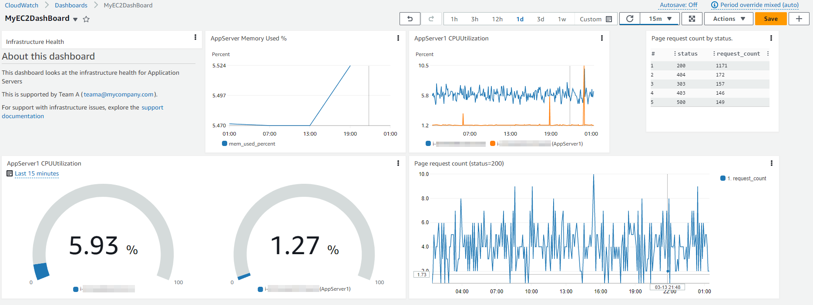

#### CloudWatch 中的资源健康仪表板

CloudWatch ServiceLens 中的资源健康是一个完全托管的解决方案，客户可以使用它来自动发现、管理和可视化其应用程序中 [Amazon EC2 主机的健康和性能](https://aws.amazon.com/blogs/mt/introducing-cloudwatch-resource-health-monitor-ec2-hosts/)。客户可以通过性能维度（如 CPU 或内存）可视化其主机的健康状况，并使用过滤器（如实例类型、实例状态或安全组）对数百台主机进行切片和切块。它支持对一组 EC2 主机进行并排比较，并提供对单个主机的细粒度见解。

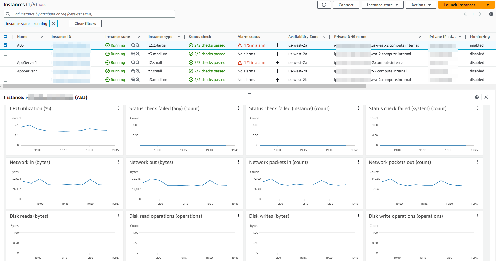

## 使用开源工具进行监控和可观测性

### 使用 AWS Distro for OpenTelemetry 监控 Amazon EC2 实例

[AWS Distro for OpenTelemetry (ADOT)](https://aws.amazon.com/otel) 是 OpenTelemetry 项目的安全、生产就绪、AWS 支持的分发版。作为 Cloud Native Computing Foundation 的一部分，OpenTelemetry 提供了开源 API、库和代理，用于收集分布式追踪和指标以进行应用程序监控。通过 AWS Distro for OpenTelemetry，客户可以仅检测一次应用程序，以将相关的指标和追踪发送到多个 AWS 和合作伙伴监控解决方案。

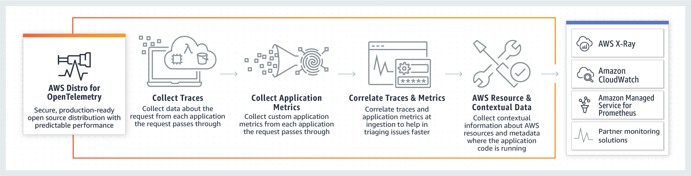

AWS Distro for OpenTelemetry (ADOT) 提供了一个分布式监控框架，能够以简单的方式关联数据以监控应用程序的性能和健康状况，这对于提高服务可见性和维护至关重要。

ADOT 的关键组件包括 SDK、自动检测代理、收集器和导出器，用于将数据发送到后端服务。

[OpenTelemetry SDK](https://github.com/aws-observability): 支持 AWS 资源特定元数据的收集，支持 OpenTelemetry SDK 的 X-Ray 追踪格式和上下文。OpenTelemetry SDK 现在关联从 AWS X-Ray 和 CloudWatch 摄取的追踪和指标数据。

[自动检测代理](https://aws-otel.github.io/docs/getting-started/java-sdk/auto-instr): OpenTelemetry Java 自动检测代理中添加了对 AWS SDK 和 AWS X-Ray 追踪数据的支持。

[OpenTelemetry Collector](https://github.com/open-telemetry/opentelemetry-collector): 分发版中的收集器是使用上游 OpenTelemetry 收集器构建的。向上游收集器添加了 AWS 特定的导出器，以将数据发送到 AWS 服务，包括 AWS X-Ray、Amazon CloudWatch 和 Amazon Managed Service for Prometheus。

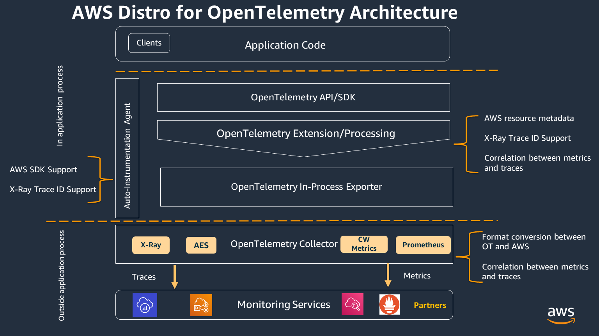

#### 通过 ADOT Collector 和 Amazon CloudWatch 获取指标和追踪

AWS Distro for OpenTelemetry (ADOT) Collector 可以与 CloudWatch 代理一起安装在 Amazon EC2 实例上，并使用 OpenTelemetry SDK 从运行在 Amazon EC2 实例上的工作负载中收集应用程序追踪和指标。

为了支持 OpenTelemetry 指标在 Amazon CloudWatch 中的使用，[AWS EMF Exporter for OpenTelemetry Collector](https://github.com/open-telemetry/opentelemetry-collector-contrib/tree/main/exporter/awsemfexporter) 将 OpenTelemetry 格式的指标转换为 CloudWatch 嵌入式指标格式 (EMF)，使集成了 OpenTelemetry 指标的应用程序能够将高基数的应用程序指标发送到 CloudWatch。[X-Ray 导出器](https://aws-otel.github.io/docs/getting-started/x-ray#configuring-the-aws-x-ray-exporter) 允许将以 OTLP 格式收集的追踪导出到 [AWS X-ray](https://aws.amazon.com/xray/)。

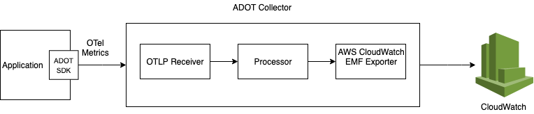

可以通过 AWS CloudFormation 或使用 [AWS Systems Manager Distributor](https://catalog.workshops.aws/observability/en-US/aws-managed-oss/ec2-monitoring/configure-adot-collector) 在 Amazon EC2 上安装 ADOT Collector 以收集应用程序指标。

### 使用 Prometheus 监控 Amazon EC2 实例

[Prometheus](https://prometheus.io/) 是一个独立的开源项目，独立维护用于系统监控和告警。Prometheus 收集并存储指标作为时间序列数据，即指标信息与记录时的时间戳一起存储，以及称为标签的可选键值对。

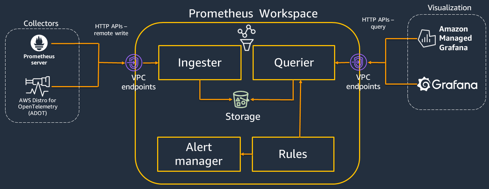

Prometheus 通过命令行标志进行配置，所有配置详细信息都保存在 prometheus.yaml 文件中。配置文件中的 'scrape_config' 部分指定了目标以及如何抓取它们的参数。[Prometheus 服务发现](https://github.com/prometheus/prometheus/tree/main/discovery) (SD) 是一种查找要抓取指标的端点的方法。Amazon EC2 服务发现配置允许从 AWS EC2 实例中检索抓取目标，并在 `ec2_sd_config` 中进行配置。

#### 通过 Prometheus 和 Amazon CloudWatch 获取指标

可以在 EC2 实例上安装并配置 CloudWatch 代理与 Prometheus 以抓取指标以在 CloudWatch 中进行监控。这对于喜欢在 EC2 上运行容器工作负载并需要与开源 Prometheus 监控兼容的自定义指标的客户非常有帮助。安装 CloudWatch 代理可以按照前面部分中解释的步骤进行。CloudWatch 代理与 Prometheus 监控需要两个配置来抓取 Prometheus 指标。一个是标准的 Prometheus 配置，如 Prometheus 文档中的 'scrape_config' 所述。另一个是 [CloudWatch 代理配置](https://docs.aws.amazon.com/AmazonCloudWatch/latest/monitoring/CloudWatch-Agent-PrometheusEC2.html#CloudWatch-Agent-PrometheusEC2-configure)。

#### 通过 Prometheus 和 ADOT Collector 获取指标

客户可以选择为其可观测性需求设置全开源环境。为此，可以配置 AWS Distro for OpenTelemetry (ADOT) Collector 以从 Prometheus 检测的应用程序中抓取指标并将指标发送到 Prometheus 服务器。此流程中涉及三个 OpenTelemetry 组件，分别是 Prometheus 接收器、Prometheus 远程写入导出器和 Sigv4 认证扩展。Prometheus 接收器接收 Prometheus 格式的指标数据。Prometheus 导出器以 Prometheus 格式导出数据。Sigv4 认证扩展提供 Sigv4 认证以向 AWS 服务发出请求。

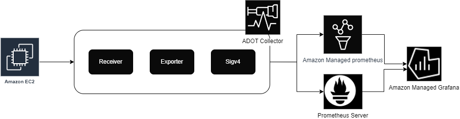

#### Prometheus Node Exporter

[Prometheus Node Exporter](https://github.com/prometheus/node_exporter) 是一个用于云环境的开源时间序列监控和告警系统。Amazon EC2 实例可以使用 Node Exporter 进行检测，以收集并存储节点级指标作为时间序列数据，记录带有时间戳的信息。Node exporter 是一个 Prometheus 导出器，可以通过 URL http://localhost:9100/metrics 公开各种主机指标。

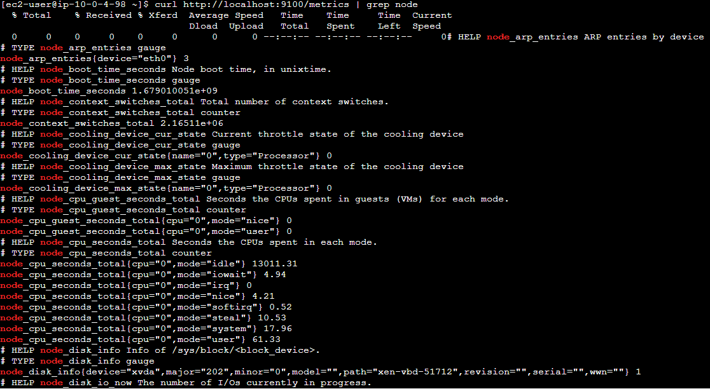

一旦创建了指标，就可以将它们发送到 [Amazon Managed Prometheus](https://aws.amazon.com/prometheus/)。

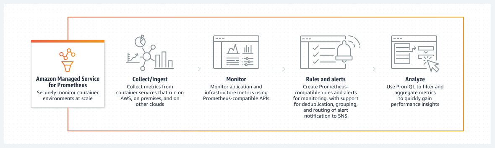

### 使用 Fluent Bit 插件从 Amazon EC2 实例流式传输日志

[Fluent Bit](https://fluentbit.io/) 是一个开源的多平台日志处理工具，用于大规模处理数据收集，收集和聚合来自各种信息源、各种数据格式、数据可靠性、安全性、灵活路由和多个目的地的数据。

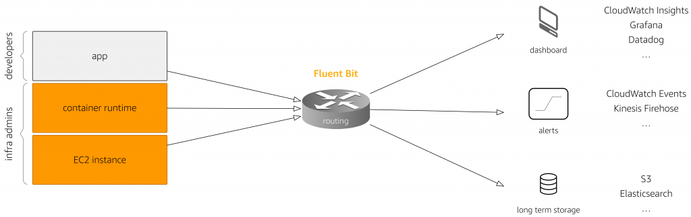

Fluent Bit 帮助创建一个简单的扩展点，用于将日志从 Amazon EC2 流式传输到 AWS 服务，包括 Amazon CloudWatch 以进行日志保留和分析。新推出的 [Fluent Bit 插件](https://github.com/aws/amazon-cloudwatch-logs-for-fluent-bit#new-higher-performance-core-fluent-bit-plugin) 可以将日志路由到 Amazon CloudWatch。

### 使用 Amazon Managed Grafana 进行仪表板

[Amazon Managed Grafana](https://aws.amazon.com/grafana/) 是一个基于开源 Grafana 项目的完全托管服务，提供丰富的、交互式的、安全的数据可视化，帮助客户即时查询、关联、分析、监控和告警跨多个数据源的指标、日志和追踪。客户可以创建交互式仪表板并与组织中的任何人共享，提供自动扩展、高可用性和企业级安全服务。通过 Amazon Managed Grafana，客户可以管理用户和团队对跨 AWS 账户、AWS 区域和数据源的仪表板的访问。

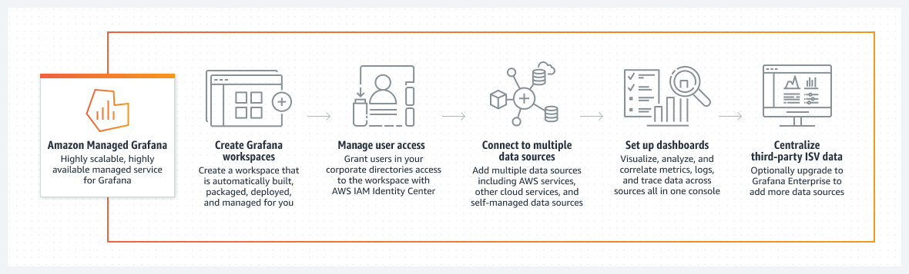

Amazon Managed Grafana 可以通过在 Grafana 工作区控制台中使用 AWS 数据源配置选项添加 Amazon CloudWatch 作为数据源。此功能通过发现现有的 CloudWatch 账户并管理访问 CloudWatch 所需的认证凭据的配置，简化了添加 CloudWatch 作为数据源的过程。Amazon Managed Grafana 还支持 [Prometheus 数据源](https://docs.aws.amazon.com/grafana/latest/userguide/prometheus-data-source.html)，即自托管的 Prometheus 服务器和 Amazon Managed Service for Prometheus 工作区作为数据源。

Amazon Managed Grafana 提供了各种面板，使构建正确的查询和自定义显示属性变得容易，允许客户创建所需的仪表板。

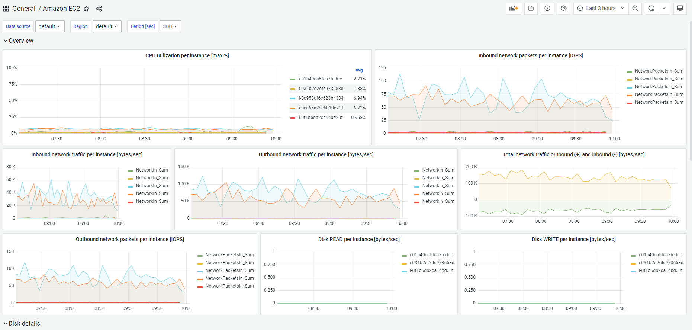

## 结论

监控让您了解系统是否正常工作。可观测性让您了解系统为什么不能正常工作。良好的可观测性使您能够回答您不知道需要了解的问题。监控与可观测性为测量系统的内部状态铺平了道路，这些状态可以从其输出中推断出来。

现代应用程序，那些在云中运行的微服务、无服务器和异步架构，生成大量数据，形式为指标、日志、追踪和事件。Amazon CloudWatch 与开源工具（如 Amazon Distro for OpenTelemetry、Amazon Managed Prometheus 和 Amazon Managed Grafana）一起，使客户能够在一个统一的平台上收集、访问和关联这些数据。帮助客户打破数据孤岛，以便轻松获得系统范围内的可见性并快速解决问题。