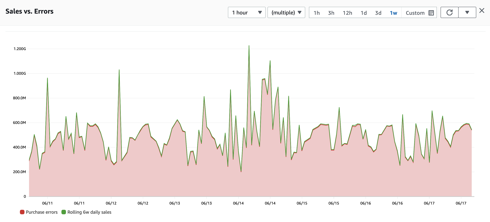

# 最佳实践概览

可观测性是一个范围广泛、工具成熟的领域，但并非每种工具都适合每个方案。为帮助你更好地应对可观测性需求、配置和最终部署，我们总结了五大关键最佳实践，帮助你在制定可观测性策略时做出更明智的决策。

## 监控重要内容

可观测性最重要的并不是服务器、网络、应用或用户，而是对*你*，你的业务、项目或用户而言最严重或最值得关注的那部分指标。

首先要明确成功的标准。例如，如果你运营一个电商应用，那么衡量成功的指标也许是在过去一小时内的购买次数。如果你是一家非营利组织，则可能是每月的捐款数量相对于目标值的完成度。支付处理方或许需要关注交易处理时长，而大学则更关注学生出勤率。

:::tip
	每个人的成功指标都不同！我们可能会用电商应用作为示例，但你的项目可能有完全不同的衡量标准。无论如何，原则不变：明确*好*应该是什么样子，并进行测量。
:::

不管你的应用是什么，第一步都是确认关键指标。然后*逆向思考*[^1]，找到哪些应用或基础设施层面的因素会影响这些指标。例如，如果 Web 服务器的高 CPU 利用率会影响客户满意度，而客户满意度又会影响销售，那么就必须监控 CPU 利用率。

#### 明确目标并对其进行测量

确认关键业务指标之后，你需要有自动化方式来监测和测量这些指标。至关重要的一点是，要在同一个系统里汇总这些业务指标和你的工作负载运维信号。以我们的电商负载为例，可能需要：

* 将销售数据导入[*时序数据*](https://en.wikipedia.org/wiki/Time_series)
* 跟踪用户注册量，并保存在同一个系统中
* 测量用户在网页上停留的时间并将数据再次写入时序

大多数用户其实已经拥有这些数据，但未必通过可观测性的方式进行收集。销售数据常见于关系型数据库或商业智能报告系统，而用户停留时长可从日志或 [实时用户监测 (RUM)](../tools/rum) 中获取。

无论原始位置或格式如何，都务必将这些关键指标维持成[*时序数据*](https://en.wikipedia.org/wiki/Time_series)。只有把最重要的业务、个人、学术或其他重要目的的数据都转换为时序格式，你才可将这些信息与其它可观测性数据（有时称为*信号*或*遥测*）进行关联。

*图 1：时序数据示例*

## 上下文传递与工具选择

在可观测性中，工具的选择非常重要，会直接影响运维和故障排查。但如果只采集部分基础信号类型，可能比选错工具更糟糕。比如，你只收集了工作负载的 [日志](../signals/logs)，却没有收集交易追踪，就会产生空白视图，导致无法全面了解整个应用体验。现代可观测性通常依赖*串联*应用追踪信息。

要全面了解健康状况和运维状态，需要收集 [日志](../signals/logs)、[指标](../signals/metrics) 和 [追踪](../signals/traces)，并进行关联、分析、[异常检测](../signals/anomalies)、[仪表盘](../tools/dashboards)、[告警](../tools/alarms) 等。

:::info
	有些可观测性解决方案可能并不包含所有上述功能，而是用于补充、扩展或赋能已有系统。在任何情况下，工具的可互操作性和可扩展性仍是开始可观测性项目时的重要考量因素。
:::

#### 每个工作负载都不同，但通用工具让结果更快落地

在各个工作负载中采用尽量统一的工具有额外好处，可以减少运维阻力和培训成本，一般应尽量减少使用过多工具或供应商。这样可让你更快地在新环境或新工作负载中部署现有可观测性方案，并在问题出现时更快进行故障排查。

你的工具应足够通用，以覆盖工作负载的方方面面：基础设施、应用程序、网站以及其他各种功能层。当无法单一工具覆盖所有需求时，选择那些遵循开放标准、开源、跨平台集成度高的工具通常是最佳做法。

#### 与现有工具和流程集成

不要重新发明轮子！「圆形」已经是一个很好的形状，而我们应该着力构建协作和开放的系统，而非数据孤岛。

* 与现有身份提供程序集成（如 Active Directory、基于 SAML 的 IdP）。
* 如果已有 IT 问题跟踪系统（如 JIRA、ServiceNow），则将可观测性告警与之关联，快速管理出现的问题。
* 如果已有工作负载管理和升级工具（如 PagerDuty、OpsGenie），就继续用它们！
* 基础设施即代码工具（如 Ansible、SaltStack、CloudFormation、TerraForm、CDK）非常适合，你也可以通过这些工具一并管理可观测性，而不是构建孤立的解决方案（详见[从第一天就把可观测性包含在内](#include-observability-from-day-one)）。

#### 使用自动化和机器学习

计算机非常适合发现模式，以及在数据不符合正常模式时发出提醒！如果你需要监控几百、几千甚至数百万个数据点，手动定义每个数据点的健康阈值几乎不可能。但很多可观测性工具已经提供异常检测和机器学习功能，能帮你处理这些繁琐的基线工作。

我们称之为「知道什么是健康状态」。如果你已经对工作负载进行了充分的负载测试，那么可能已经有了性能基线，但对于复杂的分布式应用，一一给每个指标创建基线仍然很难。这时异常检测、自动化和机器学习就至关重要。

使用能够自动管理应用健康基线并进行告警的工具，把更多时间留给你的业务目标，[监控真正重要的内容](#monitor-what-matters)。

## 从工作负载的所有层面收集遥测

你的应用并非孤立存在，与网络基础设施、云供应商、ISP、SaaS 合作伙伴以及各种内部和外部组件都有交互，这些因素都可能影响你的最终结果。你需要对整体工作负载有一个整体性的视图。

#### 关注集成点

如果要优先选择一个地方进行监测，毫无疑问是组件之间的集成处。在这里，可观测性的重要价值最能凸显。通常，每次一个组件/服务调用另一个组件/服务时，都应该至少收集以下数据：

1. 请求与响应的耗时  
2. 响应的状态  

要实现可观测性的全局视图，就必须在所收集的信号中有一个贯穿整个请求链的[*统一标识符*](../signals/traces)。

#### 别忘了终端用户体验

要获取对工作负载的完整视图，需要覆盖所有层，包括最终用户的真实体验。用户体验的好坏往往也会直接威胁到你的目标，这一点可能比监控磁盘空间或 CPU 利用率更重要。

如果你的负载面向直接用户（如任何通过网站或移动应用提供服务的应用），那么 [实时用户监测 (RUM)](../tools/rum) 不仅能监测到到达用户「最后一公里」的情况，还能帮助你了解用户实际上是如何使用你的应用。总之，如果用户无法真正使用你的服务，那么再完整的可观测性努力都毫无意义。

## 数据就是力量，但别纠结于细枝末节

根据应用规模，你可能需要从海量的组件中收集信号。尽管这样做很重要且能带来价值，但也存在效益递减。最佳实践是在[关注真正重要内容](#monitor-what-matters)的基础上，梳理清楚重要的集成和关键组件，然后聚焦真正重要的细节。

## 从第一天就把可观测性包含在内

和安全性类似，可观测性不应该被当作运维或开发的事后补救。最佳实践是在计划早期就纳入可观测性，这样能让系统更透明，就像纳入安全策略一样。比如，即便使用自动化埋点，后期才增加交易追踪也会花费时间。不过，你会发现这个投入非常值得，但如果在开发后期才进行，可会带来不必要的返工。

与其在工作负载上线后再去加入可观测性，不如用它来加速工作。通过对 [日志](../signals/logs)、[指标](../signals/metrics) 和 [追踪](../signals/traces) 的合理收集，可加快应用开发进程，提升工程实践，同时为今后的快速排障打下坚实基础。

[^1]: Amazon 广泛运用*逆向思考*法来持续关注客户及客户的预期结果，我们也建议任何可观测性实践者对自身目标应用相同的逆向思考方式。关于*逆向思考*，可在 [Werner Vogels 的博客](https://www.allthingsdistributed.com/2006/11/working_backwards.html) 了解更多。
