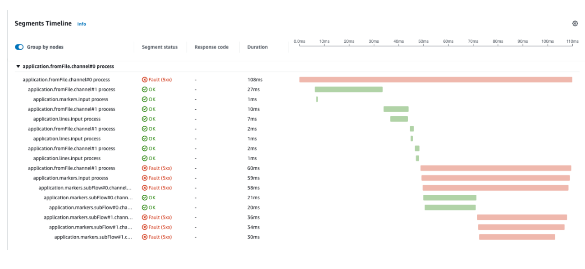

# 为 Java Spring 集成应用程序进行手动插桩

本文介绍了一种使用 [OpenTelemetry](https://opentelemetry.io/) 和 [X-Ray](https://aws.amazon.com/xray/) 手动插桩 [Spring Integration](https://docs.spring.io/spring-integration/reference/overview.html) 应用程序的方法。

Spring Integration 框架旨在支持开发典型的事件驱动架构和消息中心架构的集成解决方案。而 OpenTelemetry 更侧重于微服务架构，其中服务通过 HTTP 请求进行通信和协调。因此，本指南将提供一个示例，展示如何使用 OpenTelemetry API 手动插桩 Spring Integration 应用程序。

## 背景信息

### 什么是跟踪？

以下引用自 [OpenTelemetry 文档](https://opentelemetry.io/docs/concepts/signals/traces/) 的内容很好地概述了跟踪的目的：

:::note
    跟踪为我们提供了请求在应用程序中发生时的全局视图。无论您的应用程序是带有单一数据库的单体应用，还是复杂的服务网格，跟踪对于理解请求在应用程序中的完整“路径”至关重要。
:::

鉴于跟踪的主要好处之一是请求的端到端可见性，因此确保跟踪从请求源头到后端的正确链接非常重要。在 OpenTelemetry 中，常见的做法是使用 [嵌套跨度](https://opentelemetry.io/docs/instrumentation/java/manual/#create-nested-spans)。这在微服务架构中有效，其中跨度从一个服务传递到另一个服务，直到到达最终目的地。在 Spring Integration 应用程序中，我们需要在远程和本地创建的跨度之间创建父子关系。

## 使用上下文传播进行跟踪

我们将演示一种使用上下文传播的方法。尽管这种方法传统上用于在本地和远程位置创建的跨度之间建立父子关系，但它将用于 Spring Integration 应用程序的情况，因为它简化了代码，并使应用程序能够扩展：可以在多个线程中并行处理消息，也可以在需要时水平扩展以在不同主机上处理消息。

以下是实现此目标所需的概述：

- 创建一个 ```ChannelInterceptor``` 并将其注册为 ```GlobalChannelInterceptor```，以便它可以捕获在所有通道中发送的消息。

- 在 ```ChannelInterceptor``` 中：
  - 在 ```preSend``` 方法中：
    - 尝试从上游生成的消息中读取上下文。这是我们能够连接上游消息的跨度的地方。如果不存在上下文，则启动新的跟踪（由 OpenTelemetry SDK 完成）。
    - 创建一个具有唯一名称的 Span，以标识该操作。这可以是处理此消息的通道的名称。
    - 将当前上下文保存在消息中。
    - 将上下文和范围存储在 thread.local 中，以便稍后关闭。
    - 将上下文注入到下游发送的消息中。
  - 在 ```afterSendCompletion``` 中：
    - 从 thread.local 恢复上下文和范围。
    - 从上下文中重新创建 Span。
    - 注册处理消息时引发的任何异常。
    - 关闭 Scope。
    - 结束 Span。

这是对需要完成的工作的简化描述。我们提供了一个使用 Spring Integration 框架的功能示例应用程序。该应用程序的代码可以在 [这里](https://github.com/rapphil/spring-integration-samples/tree/rapphil-5.5.x-otel/applications/file-split-ftp) 找到。

要仅查看为插桩应用程序所做的更改，请查看此 [diff](https://github.com/rapphil/spring-integration-samples/compare/30e01ce9eefd8dae288eca44013810afa8c1a585..6f056a76350340a9658db0cad7fc12dbda505437)。

### 运行此示例应用程序：

``` bash
# 构建并运行
mvn spring-boot:run
# 创建示例输入文件以触发流程
echo 'testcontent\nline2content\nlastline' > /tmp/in/testfile.txt
```

要试验此示例应用程序，您需要在与应用程序相同的机器上运行 [ADOT Collector](https://aws-otel.github.io/docs/getting-started/collector)，并使用类似于以下配置的配置：

``` yaml
receivers:
  otlp:
    protocols:
      grpc: 
        endpoint: 0.0.0.0:4317
      http:
        endpoint: 0.0.0.0:4318
processors:
  batch/traces:
    timeout: 1s
    send_batch_size: 50
  batch/metrics:
    timeout: 60s
exporters:
  aws xray: region:us-west-2
  aws emf:
    region: us-west-2
service:
  pipelines:
    traces:
      receivers: [otlp]
      processors: [batch/traces]
      exporters: [awsxray]
    metrics:
      receivers: [otlp]
      processors: [batch/metrics]
      exporters: [awsemf]
```

## 结果

如果我们运行示例应用程序，然后运行以下命令，我们将得到以下结果：

``` bash
echo 'foo123\nbar123\nfoo1234' > /tmp/in/testfile.txt
```



我们可以看到，上述片段与示例应用程序中描述的工作流程相匹配。在处理某些消息时预期会出现异常，因此我们可以看到它们被正确注册，并允许我们在 X-Ray 中进行故障排除。

## 常见问题

### 如何创建嵌套跨度？

在 OpenTelemetry 中，有三种机制可用于连接跨度：

##### 显式

您需要将父跨度传递到创建子跨度的地方，并使用以下代码将它们链接起来：

``` java
    Span childSpan = tracer.spanBuilder("child")
    .setParent(Context.current().with(parentSpan)) 
    .startSpan();
```

##### 隐式

跨度上下文将存储在 thread.local 中。当您确定在同一线程中创建跨度时，建议使用此方法。

``` java
    void parentTwo() {
        Span parentSpan = tracer.spanBuilder("parent").startSpan(); 
        try(Scope scope = parentSpan.makeCurrent()) {
            childTwo(); 
        } finally {
        parentSpan.end(); 
        }
    }
    void childTwo() {
        Span childSpan = tracer.spanBuilder("child")
            // 注意：不需要 setParent(...)；
            // `Span.current()` 会自动添加为父级
            .startSpan();
        try(Scope scope = childSpan.makeCurrent()) { 
            // 执行操作
        } finally {
            childSpan.end();
        } 
    }
```

##### 上下文传播

此方法将上下文存储在某个地方（HTTP 头或消息中），以便可以将其传输到创建子跨度的远程位置。严格来说，这并不一定要是远程位置。它也可以在同一进程中使用。

### OpenTelemetry 属性如何转换为 X-Ray 属性？

请参阅以下 [指南](https://opentelemetry.io/docs/instrumentation/java/manual/#context-propagation) 以查看它们之间的关系。