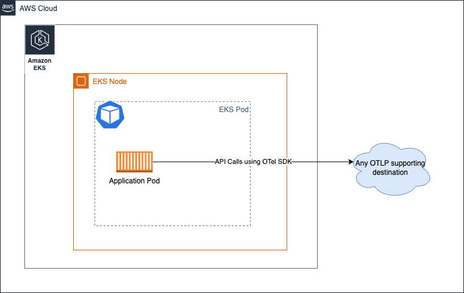
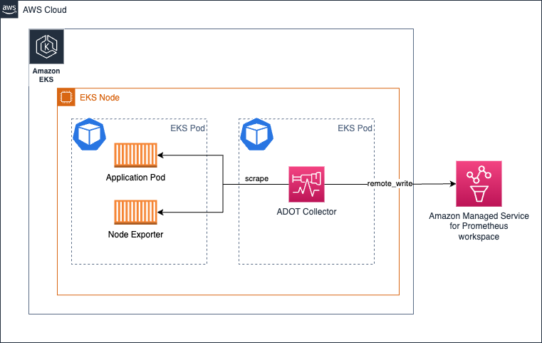
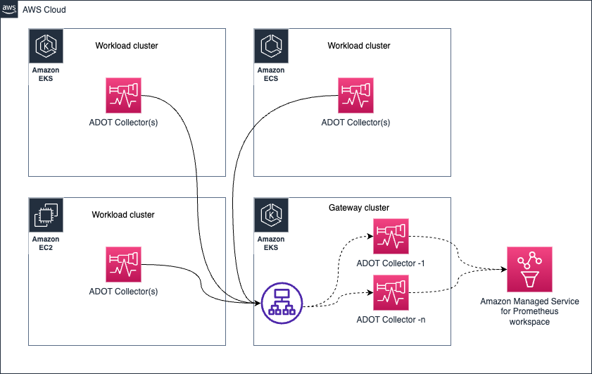
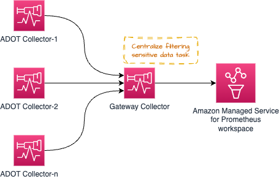
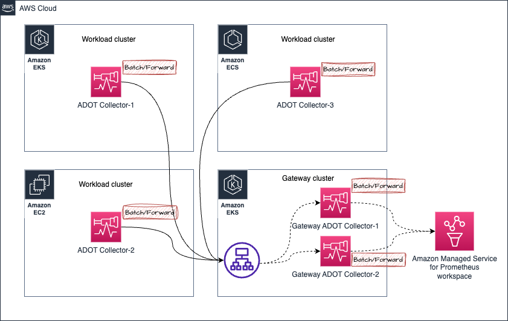

# 操作 AWS Distro for OpenTelemetry (ADOT) Collector

[ADOT Collector](https://aws-otel.github.io/) 是 [CNCF](https://www.cncf.io/) 开源的 [OpenTelemetry Collector](https://opentelemetry.io/docs/collector/) 的下游发行版。

客户可以使用 ADOT Collector 从不同环境（包括本地、AWS 和其他云提供商）收集信号，如指标和跟踪。

为了在现实环境中大规模操作 ADOT Collector，操作员应监控收集器的健康状况，并根据需要进行扩展。在本指南中，您将了解在生产环境中操作 ADOT Collector 时可以采取的措施。

## 部署架构

根据您的需求，有几种部署选项可供考虑。

* 无 Collector
* 代理模式
* 网关模式

:::tip
    查看 [OpenTelemetry 文档](https://opentelemetry.io/docs/collector/deployment/) 以获取有关这些概念的更多信息。
:::

### 无 Collector
此选项完全跳过 Collector。如果您不知道，可以直接从 OTEL SDK 调用目标服务的 API 并发送信号。想象一下，您可以直接从应用程序进程调用 AWS X-Ray 的 [PutTraceSegments](https://docs.aws.amazon.com/xray/latest/api/API_PutTraceSegments.html) API，而不是将跨度发送到像 ADOT Collector 这样的进程外代理。

我们强烈建议您查看 [上游文档中的部分](https://opentelemetry.io/docs/collector/deployment/no-collector/) 以获取更多详细信息，因为这种方法没有任何 AWS 特定的方面会改变指导。



### 代理模式
在这种方法中，您将以分布式方式运行 Collector 并将信号收集到目标中。与“无 Collector”选项不同，这里我们将关注点分离，并将应用程序与必须使用其资源进行远程 API 调用解耦，而是与本地可访问的代理通信。

在 Amazon EKS 环境中，**将 Collector 作为 Kubernetes 边车运行** 的架构如下所示：


在上述架构中，您的抓取配置不应使用任何服务发现机制，因为您将从 `localhost` 抓取目标，因为 Collector 与应用程序容器在同一 Pod 中运行。

相同的架构也适用于收集跟踪。您只需创建一个 OTEL 管道，如 [此处所示](https://aws-otel.github.io/docs/getting-started/x-ray#sample-collector-configuration-putting-it-together)

##### 优缺点
* 支持此设计的一个论点是，您不必为 Collector 分配过多的资源（CPU、内存），因为目标仅限于本地源。

* 使用这种方法的缺点可能是，Collector Pod 配置的多样化配置与您在集群上运行的应用程序数量成正比。这意味着，您必须根据 Pod 的预期工作负载为每个 Pod 单独管理 CPU、内存和其他资源分配。如果不小心处理，您可能会过度分配或不足分配 Collector Pod 的资源，从而导致性能不佳或锁定 CPU 周期和内存，这些资源本可以用于节点中的其他 Pod。

您还可以根据需要以其他模式（如 Deployment、Daemonset、Statefulset 等）部署 Collector。

#### 在 Amazon EKS 上以 Daemonset 运行 Collector

如果您希望将 Collector 的负载（抓取并将指标发送到 Amazon Managed Service for Prometheus 工作区）均匀分布在 EKS 节点上，您可以选择以 [Daemonset](https://kubernetes.io/docs/concepts/workloads/controllers/daemonset/) 运行 Collector。



确保您有 `keep` 操作，使 Collector 仅从其自己的主机/节点抓取目标。

请参阅下面的示例以获取参考。更多配置详细信息请参见 [此处](https://aws-otel.github.io/docs/getting-started/adot-eks-add-on/config-advanced#daemonset-collector-configuration)。

```yaml
scrape_configs:
    - job_name: kubernetes-apiservers
    bearer_token_file: /var/run/secrets/kubernetes.io/serviceaccount/token
    kubernetes_sd_configs:
    - role: endpoints
    relabel_configs:
    - action: keep
        regex: $K8S_NODE_NAME
        source_labels: [__meta_kubernetes_endpoint_node_name]
    scheme: https
    tls_config:
        ca_file: /var/run/secrets/kubernetes.io/serviceaccount/ca.crt
        insecure_skip_verify: true
```

相同的架构也可用于收集跟踪。在这种情况下，应用程序 Pod 将跟踪跨度发送到 Collector，而不是 Collector 抓取 Prometheus 指标。

##### 优缺点
**优点**

* 最少的扩展问题
* 配置高可用性是一个挑战
* 使用了太多 Collector 副本
* 日志支持很容易

**缺点**

* 在资源利用方面不是最优的
* 资源分配不均衡

#### 在 Amazon EC2 上运行 Collector
由于在 EC2 上运行 Collector 没有边车方法，您将在 EC2 实例上以代理模式运行 Collector。您可以设置静态抓取配置，如下所示，以发现实例中的目标并从中抓取指标。

以下配置抓取本地主机上端口 `9090` 和 `8081` 的端点。

通过我们的 [One Observability Workshop 中的 EC2 模块](https://catalog.workshops.aws/observability/en-US/aws-managed-oss/ec2-monitoring) 深入了解此主题。

```yaml
global:
  scrape_interval: 15s # 默认情况下，每 15 秒抓取一次目标。

scrape_configs:
- job_name: 'prometheus'
  static_configs:
  - targets: ['localhost:9090', 'localhost:8081']
```

#### 在 Amazon EKS 上以 Deployment 运行 Collector

以 Deployment 运行 Collector 特别适用于您希望为 Collector 提供高可用性的情况。根据目标数量、可抓取的指标等，应调整 Collector 的资源，以确保 Collector 不会因资源不足而导致信号收集问题。

[在此处阅读有关此主题的指南](https://aws-observability.github.io/observability-best-practices/guides/containers/oss/eks/best-practices-metrics-collection)

以下架构显示了如何在工作负载节点外部的单独节点中部署 Collector 以收集指标和跟踪。


要为指标收集设置高可用性，[请阅读我们的文档，其中提供了如何设置高可用性的详细说明](https://docs.aws.amazon.com/prometheus/latest/userguide/Send-high-availability-prom-community.html)

#### 在 Amazon ECS 上以中央任务运行 Collector 进行指标收集

您可以使用 [ECS Observer 扩展](https://github.com/open-telemetry/opentelemetry-collector-contrib/tree/main/extension/observer/ecsobserver) 来收集 ECS 集群中不同任务或跨集群的 Prometheus 指标。


扩展的 Collector 配置示例：

```yaml
extensions:
  ecs_observer:
    refresh_interval: 60s # 格式为 https://golang.org/pkg/time/#ParseDuration
    cluster_name: 'Cluster-1' # 集群名称需要手动配置
    cluster_region: 'us-west-2' # 区域可以直接配置或使用 AWS_REGION 环境变量
    result_file: '/etc/ecs_sd_targets.yaml' # 文件目录必须已存在
    services:
      - name_pattern: '^retail-.*$'
    docker_labels:
      - port_label: 'ECS_PROMETHEUS_EXPORTER_PORT'
    task_definitions:
      - job_name: 'task_def_1'
        metrics_path: '/metrics'
        metrics_ports:
          - 9113
          - 9090
        arn_pattern: '.*:task-definition/nginx:[0-9]+'
```

##### 优缺点
* 这种模式的一个优势是，您需要管理的 Collector 和配置较少。
* 当集群较大且有数千个目标需要抓取时，您必须仔细设计架构，以便在 Collector 之间平衡负载。再加上为高可用性运行近乎相同的 Collector 副本，应谨慎操作，以避免操作问题。

### 网关模式



## 管理 Collector 健康

OTEL Collector 暴露了几个信号，供我们监控其健康状况和性能。密切监控 Collector 的健康状况至关重要，以便采取纠正措施，例如：

* 水平扩展 Collector
* 为 Collector 提供额外的资源，以确保其按预期运行

### 从 Collector 收集健康指标

OTEL Collector 可以通过简单地将 `telemetry` 部分添加到 `service` 管道中来配置为以 Prometheus Exposition 格式暴露指标。Collector 还可以将其日志暴露到 stdout。

有关遥测配置的更多详细信息，请参见 [OpenTelemetry 文档](https://opentelemetry.io/docs/collector/configuration/#service)。

Collector 的遥测配置示例。

```yaml
service:
  telemetry:
    logs:
      level: debug
    metrics:
      level: detailed
      address: 0.0.0.0:8888
```

配置后，Collector 将开始在 `http://localhost:8888/metrics` 处导出如下指标。

```bash
# HELP otelcol_exporter_enqueue_failed_spans 未能添加到发送队列的跨度数。
# TYPE otelcol_exporter_enqueue_failed_spans counter
otelcol_exporter_enqueue_failed_spans{exporter="awsxray",service_instance_id="523a2182-539d-47f6-ba3c-13867b60092a",service_name="aws-otel-collector",service_version="v0.25.0"} 0

# HELP otelcol_process_runtime_total_sys_memory_bytes 从操作系统获取的总内存字节数（参见 'go doc runtime.MemStats.Sys'）
# TYPE otelcol_process_runtime_total_sys_memory_bytes gauge
otelcol_process_runtime_total_sys_memory_bytes{service_instance_id="523a2182-539d-47f6-ba3c-13867b60092a",service_name="aws-otel-collector",service_version="v0.25.0"} 2.4462344e+07

# HELP otelcol_process_memory_rss 总物理内存（驻留集大小）
# TYPE otelcol_process_memory_rss gauge
otelcol_process_memory_rss{service_instance_id="523a2182-539d-47f6-ba3c-13867b60092a",service_name="aws-otel-collector",service_version="v0.25.0"} 6.5675264e+07

# HELP otelcol_exporter_enqueue_failed_metric_points 未能添加到发送队列的指标点数。
# TYPE otelcol_exporter_enqueue_failed_metric_points counter
otelcol_exporter_enqueue_failed_metric_points{exporter="awsxray",service_instance_id="d234b769-dc8a-4b20-8b2b-9c4f342466fe",service_name="aws-otel-collector",service_version="v0.25.0"} 0
otelcol_exporter_enqueue_failed_metric_points{exporter="logging",service_instance_id="d234b769-dc8a-4b20-8b2b-9c4f342466fe",service_name="aws-otel-collector",service_version="v0.25.0"} 0
```

在上面的示例输出中，您可以看到 Collector 暴露了一个名为 `otelcol_exporter_enqueue_failed_spans` 的指标，显示未能添加到发送队列的跨度数。此指标是了解 Collector 在将跟踪数据发送到配置的目标时是否遇到问题的关键。在这种情况下，您可以看到 `exporter` 标签的值为 `awsxray`，表示正在使用的跟踪目标。

另一个指标 `otelcol_process_runtime_total_sys_memory_bytes` 是了解 Collector 使用的内存量的指标。如果此内存接近 `otelcol_process_memory_rss` 指标中的值，则表明 Collector 即将耗尽为进程分配的内存，您可能需要采取行动，例如为 Collector 分配更多内存以避免问题。

同样，您可以看到另一个计数器指标 `otelcol_exporter_enqueue_failed_metric_points`，它指示未能发送到远程目标的指标数。

#### Collector 健康检查
Collector 暴露了一个活跃度探针，供您检查 Collector 是否存活。建议使用该端点定期检查 Collector 的可用性。

[`healthcheck`](https://github.com/open-telemetry/opentelemetry-collector-contrib/tree/main/extension/healthcheckextension) 扩展可用于使 Collector 暴露该端点。请参阅下面的示例配置：

```yaml
extensions:
  health_check:
    endpoint: 0.0.0.0:13133
```

有关完整配置选项，请参阅 [GitHub 仓库](https://github.com/open-telemetry/opentelemetry-collector-contrib/tree/main/extension/healthcheckextension)。

```bash
❯ curl -v http://localhost:13133
*   Trying 127.0.0.1:13133...
* Connected to localhost (127.0.0.1) port 13133 (#0)
> GET / HTTP/1.1
> Host: localhost:13133
> User-Agent: curl/7.79.1
> Accept: */*
>
* Mark bundle as not supporting multiuse
< HTTP/1.1 200 OK
< Date: Fri, 24 Feb 2023 19:09:22 GMT
< Content-Length: 0
<
* Connection #0 to host localhost left intact
```

#### 设置限制以防止灾难性故障
鉴于任何环境中的资源（CPU、内存）都是有限的，您应该为 Collector 组件设置限制，以避免由于不可预见的情况而导致故障。

在操作 ADOT Collector 收集 Prometheus 指标时，这一点尤为重要。考虑以下场景：您负责在 Amazon EKS 集群中部署和操作 ADOT Collector 的 DevOps 团队。您的应用程序团队可以随时随意部署其应用程序 Pod，他们期望从这些 Pod 暴露的指标被收集到 Amazon Managed Service for Prometheus 工作区中。

现在，您有责任确保此管道无故障运行。从高层次来看，有两种方法可以解决此问题：

* 无限扩展 Collector（因此根据需要向集群添加节点）以支持此需求
* 设置指标收集的上限，并向应用程序团队宣传上限阈值

这两种方法各有优缺点。如果您完全致力于支持不断增长的业务需求，而不考虑成本或可能带来的开销，您可能会选择选项 1。虽然支持无限增长的业务需求听起来像是“云是为了无限扩展”的观点，但这可能会带来大量的操作开销，并且如果没有无限的时间和人力资源来确保持续不间断的操作，可能会导致更灾难性的情况，这在大多数情况下是不切实际的。

更务实和节俭的方法是选择选项 2，即您在任何给定时间设置上限（并根据需要逐步增加），以确保操作边界明确。

以下是如何在 ADOT Collector 中使用 Prometheus 接收器执行此操作的示例。

在 Prometheus [scrape_config](https://prometheus.io/docs/prometheus/latest/configuration/configuration/#relabel_config) 中，您可以为任何特定的抓取作业设置多个限制。您可以设置以下限制：

* 抓取的总主体大小
* 限制接受的标签数量（如果超过此限制，抓取将被丢弃，您可以在 Collector 日志中看到）
* 限制要抓取的目标数量
* ..更多

您可以在 [Prometheus 文档](https://prometheus.io/docs/prometheus/latest/configuration/configuration/#relabel_config) 中查看所有可用选项。

##### 限制内存使用
Collector 管道可以配置为使用 [`memorylimiterprocessor`](https://github.com/open-telemetry/opentelemetry-collector/tree/main/processor/memorylimiterprocessor) 来限制处理器组件将使用的内存量。常见的情况是客户希望 Collector 执行需要大量内存和 CPU 资源的复杂操作。

虽然使用诸如 [`redactionprocessor`](https://github.com/open-telemetry/opentelemetry-collector-contrib/tree/main/processor/redactionprocessor)、[`filterprocessor`](https://github.com/open-telemetry/opentelemetry-collector-contrib/tree/main/processor/filterprocessor)、[`spanprocessor`](https://github.com/open-telemetry/opentelemetry-collector-contrib/tree/main/processor/spanprocessor) 等处理器非常令人兴奋且非常有用，但您还应记住，处理器通常处理数据转换任务，并且需要将数据保留在内存中以完成任务。这可能导致特定处理器完全破坏 Collector，并且 Collector 没有足够的内存来暴露其自身的健康指标。

您可以通过使用 [`memorylimiterprocessor`](https://github.com/open-telemetry/opentelemetry-collector/tree/main/processor/memorylimiterprocessor) 来限制 Collector 可以使用的内存量来避免这种情况。建议为此提供缓冲内存，以便 Collector 可以用于暴露健康指标和执行其他任务，从而避免处理器占用所有分配的内存。

例如，如果您的 EKS Pod 的内存限制为 `10Gi`，则将 `memorylimitprocessor` 设置为小于 `10Gi`，例如 `9Gi`，以便 `1Gi` 的缓冲区可用于执行其他操作，例如暴露健康指标、接收器和导出器任务。

#### 背压管理

某些架构模式（网关模式）如下所示，可用于集中一些操作任务，例如（但不限于）过滤掉信号数据中的敏感数据以保持合规性要求。



然而，可能会因过多的此类 _处理_ 任务而使网关 Collector 不堪重负，从而导致问题。推荐的方法是在各个 Collector 和网关之间分配处理/内存密集型任务，以便共享工作负载。

例如，您可以使用 [`resourceprocessor`](https://github.com/open-telemetry/opentelemetry-collector-contrib/tree/main/processor/resourceprocessor) 来处理资源属性，并使用 [`transformprocessor`](https://github.com/open-telemetry/opentelemetry-collector-contrib/tree/main/processor/transformprocessor) 在信号收集发生后立即转换信号数据。

然后，您可以使用 [`filterprocessor`](https://github.com/open-telemetry/opentelemetry-collector-contrib/tree/main/processor/filterprocessor) 过滤掉信号数据的某些部分，并使用 [`redactionprocessor`](https://github.com/open-telemetry/opentelemetry-collector-contrib/tree/main/processor/redactionprocessor) 编辑敏感信息，例如信用卡号等。

高级架构图如下所示：


正如您可能已经观察到的那样，网关 Collector 很快就会成为单点故障。一个明显的选择是启动多个网关 Collector，并通过负载均衡器（如 [AWS Application Load Balancer (ALB)](https://aws.amazon.com/elasticloadbalancing/application-load-balancer/)）代理请求，如下所示。


##### 处理 Prometheus 指标收集中的乱序样本

考虑以下架构中的场景：



1. 假设来自 Amazon EKS 集群中的 **ADOT Collector-1** 的指标被发送到网关集群，该集群被定向到 **网关 ADOT Collector-1**
1. 在某一时刻，来自同一 **ADOT Collector-1**（收集相同目标，因此处理相同的指标样本）的指标被发送到 **网关 ADOT Collector-2**
1. 现在，如果 **网关 ADOT Collector-2** 首先将指标发送到 Amazon Managed Service for Prometheus 工作区，然后 **网关 ADOT Collector-1** 发送包含相同指标系列的较旧样本的指标，您将从 Amazon Managed Service for Prometheus 收到 `out of order sample` 错误。

请参阅下面的错误示例：

```bash
Error message:
 2023-03-02T21:18:54.447Z        error   exporterhelper/queued_retry.go:394      Exporting failed. The error is not retryable. Dropping data.    {"kind": "exporter", "data_type": "metrics", "name": "prometheusremotewrite", "error": "Permanent error: Permanent error: remote write returned HTTP status 400 Bad Request; err = %!w(<nil>): user=820326043460_ws-5f42c3b6-3268-4737-b215-1371b55a9ef2: err: out of order sample. timestamp=2023-03-02T21:17:59.782Z, series={__name__=\"otelcol_exporter_send_failed_metric_points\", exporter=\"logging\", http_scheme=\"http\", instance=\"10.195.158.91:28888\", ", "dropped_items": 6474}
go.opentelemetry.io/collector/exporter/exporterhelper.(*retrySender).send
        go.opentelemetry.io/collector@v0.66.0/exporter/exporterhelper/queued_retry.go:394
go.opentelemetry.io/collector/exporter/exporterhelper.(*metricsSenderWithObservability).send
        go.opentelemetry.io/collector@v0.66.0/exporter/exporterhelper/metrics.go:135
go.opentelemetry.io/collector/exporter/exporterhelper.(*queuedRetrySender).start.func1
        go.opentelemetry.io/collector@v0.66.0/exporter/exporterhelper/queued_retry.go:205
go.opentelemetry.io/collector/exporter/exporterhelper/internal.(*boundedMemoryQueue).StartConsumers.func1
        go.opentelemetry.io/collector@v0.66.0/exporter/exporterhelper/internal/bounded_memory_queue.go:61
```

###### 解决乱序样本错误

您可以通过以下几种方式解决此特定设置中的乱序样本错误：

* 使用粘性负载均衡器，根据 IP 地址将来自特定源的请求定向到同一目标。

  有关更多详细信息，请参阅 [此链接](https://aws.amazon.com/premiumsupport/knowledge-center/elb-route-requests-with-source-ip-alb/)。

* 作为替代方案，您可以在网关 Collector 中添加外部标签以区分指标系列，以便 Amazon Managed Service for Prometheus 将这些指标视为单独的指标系列，而不是来自同一系列。

:::warning
        使用此解决方案将导致指标系列按网关 Collector 的数量成倍增加。这可能意味着您可能会超过某些限制，例如 [`活动时间序列限制`](https://docs.aws.amazon.com/prometheus/latest/userguide/AMP_quotas.html)
:::

* **如果您将 ADOT Collector 部署为 Daemonset**：确保使用 `relabel_configs` 仅保留来自每个 ADOT Collector Pod 运行的同一节点的样本。请查看以下链接以了解更多信息。
    - [Amazon Managed Prometheus 的高级 Collector 配置](https://aws-otel.github.io/docs/getting-started/adot-eks-add-on/config-advanced) - 展开 *Click to View* 部分，并查找类似于以下内容的条目：
        ```yaml
            relabel_configs:
            - action: keep
              regex: $K8S_NODE_NAME
        ```
    - [ADOT Add-On 高级配置](https://aws-otel.github.io/docs/getting-started/adot-eks-add-on/add-on-configuration) - 了解如何使用 ADOT Add-On for EKS 高级配置部署 ADOT Collector。
    - [ADOT Collector 部署策略](https://aws-otel.github.io/docs/getting-started/adot-eks-add-on/installation#deploy-the-adot-collector) - 了解更多关于大规模部署 ADOT Collector 的不同替代方案及其优势。

#### Open Agent Management Protocol (OpAMP)

OpAMP 是一种客户端/服务器协议，支持通过 HTTP 和 WebSockets 进行通信。OpAMP 在 OTel Collector 中实现，因此 OTel Collector 可以用作控制平面的一部分来管理支持 OpAMP 的其他代理，如 OTel Collector 本身。这里的“管理”部分涉及能够更新 Collector 的配置、监控健康状况甚至升级 Collector。

该协议的详细信息在 [上游 OpenTelemetry 网站](https://opentelemetry.io/docs/collector/management/) 中有详细记录。

### 水平扩展
根据您的工作负载，可能需要水平扩展 ADOT Collector。水平扩展的需求完全取决于您的用例、Collector 配置和遥测吞吐量。

可以像对待任何其他应用程序一样，将平台特定的水平扩展技术应用于 Collector，同时注意有状态、无状态和抓取器 Collector 组件。

大多数 Collector 组件是 `无状态的`，这意味着它们不在内存中保留状态，如果保留，则与扩展目的无关。可以在应用程序负载均衡器后面扩展无状态 Collector 的额外副本。

`有状态` Collector 组件是那些在内存中保留信息且对该组件的操作至关重要的 Collector 组件。

ADOT Collector 中有状态组件的示例包括但不限于：

* [尾部采样处理器](https://github.com/open-telemetry/opentelemetry-collector-contrib/tree/main/processor/tailsamplingprocessor) - 需要跟踪的所有跨度以做出准确的采样决策。高级采样扩展技术在 [ADOT 开发者门户](https://aws-otel.github.io/docs/getting-started/advanced-sampling) 中有记录。
* [AWS EMF 导出器](https://github.com/open-telemetry/opentelemetry-collector-contrib/tree/main/exporter/awsemfexporter) - 对某些指标类型执行累积到增量转换。此转换需要将先前的指标值存储在内存中。
* [累积到增量处理器](https://github.com/open-telemetry/opentelemetry-collector-contrib/tree/main/processor/cumulativetodeltaprocessor#cumulative-to-delta-processor) - 累积到增量转换需要将先前的指标值存储在内存中。

`抓取器` Collector 组件主动获取遥测数据，而不是被动接收。目前，[Prometheus 接收器](https://github.com/open-telemetry/opentelemetry-collector-contrib/tree/main/receiver/prometheusreceiver) 是 ADOT Collector 中唯一的抓取器类型组件。水平扩展包含 Prometheus 接收器的 Collector 配置需要将抓取作业按 Collector 拆分，以确保没有两个 Collector 抓取相同的端点。如果不这样做，可能会导致 Prometheus 乱序样本错误。

扩展 Collector 的过程和技术在 [上游 OpenTelemetry 网站](https://opentelemetry.io/docs/collector/scaling/) 中有更详细的记录。