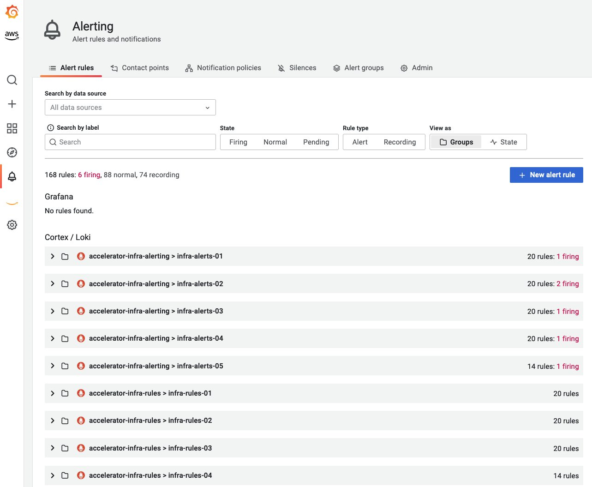
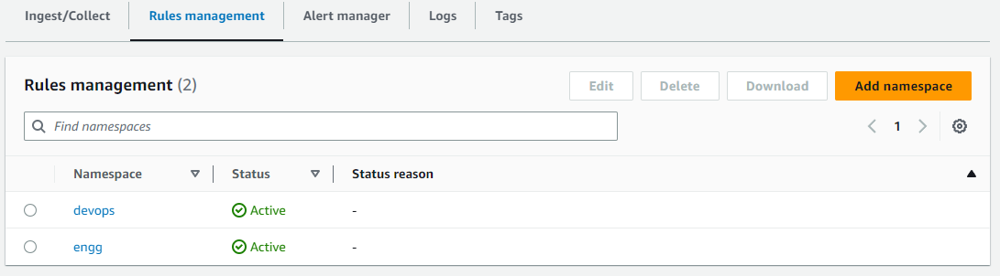

# Amazon Managed Service for Prometheus 告警管理器

## 简介

[Amazon Managed Service for Prometheus](https://aws.amazon.com/prometheus/) (AMP) 支持两种类型的规则，即“**记录规则**”和“**告警规则**”，可以从现有的 Prometheus 服务器导入，并定期进行评估。

[告警规则](https://prometheus.io/docs/prometheus/latest/configuration/alerting_rules/) 允许客户基于 [PromQL](https://prometheus.io/docs/prometheus/latest/querying/basics/) 和阈值定义告警条件。当告警规则的值超过阈值时，通知将发送到 Amazon Managed Service for Prometheus 中的告警管理器，该管理器提供与独立 Prometheus 中的告警管理器类似的功能。告警是 Prometheus 中告警规则在激活时的结果。

## 告警规则文件

Amazon Managed Service for Prometheus 中的告警规则由 YAML 格式的规则文件定义，该文件遵循与独立 Prometheus 中的规则文件相同的格式。客户可以在 Amazon Managed Service for Prometheus 工作区中拥有多个规则文件。工作区是专门用于存储和查询 Prometheus 指标的逻辑空间。

规则文件通常包含以下字段：

```yaml
groups:
  - name:
  rules:
  - alert:
  expr:
  for:
  labels:
  annotations:
```

```console
Groups: 一组按顺序定期运行的规则
Name: 组的名称
Rules: 组中的规则
Alert: 告警的名称
Expr: 触发告警的表达式
For: 告警表达式超过阈值的最小持续时间，然后更新为触发状态
Labels: 附加到告警的任何标签
Annotations: 上下文详细信息，例如描述或链接
```

一个示例规则文件如下所示：

```yaml
groups:
  - name: test
    rules:
    - record: metric:recording_rule
      expr: avg(rate(container_cpu_usage_seconds_total[5m]))
  - name: alert-test
    rules:
    - alert: metric:alerting_rule
      expr: avg(rate(container_cpu_usage_seconds_total[5m])) > 0
      for: 2m
```

## 告警管理器配置文件

Amazon Managed Service for Prometheus 告警管理器使用 YAML 格式的配置文件来设置告警（用于接收服务），其结构与独立 Prometheus 中的告警管理器配置文件相同。配置文件由两个关键部分组成：告警管理器和模板。

1. **[template_files](https://prometheus.io/docs/prometheus/latest/configuration/template_reference/)**: 包含告警中注释和标签的模板，暴露为 `$value`、`$labels`、`$externalLabels` 和 `$externalURL` 变量以便使用。`$labels` 变量保存告警实例的标签键/值对。配置的外部标签可以通过 `$externalLabels` 变量访问。`$value` 变量保存告警实例的评估值。`.Value`、`.Labels`、`.ExternalLabels` 和 `.ExternalURL` 分别包含告警值、告警标签、全局配置的外部标签和外部 URL（通过 `--web.external-url` 配置）。

2. **[alertmanager_config](https://prometheus.io/docs/alerting/latest/configuration/)**: 包含告警管理器配置，其结构与独立 Prometheus 中的告警管理器配置文件相同。

一个包含 `template_files` 和 `alertmanager_config` 的示例告警管理器配置文件如下所示：

```yaml
template_files:
  default_template: |
    {{ define "sns.default.subject" }}[{{ .Status | toUpper }}{{ if eq .Status "firing" }}:{{ .Alerts.Firing | len }}{{ end }}]{{ end }}
    {{ define "__alertmanager" }}AlertManager{{ end }}
    {{ define "__alertmanagerURL" }}{{ .ExternalURL }}/#/alerts?receiver={{ .Receiver | urlquery }}{{ end }}
alertmanager_config: |
  global:
  templates:
    - 'default_template'
  route:
    receiver: default
  receivers:
    - name: 'default'
      sns_configs:
      - topic_arn: arn:aws:sns:us-east-2:accountid:My-Topic
        sigv4:
          region: us-east-2
        attributes:
          key: severity
          value: SEV2
```

## 告警的关键方面

在创建 Amazon Managed Service for Prometheus [告警管理器配置文件](https://docs.aws.amazon.com/prometheus/latest/userguide/AMP-alert-manager.html) 时，有三个重要方面需要注意：

- **分组**：这有助于将类似的告警收集到单个通知中，当故障或中断的影响范围较大且同时触发多个告警时非常有用。这也可以用于按类别分组（例如节点告警、Pod 告警）。可以在告警管理器配置文件中的 [route](https://prometheus.io/docs/alerting/latest/configuration/#route) 块中配置此分组。
- **抑制**：这是一种抑制某些通知以避免对已经激活并触发的类似告警进行垃圾邮件通知的方式。可以使用 [inhibit_rules](https://prometheus.io/docs/alerting/latest/configuration/#inhibit_rule) 块编写抑制规则。
- **静默**：可以在指定的持续时间内静默告警，例如在维护窗口或计划中断期间。在静默告警之前，传入的告警将验证是否匹配所有相等性或正则表达式。可以使用 [PutAlertManagerSilences](https://docs.aws.amazon.com/prometheus/latest/userguide/AMP-APIReference.html#AMP-APIReference-PutAlertManagerSilences) API 创建静默。

## 通过 Amazon Simple Notification Service (SNS) 路由告警

目前，[Amazon Managed Service for Prometheus 告警管理器支持 Amazon SNS](https://docs.aws.amazon.com/prometheus/latest/userguide/AMP-alertmanager-receiver-AMPpermission.html) 作为唯一的接收器。`alertmanager_config` 块中的关键部分是 `receivers`，它允许客户配置 [Amazon SNS 以接收告警](https://docs.aws.amazon.com/prometheus/latest/userguide/AMP-alertmanager-receiver-config.html)。以下部分可以用作 `receivers` 块的模板。

```yaml
- name: name_of_receiver
  sns_configs:
    - sigv4:
        region: <AWS_Region>
    topic_arn: <ARN_of_SNS_topic>
    subject: somesubject
    attributes:
       key: <somekey>
       value: <somevalue>
```

Amazon SNS 配置使用以下模板作为默认值，除非显式覆盖：

```yaml
{{ define "sns.default.message" }}{{ .CommonAnnotations.SortedPairs.Values | join " " }}
  {{ if gt (len .Alerts.Firing) 0 -}}
  Alerts Firing:
    {{ template "__text_alert_list" .Alerts.Firing }}
  {{- end }}
  {{ if gt (len .Alerts.Resolved) 0 -}}
  Alerts Resolved:
    {{ template "__text_alert_list" .Alerts.Resolved }}
  {{- end }}
{{- end }}
```

更多参考：[通知模板示例](https://prometheus.io/docs/alerting/latest/notification_examples/)

## 将告警路由到 Amazon SNS 之外的其他目的地

Amazon Managed Service for Prometheus 告警管理器可以使用 [Amazon SNS 连接到其他目的地](https://docs.aws.amazon.com/prometheus/latest/userguide/AMP-alertmanager-SNS-otherdestinations.html)，例如电子邮件、Webhook（HTTP）、Slack、PagerDuty 和 OpsGenie。

- **电子邮件**：成功的通知将导致从 Amazon Managed Service for Prometheus 告警管理器通过 Amazon SNS 主题接收电子邮件，其中包含告警详细信息作为目标之一。
- Amazon Managed Service for Prometheus 告警管理器可以 [以 JSON 格式发送告警](https://docs.aws.amazon.com/prometheus/latest/userguide/AMP-alertmanager-receiver-JSON.html)，以便它们可以从 Amazon SNS 下游在 AWS Lambda 或 Webhook 接收端点中进行处理。
- **Webhook**：可以将现有的 Amazon SNS 主题配置为将消息输出到 Webhook 端点。Webhook 是基于事件驱动触发器在应用程序之间通过 HTTP 交换的序列化编码 JSON 或 XML 格式的消息。这可以用于连接到任何现有的 [SIEM 或协作工具](https://repost.aws/knowledge-center/sns-lambda-webhooks-chime-slack-teams) 以进行告警、票证或事件管理系统。
- **Slack**：客户可以集成 [Slack 的](https://aws.amazon.com/blogs/mt/how-to-integrate-amazon-managed-service-for-prometheus-with-slack/) 电子邮件到频道集成，其中 Slack 可以接受电子邮件并将其转发到 Slack 频道，或者使用 Lambda 函数重写 SNS 通知到 Slack。
- **PagerDuty**：可以在 `alertmanager_config` 定义中的 `template_files` 块中自定义模板，以将有效负载发送到 [PagerDuty](https://aws.amazon.com/blogs/mt/using-amazon-managed-service-for-prometheus-alert-manager-to-receive-alerts-with-pagerduty/) 作为 Amazon SNS 的目的地。

更多参考：[自定义告警管理器模板](https://prometheus.io/blog/2016/03/03/custom-alertmanager-templates/)

## 告警状态

告警规则基于表达式定义告警条件，以在超过设定的阈值时向任何通知服务发送告警。示例如下：

```yaml
rules:
- alert: metric:alerting_rule
  expr: avg(rate(container_cpu_usage_seconds_total[5m])) > 0
  for: 2m
```

每当告警表达式在某个时间点产生一个或多个向量元素时，告警将被视为激活。告警可以处于激活（pending | firing）或已解决状态。

- **Pending**：自阈值突破以来经过的时间小于记录间隔。
- **Firing**：自阈值突破以来经过的时间大于记录间隔，并且告警管理器正在路由告警。
- **Resolved**：由于不再突破阈值，告警不再触发。

可以通过使用 [awscurl](https://docs.aws.amazon.com/prometheus/latest/userguide/AMP-compatible-APIs.html) 命令查询 Amazon Managed Service for Prometheus 告警管理器端点，使用 [ListAlerts](https://docs.aws.amazon.com/prometheus/latest/userguide/AMP-APIReference.html#AMP-APIReference-ListAlerts) API 手动验证这一点。示例如下：

```bash
awscurl https://aps-workspaces.us-east-1.amazonaws.com/workspaces/$WORKSPACE_ID/alertmanager/api/v2/alerts --service="aps" -H "Content-Type: application/json"
```

## Amazon Managed Grafana 中的 Amazon Managed Service for Prometheus 告警管理器规则

Amazon Managed Grafana (AMG) 的告警功能允许客户从其 Amazon Managed Grafana 工作区中查看 Amazon Managed Service for Prometheus 告警管理器告警。使用 Amazon Managed Service for Prometheus 工作区收集 Prometheus 指标的客户可以利用服务中的完全托管告警管理器和 Ruler 功能来配置告警和记录规则。通过此功能，他们可以可视化在其 Amazon Managed Service for Prometheus 工作区中配置的所有告警和记录规则。可以通过在 Grafana 工作区配置选项选项卡中选中 Grafana 告警复选框来查看 Prometheus 告警视图。一旦启用，这还将把之前在 Grafana 仪表板中创建的本机 Grafana 告警迁移到 Grafana 工作区中的新告警页面。

参考：[宣布 Amazon Managed Grafana 中的 Prometheus 告警管理器规则](https://aws.amazon.com/blogs/mt/announcing-prometheus-alertmanager-rules-in-amazon-managed-grafana/)



## 基线监控的推荐告警

告警是强大的监控和可观测性最佳实践的关键方面。告警机制应在告警疲劳和错过关键告警之间取得平衡。以下是一些推荐的告警，以提高工作负载的整体可靠性。组织中的各个团队从不同的角度监控其基础设施和工作负载，因此可以根据需求和场景扩展或更改此列表，当然这不是一个全面的列表。

- 容器节点使用的内存超过某些（例如 80%）分配的内存限制。
- 容器节点使用的 CPU 超过某些（例如 80%）分配的 CPU 限制。
- 容器节点使用的磁盘空间超过某些（例如 90%）分配的磁盘空间。
- 命名空间中的 Pod 中的容器使用的 CPU 超过某些（例如 80%）分配的 CPU 限制。
- 命名空间中的 Pod 中的容器使用的内存超过某些（例如 80%）分配的内存限制。
- 命名空间中的 Pod 中的容器重启次数过多。
- 命名空间中的持久卷使用的磁盘空间超过某些（最大 75%）分配的空间。
- 部署当前没有运行的活动 Pod。
- 命名空间中的 Horizontal Pod Autoscaler (HPA) 以最大容量运行。

为上述或任何类似场景设置告警的关键在于根据需要更改表达式。例如：

```yaml
expr: |
        ((sum(irate(container_cpu_usage_seconds_total{image!="",container!="POD", namespace!="kube-sys"}[30s])) by (namespace,container,pod) /
sum(container_spec_cpu_quota{image!="",container!="POD", namespace!="kube-sys"} /
container_spec_cpu_period{image!="",container!="POD", namespace!="kube-sys"}) by (namespace,container,pod) ) * 100)  > 80
      for: 5m
```

## Amazon Managed Service for Prometheus 的 ACK 控制器

Amazon Managed Service for Prometheus [AWS Controller for Kubernetes](https://github.com/aws-controllers-k8s/community) (ACK) 控制器可用于 Workspace、告警管理器和 Ruler 资源，使客户能够利用 [自定义资源定义](https://kubernetes.io/docs/concepts/extend-kubernetes/api-extension/custom-resources/) (CRD) 和提供支持功能的本机对象或服务，而无需在 Kubernetes 集群之外定义任何资源。[Amazon Managed Service for Prometheus 的 ACK 控制器](https://aws.amazon.com/blogs/mt/introducing-the-ack-controller-for-amazon-managed-service-for-prometheus/) 可用于直接从您正在监控的 Kubernetes 集群管理所有资源，使 Kubernetes 成为您工作负载所需状态的“单一事实来源”。[ACK](https://aws-controllers-k8s.github.io/community/docs/community/overview/) 是一组 Kubernetes CRD 和自定义控制器，它们协同工作以扩展 Kubernetes API 并管理 AWS 资源。

使用 ACK 配置的告警规则片段如下所示：

```yaml
apiVersion: prometheusservice.services.k8s.aws/v1alpha1
kind: RuleGroupsNamespace
metadata:
  name: default-rule
spec:
  workspaceID: WORKSPACE-ID
  name: default-rule
  configuration: |
    groups:
    - name: example
      rules:
      - alert: HostHighCpuLoad
        expr: 100 - (avg(rate(node_cpu_seconds_total{mode="idle"}[2m])) * 100) > 60
        for: 5m
        labels:
          severity: warning
          event_type: scale_up
        annotations:
          summary: Host high CPU load (instance {{ $labels.instance }})
          description: "CPU load is > 60%\n  VALUE = {{ $value }}\n  LABELS = {{ $labels }}"
      - alert: HostLowCpuLoad
        expr: 100 - (avg(rate(node_cpu_seconds_total{mode="idle"}[2m])) * 100) < 30
        for: 5m
        labels:
          severity: warning
          event_type: scale_down
        annotations:
          summary: Host low CPU load (instance {{ $labels.instance }})
          description: "CPU load is < 30%\n  VALUE = {{ $value }}\n  LABELS = {{ $labels }}"
```

## 使用 IAM 策略限制对规则的访问

组织要求各个团队为其记录和告警需求创建和管理自己的规则。Amazon Managed Service for Prometheus 中的规则管理允许使用 AWS Identity and Access Management (IAM) 策略对规则进行访问控制，以便每个团队可以控制其自己的规则和告警集，按 `rulegroupnamespaces` 分组。

下图显示了两个示例 `rulegroupnamespaces`，称为 `devops` 和 `engg`，添加到 Amazon Managed Service for Prometheus 的规则管理中。



以下 JSON 是一个示例 IAM 策略，它限制对 `devops` `rulegroupnamespace`（如上所示）的访问，并指定了资源 ARN。此 IAM 策略中的显著操作是 [PutRuleGroupsNamespace](https://docs.aws.amazon.com/cli/latest/reference/amp/put-rule-groups-namespace.html) 和 [DeleteRuleGroupsNamespace](https://docs.aws.amazon.com/cli/latest/reference/amp/delete-rule-groups-namespace.html)，它们被限制为指定的 AMP 工作区的 `rulegroupnamespace` 的资源 ARN。创建策略后，可以将其分配给任何所需的用户、组或角色以满足所需的访问控制要求。可以根据 [IAM 权限](https://docs.aws.amazon.com/prometheus/latest/userguide/AMP-APIReference.html) 修改/限制 IAM 策略中的操作，以允许或限制所需的操作。

```json
{
  "Version": "2012-10-17",
  "Statement": [
    {
      "Sid": "VisualEditor0",
      "Effect": "Allow",
      "Action": [
        "aps:RemoteWrite",
        "aps:DescribeRuleGroupsNamespace",
        "aps:PutRuleGroupsNamespace",
        "aps:DeleteRuleGroupsNamespace"
      ],
      "Resource": [
        "arn:aws:aps:us-west-2:XXXXXXXXXXXX:workspace/ws-8da31ad6-f09d-44ff-93a3-xxxxxxxxxx",
        "arn:aws:aps:us-west-2:XXXXXXXXXXXX:rulegroupsnamespace/ws-8da31ad6-f09d-44ff-93a3-xxxxxxxxxx/devops"
      ]
    }
  ]
}
```

以下 awscli 交互显示了 IAM 用户对通过 IAM 策略中指定的资源 ARN（即 `devops` `rulegroupnamespace`）具有受限访问权限的示例，以及同一用户如何被拒绝访问其他资源（即 `engg` `rulegroupnamespace`）。

```bash
$ aws amp describe-rule-groups-namespace --workspace-id ws-8da31ad6-f09d-44ff-93a3-xxxxxxxxxx --name devops
{
    "ruleGroupsNamespace": {
        "arn": "arn:aws:aps:us-west-2:XXXXXXXXXXXX:rulegroupsnamespace/ws-8da31ad6-f09d-44ff-93a3-xxxxxxxxxx/devops",
        "createdAt": "2023-04-28T01:50:15.408000+00:00",
        "data": "Z3JvdXBzOgogIC0gbmFtZTogZGV2b3BzX3VwZGF0ZWQKICAgIHJ1bGVzOgogICAgLSByZWNvcmQ6IG1ldHJpYzpob3N0X2NwdV91dGlsCiAgICAgIGV4cHI6IGF2ZyhyYXRlKGNvbnRhaW5lcl9jcHVfdXNhZ2Vfc2Vjb25kc190b3RhbFsybV0pKQogICAgLSBhbGVydDogaGlnaF9ob3N0X2NwdV91c2FnZQogICAgICBleHByOiBhdmcocmF0ZShjb250YWluZXJfY3B1X3VzYWdlX3NlY29uZHNfdG90YWxbNW1dKSkKICAgICAgZm9yOiA1bQogICAgICBsYWJlbHM6CiAgICAgICAgICAgIHNldmVyaXR5OiBjcml0aWNhbAogIC0gbmFtZTogZGV2b3BzCiAgICBydWxlczoKICAgIC0gcmVjb3JkOiBjb250YWluZXJfbWVtX3V0aWwKICAgICAgZXhwcjogYXZnKHJhdGUoY29udGFpbmVyX21lbV91c2FnZV9ieXRlc190b3RhbFs1bV0pKQogICAgLSBhbGVydDogY29udGFpbmVyX2hvc3RfbWVtX3VzYWdlCiAgICAgIGV4cHI6IGF2ZyhyYXRlKGNvbnRhaW5lcl9tZW1fdXNhZ2VfYnl0ZXNfdG90YWxbNW1dKSkKICAgICAgZm9yOiA1bQogICAgICBsYWJlbHM6CiAgICAgICAgc2V2ZXJpdHk6IGNyaXRpY2FsCg==",
        "modifiedAt": "2023-05-01T17:47:06.409000+00:00",
        "name": "devops",
        "status": {
            "statusCode": "ACTIVE",
            "statusReason": ""
        },
        "tags": {}
    }
}

$ cat > devops.yaml <<EOF
> groups:
>  - name: devops_new
>    rules:
>   - record: metric:host_cpu_util
>     expr: avg(rate(container_cpu_usage_seconds_total[2m]))
>   - alert: high_host_cpu_usage
>     expr: avg(rate(container_cpu_usage_seconds_total[5m]))
>     for: 5m
>     labels:
>            severity: critical
>  - name: devops
>    rules:
>    - record: container_mem_util
>      expr: avg(rate(container_mem_usage_bytes_total[5m]))
>    - alert: container_host_mem_usage
>      expr: avg(rate(container_mem_usage_bytes_total[5m]))
>      for: 5m
>      labels:
>        severity: critical
> EOF

$ base64 devops.yaml > devops_b64.yaml

$ aws amp put-rule-groups-namespace --workspace-id ws-8da31ad6-f09d-44ff-93a3-xxxxxxxxxx --name devops --data file://devops_b64.yaml
{
    "arn": "arn:aws:aps:us-west-2:XXXXXXXXXXXX:rulegroupsnamespace/ws-8da31ad6-f09d-44ff-93a3-xxxxxxxxxx/devops",
    "name": "devops",
    "status": {
        "statusCode": "UPDATING"
    },
    "tags": {}
}
```

```bash
$ aws amp describe-rule-groups-namespace --workspace-id ws-8da31ad6-f09d-44ff-93a3-xxxxxxxxxx --name engg
An error occurred (AccessDeniedException) when calling the DescribeRuleGroupsNamespace operation: User: arn:aws:iam::XXXXXXXXXXXX:user/amp_ws_user is not authorized to perform: aps:DescribeRuleGroupsNamespace on resource: arn:aws:aps:us-west-2:XXXXXXXXXXXX:rulegroupsnamespace/ws-8da31ad6-f09d-44ff-93a3-xxxxxxxxxx/engg

$ aws amp put-rule-groups-namespace --workspace-id ws-8da31ad6-f09d-44ff-93a3-xxxxxxxxxx --name engg --data file://devops_b64.yaml
An error occurred (AccessDeniedException) when calling the PutRuleGroupsNamespace operation: User: arn:aws:iam::XXXXXXXXXXXX:user/amp_ws_user is not authorized to perform: aps:PutRuleGroupsNamespace on resource: arn:aws:aps:us-west-2:XXXXXXXXXXXX:rulegroupsnamespace/ws-8da31ad6-f09d-44ff-93a3-xxxxxxxxxx/engg

$ aws amp delete-rule-groups-namespace --workspace-id ws-8da31ad6-f09d-44ff-93a3-xxxxxxxxxx --name engg
An error occurred (AccessDeniedException) when calling the DeleteRuleGroupsNamespace operation: User: arn:aws:iam::XXXXXXXXXXXX:user/amp_ws_user is not authorized to perform: aps:DeleteRuleGroupsNamespace on resource: arn:aws:aps:us-west-2:XXXXXXXXXXXX:rulegroupsnamespace/ws-8da31ad6-f09d-44ff-93a3-xxxxxxxxxx/engg
```

用户使用规则的权限也可以使用 [IAM 策略](https://docs.aws.amazon.com/prometheus/latest/userguide/AMP-alertmanager-IAM-permissions.html)（文档示例）进行限制。

有关更多信息，客户可以阅读 [AWS 文档](https://docs.aws.amazon.com/prometheus/latest/userguide/AMP-alert-manager.html)，并通过 [AWS 可观测性研讨会](https://catalog.workshops.aws/observability/en-US/aws-managed-oss/amp/setup-alert-manager) 了解 Amazon Managed Service for Prometheus 告警管理器。

更多参考：[Amazon Managed Service for Prometheus 现已正式推出告警管理器和 Ruler](https://aws.amazon.com/blogs/aws/amazon-managed-service-for-prometheus-is-now-generally-available-with-alert-manager-and-ruler/)