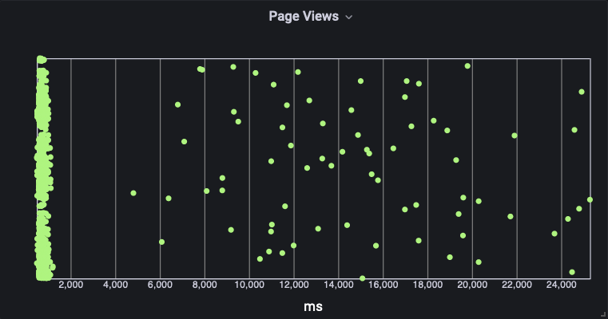

# 百分位数的重要性

在监控和报告中，百分位数非常重要，因为它们提供了比仅仅依赖平均值更详细和准确的数据分布视图。平均值有时可能会隐藏重要的信息，例如异常值或数据中的变化，这些信息可能会显著影响性能和用户体验。而百分位数可以揭示这些隐藏的细节，帮助你更好地理解数据的分布情况。

在 [Amazon CloudWatch](https://aws.amazon.com/cloudwatch/) 中，百分位数可以用于监控和报告各种指标，例如响应时间、延迟和错误率，涵盖你的应用程序和基础设施。通过设置百分位数的警报，你可以在特定百分位数值超过阈值时收到通知，从而在影响更多客户之前采取行动。

要在 [CloudWatch 中使用百分位数](https://docs.aws.amazon.com/AmazonCloudWatch/latest/monitoring/cloudwatch_concepts.html#Percentiles)，请在 CloudWatch 控制台的 **All metrics** 中选择你的指标，并使用现有指标并将 **statistic** 设置为 **p99**，然后你可以编辑 p 后面的值以选择你想要的百分位数。你可以查看百分位数图表，将它们添加到 [CloudWatch 仪表板](https://docs.aws.amazon.com/AmazonCloudWatch/latest/monitoring/CloudWatch_Dashboards.html) 中，并设置这些指标的警报。例如，你可以设置一个警报，当响应时间的第 95 百分位数超过某个阈值时通知你，这表明有相当一部分用户正在经历较慢的响应时间。

下面的直方图是在 [Amazon Managed Grafana](https://aws.amazon.com/grafana/) 中使用 [CloudWatch Logs Insights](https://docs.aws.amazon.com/AmazonCloudWatch/latest/logs/AnalyzingLogData.html) 查询从 [CloudWatch RUM](https://docs.aws.amazon.com/AmazonCloudWatch/latest/monitoring/CloudWatch-RUM.html) 日志中创建的。使用的查询是：

```
fields @timestamp, event_details.duration
| filter event_type = "com.amazon.rum.performance_navigation_event"
| sort @timestamp desc
```

直方图绘制了以毫秒为单位的页面加载时间。通过这种视图，可以清楚地看到异常值。如果使用平均值，这些数据将被隐藏。



在 CloudWatch 中使用平均值显示的相同数据表明，页面加载时间不到两秒。你可以从上面的直方图中看到，大多数页面实际上加载时间不到一秒，并且存在异常值。


再次使用相同的数据，但这次使用百分位数（p99），表明存在问题。CloudWatch 图表现在显示，99% 的页面加载时间不到 23 秒。


为了更直观地展示这一点，下面的图表将平均值与第 99 百分位数进行了比较。在这种情况下，目标页面加载时间为两秒，可以使用替代的 [CloudWatch 统计信息](https://docs.aws.amazon.com/AmazonCloudWatch/latest/monitoring/Statistics-definitions.html#Percentile-versus-Trimmed-Mean) 和 [指标数学](https://docs.aws.amazon.com/AmazonCloudWatch/latest/monitoring/using-metric-math.html) 进行其他计算。在这种情况下，使用百分位数排名（PR）和统计信息 **PR(:2000)** 显示 92.7% 的页面加载在 2000 毫秒的目标时间内完成。


在 CloudWatch 中使用百分位数可以帮助你更深入地了解系统的性能，及早发现问题，并通过识别那些原本会被隐藏的异常值来改善客户体验。