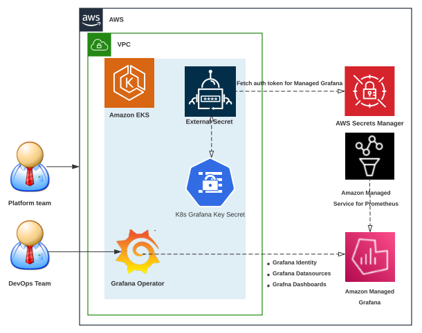
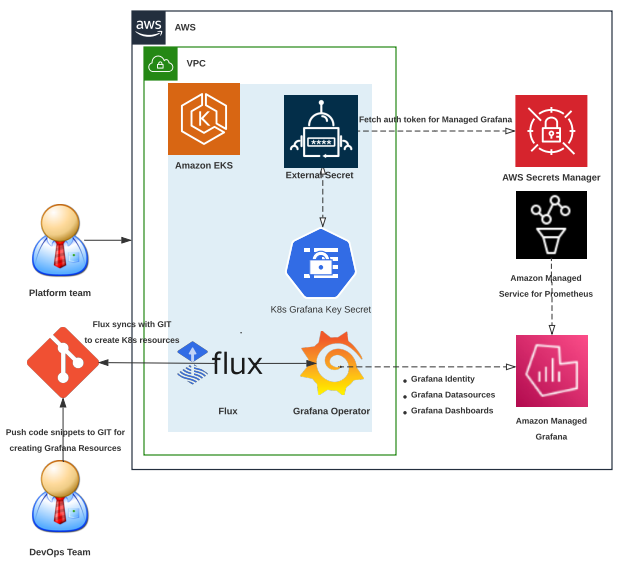

# 使用 GitOps 和 Grafana Operator 与 Amazon Managed Grafana

## 如何使用本指南

本可观测性最佳实践指南面向希望了解如何在 Amazon EKS 集群上使用 [grafana-operator](https://github.com/grafana-operator/grafana-operator#:~:text=The%20grafana%2Doperator%20is%20a,an%20easy%20and%20scalable%20way.) 作为 Kubernetes 操作符，以 Kubernetes 原生的方式在 Amazon Managed Grafana 中创建和管理 Grafana 资源及仪表板的开发人员和架构师。

## 介绍

客户使用 Grafana 作为开源分析和监控解决方案的可观测性平台。我们看到在 Amazon EKS 上运行工作负载的客户希望将重点转向工作负载管理，并依赖 Kubernetes 原生控制器来部署和管理外部资源（如云资源）的生命周期。我们看到客户安装 [AWS Controllers for Kubernetes (ACK)](https://aws-controllers-k8s.github.io/community/docs/community/overview/) 来创建、部署和管理 AWS 服务。如今，许多客户选择将 Prometheus 和 Grafana 的实现卸载到托管服务，对于 AWS 来说，这些服务是 [Amazon Managed Service for Prometheus](https://docs.aws.amazon.com/prometheus/?icmpid=docs_homepage_mgmtgov) 和 [Amazon Managed Grafana](https://docs.aws.amazon.com/grafana/?icmpid=docs_homepage_mgmtgov)，用于监控他们的工作负载。

客户在使用 Grafana 时面临的一个常见挑战是，如何从他们的 Kubernetes 集群中创建和管理外部 Grafana 实例（如 Amazon Managed Grafana）中的 Grafana 资源和仪表板的生命周期。客户在寻找完全自动化和管理整个系统的基础设施和应用程序部署的方法时面临挑战，这些方法包括在 Amazon Managed Grafana 中创建 Grafana 资源。在本可观测性最佳实践指南中，我们将重点讨论以下主题：

* Grafana Operator 简介 - 一个 Kubernetes 操作符，用于从 Kubernetes 集群管理外部 Grafana 实例
* GitOps 简介 - 使用基于 Git 的工作流自动化创建和管理基础设施的机制
* 在 Amazon EKS 上使用 Grafana Operator 管理 Amazon Managed Grafana
* 在 Amazon EKS 上使用 GitOps 和 Flux 管理 Amazon Managed Grafana

## Grafana Operator 简介

[grafana-operator](https://github.com/grafana-operator/grafana-operator#:~:text=The%20grafana%2Doperator%20is%20a,an%20easy%20and%20scalable%20way.) 是一个 Kubernetes 操作符，旨在帮助你在 Kubernetes 内部管理 Grafana 实例。Grafana Operator 使你能够以声明式的方式在多个实例之间轻松且可扩展地管理和创建 Grafana 仪表板、数据源等。Grafana Operator 现在支持管理托管在外部环境（如 Amazon Managed Grafana）上的资源，例如仪表板、数据源等。这最终使我们能够使用 GitOps 机制，通过 CNCF 项目（如 [Flux](https://fluxcd.io/)）从 Amazon EKS 集群创建和管理 Amazon Managed Grafana 中的资源生命周期。

## GitOps 简介

### 什么是 GitOps 和 Flux

GitOps 是一种软件开发和运维方法，使用 Git 作为部署配置的单一事实来源。它涉及将应用程序或基础设施的期望状态保存在 Git 仓库中，并使用基于 Git 的工作流来管理和部署变更。GitOps 是一种管理应用程序和基础设施部署的方式，使整个系统以声明式的方式描述在 Git 仓库中。它是一种操作模型，使你能够利用版本控制、不可变工件和自动化的最佳实践来管理多个 Kubernetes 集群的状态。

Flux 是一个 GitOps 工具，用于自动化 Kubernetes 上的应用程序部署。它通过持续监控 Git 仓库的状态并将任何变更应用到集群中来工作。Flux 集成了各种 Git 提供商，如 GitHub、[GitLab](https://dzone.com/articles/auto-deploy-spring-boot-app-using-gitlab-cicd) 和 Bitbucket。当仓库发生变更时，Flux 会自动检测并相应地更新集群。

### 使用 Flux 的优势

* **自动化部署**：Flux 自动化了部署过程，减少了手动错误，使开发人员能够专注于其他任务。
* **基于 Git 的工作流**：Flux 利用 Git 作为单一事实来源，使得跟踪和回滚变更更加容易。
* **声明式配置**：Flux 使用 [Kubernetes](https://dzone.com/articles/kubernetes-full-stack-example-with-kong-ingress-co) 清单来定义集群的期望状态，使得管理和跟踪变更更加容易。

### 采用 Flux 的挑战

* **有限的定制化**：Flux 仅支持有限的定制化，可能不适合所有用例。
* **陡峭的学习曲线**：Flux 对新用户来说学习曲线陡峭，需要对 Kubernetes 和 Git 有深入的理解。

## 在 Amazon EKS 上使用 Grafana Operator 管理 Amazon Managed Grafana 中的资源

正如前一节所讨论的，Grafana Operator 使我们能够使用 Kubernetes 集群以 Kubernetes 原生的方式创建和管理 Amazon Managed Grafana 中的资源生命周期。下面的架构图展示了使用 Grafana Operator 将 Kubernetes 集群作为控制平面，设置与 AMG 的身份验证，将 Amazon Managed Service for Prometheus 添加为数据源，并从 Amazon EKS 集群以 Kubernetes 原生的方式在 Amazon Managed Grafana 上创建仪表板的演示。

请参考我们的文章 [在 Kubernetes 集群上使用开源 Grafana Operator 管理 Amazon Managed Grafana](https://aws.amazon.com/blogs/mt/using-open-source-grafana-operator-on-your-kubernetes-cluster-to-manage-amazon-managed-grafana/)，了解如何在你的 Amazon EKS 集群上部署上述解决方案的详细演示。

## 在 Amazon EKS 上使用 GitOps 和 Flux 管理 Amazon Managed Grafana 中的资源

如上所述，Flux 自动化了 Kubernetes 上的应用程序部署。它通过持续监控 Git 仓库（如 GitHub）的状态来工作，当仓库发生变更时，Flux 会自动检测并相应地更新集群。请参考下面的架构图，我们将演示如何使用 Kubernetes 集群中的 Grafana Operator 和 Flux 的 GitOps 机制，将 Amazon Managed Service for Prometheus 添加为数据源，并以 Kubernetes 原生的方式在 Amazon Managed Grafana 中创建仪表板。

请参考我们的 One Observability Workshop 模块 - [GitOps with Amazon Managed Grafana](https://catalog.workshops.aws/observability/en-US/aws-managed-oss/gitops-with-amg)。该模块在你的 EKS 集群上设置了所需的“Day 2”操作工具，例如：

* [External Secrets Operator](https://github.com/external-secrets/external-secrets/tree/main/deploy/charts/external-secrets) 已成功安装，用于从 AWS Secret Manager 读取 Amazon Managed Grafana 的密钥
* [Prometheus Node Exporter](https://github.com/prometheus/node_exporter) 用于测量各种机器资源，如内存、磁盘和 CPU 利用率
* [Grafana Operator](https://github.com/grafana-operator/grafana-operator) 用于使用 Kubernetes 集群以 Kubernetes 原生的方式创建和管理 Amazon Managed Grafana 中的资源生命周期
* [Flux](https://fluxcd.io/) 用于使用 GitOps 机制自动化 Kubernetes 上的应用程序部署

## 结论

在本节的可观测性最佳实践指南中，我们学习了如何使用 Grafana Operator 和 GitOps 与 Amazon Managed Grafana。我们从了解 GitOps 和 Grafana Operator 开始，然后重点讨论了如何在 Amazon EKS 上使用 Grafana Operator 管理 Amazon Managed Grafana 中的资源，以及如何在 Amazon EKS 上使用 GitOps 和 Flux 管理 Amazon Managed Grafana 中的资源，以 Kubernetes 原生的方式设置与 AMG 的身份验证，并在 Amazon Managed Grafana 中添加 AWS 数据源。