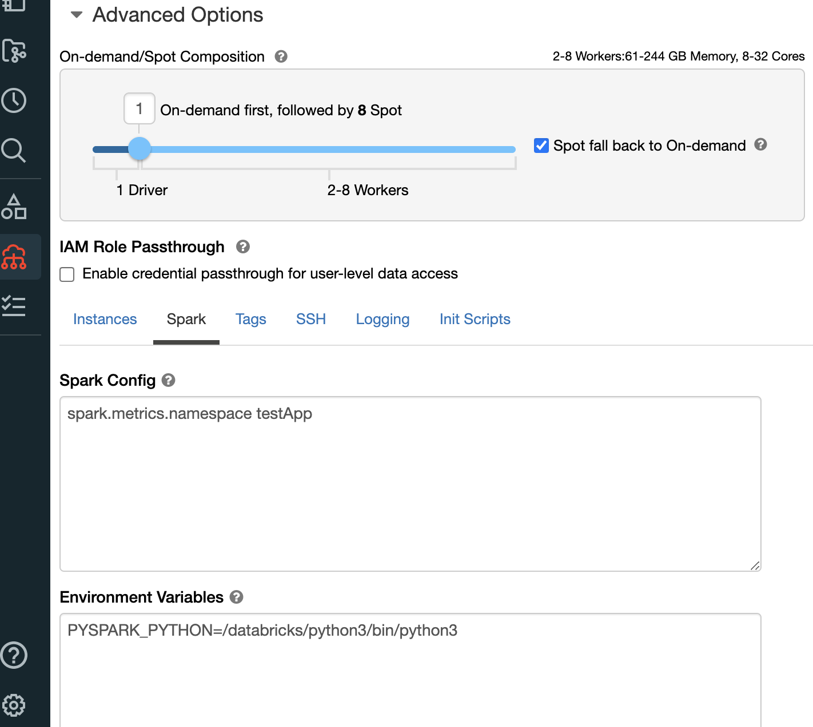
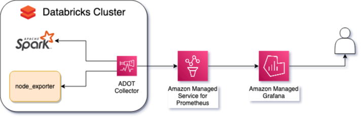

# 在 AWS 上监控和观测 Databricks 的最佳实践

Databricks 是一个用于管理数据分析和 AI/ML 工作负载的平台。本指南旨在支持在 AWS 上运行 [Databricks](https://aws.amazon.com/solutions/partners/databricks/) 的客户，使用 AWS 原生服务或开源托管服务来监控这些工作负载。

## 为什么要监控 Databricks

管理 Databricks 集群的运维团队受益于集成的、自定义的仪表板，用于跟踪工作负载状态、错误、性能瓶颈；对不良行为（如资源使用总量或错误百分比）进行告警；以及集中日志记录，用于根本原因分析，并提取额外的自定义指标。

## 监控什么

Databricks 在其集群实例中运行 Apache Spark，Spark 具有原生功能来暴露指标。这些指标将提供有关驱动程序、工作节点和集群中执行的工作负载的信息。

运行 Spark 的实例还将提供有关存储、CPU、内存和网络的有用信息。了解哪些外部因素可能影响 Databricks 集群的性能非常重要。对于具有多个实例的集群，了解瓶颈和整体健康状况也很重要。

## 如何监控

要安装收集器及其依赖项，需要 Databricks 初始化脚本。这些脚本在 Databricks 集群的每个实例启动时运行。

Databricks 集群还需要权限，以便使用实例配置文件发送指标和日志。

最后，最佳实践是在 Databricks 集群的 Spark 配置中配置指标命名空间，将 `testApp` 替换为集群的适当引用。

*图 1：指标命名空间 Spark 配置示例*

## 良好的 Databricks 可观测性解决方案的关键部分

**1) 指标：** 指标是描述活动或特定过程在一段时间内测量的数字。以下是 Databricks 上的不同类型的指标：

- 系统资源级指标，如 CPU、内存、磁盘和网络。
- 使用自定义指标源、StreamingQueryListener 和 QueryExecutionListener 的应用程序指标。
- 由 MetricsSystem 暴露的 Spark 指标。

**2) 日志：** 日志是已发生事件的序列化表示，它们讲述了这些事件的线性故事。以下是 Databricks 上的不同类型的日志：

- 事件日志
- 审计日志
- 驱动程序日志：stdout、stderr、log4j 自定义日志（启用结构化日志）
- 执行器日志：stdout、stderr、log4j 自定义日志（启用结构化日志）

**3) 追踪：** 堆栈追踪提供端到端的可见性，并显示整个流程的阶段。这在调试以识别哪些阶段/代码导致错误/性能问题时非常有用。

**4) 仪表板：** 仪表板提供了应用程序/服务的黄金指标的摘要视图。

**5) 告警：** 告警通知工程师有关需要关注的条件。

## AWS 原生可观测性选项

原生解决方案（如 Ganglia UI 和日志交付）是收集系统指标和查询 Apache Spark™ 指标的绝佳解决方案。然而，某些方面可以改进：

- Ganglia 不支持告警。
- Ganglia 不支持从日志中创建派生指标（例如，ERROR 日志增长率）。
- 您无法使用自定义仪表板来跟踪与数据正确性、数据新鲜度或端到端延迟相关的 SLO（服务级别目标）和 SLI（服务级别指标），并在 Ganglia 中可视化它们。

[Amazon CloudWatch](https://aws.amazon.com/cloudwatch/) 是监控和管理 AWS 上 Databricks 集群的关键工具。它提供了有关集群性能的宝贵见解，并帮助您快速识别和解决问题。将 Databricks 与 CloudWatch 集成并启用结构化日志记录可以帮助改进这些领域。CloudWatch Application Insights 可以帮助您自动发现日志中包含的字段，CloudWatch Logs Insights 提供了一个专用的查询语言，用于更快的调试和分析。

*图 2：Databricks CloudWatch 架构*

有关如何使用 CloudWatch 监控 Databricks 的更多信息，请参阅：
[如何使用 Amazon CloudWatch 监控 Databricks](https://aws.amazon.com/blogs/mt/how-to-monitor-databricks-with-amazon-cloudwatch/)

## 开源软件可观测性选项

[Amazon Managed Service for Prometheus](https://aws.amazon.com/prometheus/) 是一个与 Prometheus 兼容的监控托管、无服务器服务，负责存储指标并管理基于这些指标创建的告警。Prometheus 是一种流行的开源监控技术，是 Cloud Native Computing Foundation 的第二个项目，仅次于 Kubernetes。

[Amazon Managed Grafana](https://aws.amazon.com/grafana/) 是 Grafana 的托管服务。Grafana 是一种用于时间序列数据可视化的开源技术，通常用于可观测性。我们可以使用 Grafana 从多个来源（如 Amazon Managed Service for Prometheus、Amazon CloudWatch 等）可视化数据。它将用于可视化 Databricks 指标和告警。

[AWS Distro for OpenTelemetry](https://aws-otel.github.io/) 是 AWS 支持的 OpenTelemetry 项目分发版，提供了用于收集追踪和指标的开源标准、库和服务。通过 OpenTelemetry，我们可以收集多种不同的可观测性数据格式（如 Prometheus 或 StatsD），丰富这些数据并将其发送到多个目的地（如 CloudWatch 或 Amazon Managed Service for Prometheus）。

### 使用案例

虽然 AWS 原生服务将提供管理 Databricks 集群所需的可观测性，但在某些情况下，使用开源托管服务是最佳选择。

Prometheus 和 Grafana 都是非常流行的技术，已经在许多公司中使用。AWS 开源可观测性服务将使运维团队能够使用相同的现有基础设施、相同的查询语言以及现有的仪表板和告警来监控 Databricks 工作负载，而无需管理这些服务的基础设施、扩展性和性能。

ADOT 是那些需要将指标和追踪发送到不同目的地（如 CloudWatch 和 Prometheus）或处理不同类型数据源（如 OTLP 和 StatsD）的团队的最佳选择。

最后，Amazon Managed Grafana 支持许多不同的数据源，包括 CloudWatch 和 Prometheus，并帮助团队在使用多个工具时关联数据，允许创建模板，为所有 Databricks 集群提供可观测性，并通过基础设施即代码提供强大的 API 来配置和配置。

*图 3：Databricks 开源可观测性架构*

要使用 AWS 托管开源服务观察 Databricks 集群的指标，您需要一个 Amazon Managed Grafana 工作区来可视化指标和告警，以及一个 Amazon Managed Service for Prometheus 工作区，配置为 Amazon Managed Grafana 工作区中的数据源。

有两种重要的指标必须收集：Spark 和节点指标。

Spark 指标将提供诸如集群中当前工作节点或执行器的数量、节点在处理期间交换数据时发生的 shuffle、或数据从 RAM 到磁盘以及从磁盘到 RAM 的 spill 等信息。要暴露这些指标，必须通过 Databricks 管理控制台启用 Spark 原生的 Prometheus（自 3.0 版本起可用），并通过 `init_script` 进行配置。

为了跟踪节点指标（如磁盘使用情况、CPU 时间、内存、存储性能），我们使用 `node_exporter`，它可以在没有任何进一步配置的情况下使用，但应仅暴露重要指标。

必须在集群的每个节点上安装 ADOT Collector，抓取由 Spark 和 `node_exporter` 暴露的指标，过滤这些指标，注入元数据（如 `cluster_name`），并将这些指标发送到 Prometheus 工作区。

ADOT Collector 和 `node_exporter` 都必须通过 `init_script` 安装和配置。

Databricks 集群必须配置具有在 Prometheus 工作区中写入指标权限的 IAM 角色。

## 最佳实践

### 优先考虑有价值的指标

Spark 和 node_exporter 都暴露了许多指标，并且同一指标有多种格式。如果不过滤哪些指标对监控和事件响应有用，检测问题的平均时间会增加，存储样本的成本会增加，有价值的信息将更难找到和理解。使用 OpenTelemetry 处理器，可以过滤并仅保留有价值的指标，或过滤掉没有意义的指标；在将指标发送到 AMP 之前聚合和计算指标。

### 避免告警疲劳

一旦有价值的指标被摄取到 AMP 中，配置告警至关重要。然而，对每个资源使用突增进行告警可能会导致告警疲劳，即过多的噪音会降低对告警严重性的信心，并使重要事件未被发现。应使用 AMP 告警规则组功能来避免歧义，即多个连接的告警生成单独的通知。此外，告警应具有适当的严重性，并应反映业务优先级。

### 重用 Amazon Managed Grafana 仪表板

Amazon Managed Grafana 利用 Grafana 原生的模板功能，允许为所有现有和新的 Databricks 集群创建仪表板。它消除了为每个集群手动创建和维护可视化的需要。要使用此功能，重要的是在指标中具有正确的标签以按集群分组这些指标。再次强调，可以使用 OpenTelemetry 处理器实现这一点。

## 参考和更多信息

- [创建 Amazon Managed Service for Prometheus 工作区](https://docs.aws.amazon.com/prometheus/latest/userguide/AMP-onboard-create-workspace.html)
- [创建 Amazon Managed Grafana 工作区](https://docs.aws.amazon.com/grafana/latest/userguide/Amazon-Managed-Grafana-create-workspace.html)
- [配置 Amazon Managed Service for Prometheus 数据源](https://docs.aws.amazon.com/grafana/latest/userguide/prometheus-data-source.html)
- [Databricks 初始化脚本](https://docs.databricks.com/clusters/init-scripts.html)