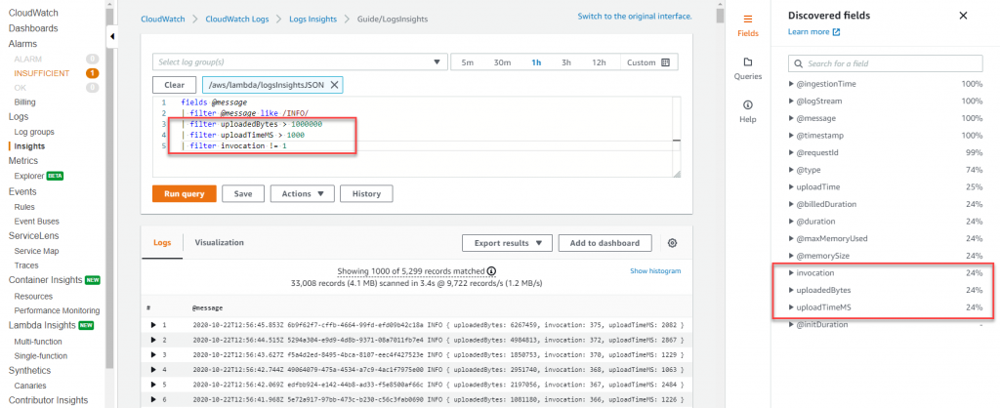
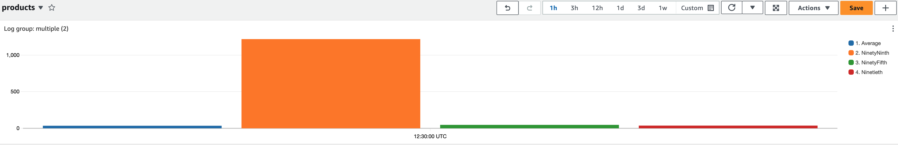
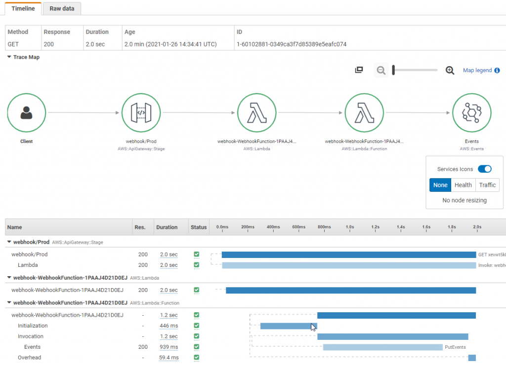

# 基于 AWS Lambda 的无服务器可观测性

在分布式系统和无服务器计算的世界中，实现可观测性是确保应用程序可靠性和性能的关键。它不仅仅是传统的监控。通过利用 AWS 的可观测性工具，如 Amazon CloudWatch 和 AWS X-Ray，您可以深入了解您的无服务器应用程序，排查问题并优化应用程序性能。在本指南中，我们将学习实现基于 Lambda 的无服务器应用程序可观测性的关键概念、工具和最佳实践。

在为您的基础设施或应用程序实施可观测性之前，第一步是确定您的关键目标。可能是增强用户体验、提高开发人员生产力、满足服务级别目标（SLO）、增加业务收入，或根据您的应用程序类型设定的任何其他特定目标。因此，请明确定义这些关键目标，并确定如何衡量它们。然后从这些目标出发，设计您的可观测性策略。请参考“[监控重要事项](https://aws-observability.github.io/observability-best-practices/guides/#monitor-what-matters)”以了解更多信息。

## 可观测性的三大支柱

可观测性有三大支柱：

* **日志**：记录应用程序或系统中发生的离散事件的时间戳，例如故障、错误或状态转换。
* **指标**：在不同时间间隔测量的数值数据（时间序列数据）；SLI（请求率、错误率、持续时间、CPU% 等）。
* **追踪**：追踪表示单个用户在多个应用程序和系统（通常是微服务）中的旅程。

AWS 提供了原生和开源工具，以促进日志记录、监控指标和追踪，从而为您的 AWS Lambda 应用程序提供可操作的见解。

## **日志**

在本节的可观测性最佳实践指南中，我们将深入探讨以下主题：

* 非结构化日志与结构化日志
* CloudWatch Logs Insights
* 日志关联 ID
* 使用 Lambda Powertools 的代码示例
* 使用 CloudWatch 仪表板进行日志可视化
* CloudWatch 日志保留

日志是应用程序中发生的离散事件。这些事件可以包括故障、错误、执行路径或其他内容。日志可以以非结构化、半结构化或结构化格式记录。

### **非结构化日志与结构化日志**

我们经常看到开发人员在应用程序中使用 `print` 或 `console.log` 语句开始简单的日志记录。这些日志难以在规模上进行程序化解析和分析，特别是在生成大量日志消息的 AWS Lambda 应用程序中。因此，将这些日志整合到 CloudWatch 中变得具有挑战性且难以分析。您需要进行文本匹配或正则表达式来查找日志中的相关信息。以下是非结构化日志的示例：

```plaintext
[2023-07-19T19:59:07Z]  INFO  Request started
[2023-07-19T19:59:07Z]  INFO  AccessDenied: Could not access resource
[2023-07-19T19:59:08Z]  INFO  Request finished
```

正如您所见，日志消息缺乏一致的结构，因此很难从中获得有用的见解。此外，很难为其添加上下文信息。

而结构化日志是一种以一致格式（通常为 JSON）记录信息的方式，允许将日志视为数据而不是文本，这使得查询和过滤变得简单。它为开发人员提供了高效存储、检索和分析日志的能力，并有助于更好地调试。结构化日志提供了一种更简单的方法，通过日志级别在不同环境中修改日志的详细程度。**注意日志级别。** 过多的日志记录会增加成本并降低应用程序的吞吐量。确保在日志记录之前删除个人身份信息。以下是结构化日志的示例：

```json
{
   "correlationId": "9ac54d82-75e0-4f0d-ae3c-e84ca400b3bd",
   "requestId": "58d9c96e-ae9f-43db-a353-c48e7a70bfa8",
   "level": "INFO",
   "message": "AccessDenied",
   "function-name": "demo-observability-function",
   "cold-start": true
}
```

**`建议使用结构化和集中化的日志记录到 CloudWatch 日志中`**，以发出有关事务、跨不同组件的关联标识符以及应用程序的业务结果的运营信息。

### **CloudWatch Logs Insights**

使用 CloudWatch Logs Insights，它可以自动发现 JSON 格式日志中的字段。此外，JSON 日志可以扩展为记录特定于应用程序的自定义元数据，这些元数据可用于搜索、过滤和聚合日志。

### **日志关联 ID**

例如，对于从 API Gateway 传入的 HTTP 请求，关联 ID 设置在 `requestContext.requestId` 路径中，可以轻松提取并使用 Lambda Powertools 在下游 Lambda 函数中记录。分布式系统通常涉及多个服务和组件协同处理请求。因此，记录关联 ID 并将其传递到下游系统对于端到端追踪和调试至关重要。关联 ID 是在请求开始时分配的唯一标识符。随着请求通过不同的服务，关联 ID 包含在日志中，使您能够追踪请求的整个路径。您可以手动将关联 ID 插入到 AWS Lambda 日志中，或使用 [AWS Lambda Powertools](https://docs.powertools.aws.dev/lambda/python/latest/core/logger/#setting-a-correlation-id) 等工具轻松从 API Gateway 获取关联 ID 并将其与应用程序日志一起记录。例如，对于 HTTP 请求，关联 ID 可以是请求 ID，可以在 API Gateway 中启动，然后传递到后端服务（如 Lambda 函数）。

### **使用 Lambda Powertools 的代码示例**

作为最佳实践，尽可能早地在请求生命周期中生成关联 ID，最好是在无服务器应用程序的入口点（如 API Gateway 或应用程序负载均衡器）生成。使用 UUID 或请求 ID 或任何其他唯一属性来跟踪分布式系统中的请求。将关联 ID 作为自定义标头、正文或元数据的一部分与每个请求一起传递。确保在所有下游服务的日志条目和追踪中包含关联 ID。

您可以手动捕获并将关联 ID 包含在 Lambda 函数日志中，或使用 [AWS Lambda Powertools](https://docs.powertools.aws.dev/lambda/python/latest/core/logger/#setting-a-correlation-id) 等工具。使用 Lambda Powertools，您可以轻松从支持的预定义请求 [路径映射](https://github.com/aws-powertools/powertools-lambda-python/blob/08a0a7b68d2844d36c33ab8156640f4ea9632d0c/aws_lambda_powertools/logging/correlation_paths.py) 中获取关联 ID，并自动将其添加到应用程序日志中。此外，确保在所有错误消息中添加关联 ID，以便在发生故障时轻松调试和识别根本原因，并将其与原始请求关联起来。

让我们看一下代码示例，展示如何使用关联 ID 进行结构化日志记录，并在 CloudWatch 中查看以下无服务器架构的日志：


```java
// 初始化日志记录器
Logger log = LogManager.getLogger();

// 使用 Lambda Powertools 中的 @Logger 注解，该注解接受可选参数 correlationIdPath 以从 API Gateway 标头中提取关联 ID，并将 correlation_id 插入到 Lambda 函数日志中，以结构化格式记录。
@Logging(correlationIdPath = "/headers/path-to-correlation-id")
public APIGatewayProxyResponseEvent handleRequest(final APIGatewayProxyRequestEvent input, final Context context) {
  ...
  // 下面的日志语句还将包含额外的 correlation_id
  log.info("Success")
  ...
}
```

在此示例中，基于 Java 的 Lambda 函数使用 Lambda Powertools 库记录来自 API Gateway 请求的 `correlation_id`。

代码示例的 CloudWatch 日志示例：

```json
{
   "level": "INFO",
   "message": "Success",
   "function-name": "demo-observability-function",
   "cold-start": true,
   "lambda_request_id": "52fdfc07-2182-154f-163f-5f0f9a621d72",
   "correlation_id": "<correlation_id_value>"
}
```

### **使用 CloudWatch 仪表板进行日志可视化**

一旦您以结构化 JSON 格式记录数据，[CloudWatch Logs Insights](https://docs.aws.amazon.com/AmazonCloudWatch/latest/logs/AnalyzingLogData.html) 就会自动发现 JSON 输出中的值并将消息解析为字段。CloudWatch Logs Insights 提供了专用的 [SQL 类查询](https://serverlessland.com/snippets?type=CloudWatch+Logs+Insights) 语言，用于搜索和过滤多个日志流。您可以使用通配符和正则表达式模式匹配对多个日志组执行查询。此外，您还可以编写自定义查询并保存它们以便重新运行，而无需每次都重新创建它们。



在 CloudWatch Logs Insights 中，您可以从查询中生成可视化图表，如折线图、条形图和堆叠面积图，并使用一个或多个聚合函数。然后，您可以轻松地将这些可视化添加到 CloudWatch 仪表板中。下面的示例仪表板显示了 Lambda 函数执行持续时间的百分位数报告。此类仪表板将快速为您提供有关应集中精力改进应用程序性能的见解。平均延迟是一个很好的指标，但**`您应该优化 p99 而不是平均延迟。`**



要将（平台、函数和扩展）日志发送到 CloudWatch 以外的位置，您可以使用 [Lambda Telemetry API](https://docs.aws.amazon.com/lambda/latest/dg/telemetry-api.html) 和 Lambda 扩展。许多 [合作伙伴解决方案](https://docs.aws.amazon.com/lambda/latest/dg/extensions-api-partners.html) 提供了使用 Lambda Telemetry API 的 Lambda 层，并使与他们的系统集成更加容易。

为了充分利用 CloudWatch Logs Insights，请考虑必须以结构化日志记录的形式将哪些数据摄取到日志中，这将有助于更好地监控应用程序的健康状况。

### **CloudWatch 日志保留**

默认情况下，Lambda 函数中写入 stdout 的所有消息都会保存到 Amazon CloudWatch 日志流中。Lambda 函数的执行角色应具有创建 CloudWatch 日志流并将日志事件写入流的权限。需要注意的是，CloudWatch 按摄取的数据量和使用的存储量计费。因此，减少日志记录量将有助于最小化相关成本。**`默认情况下，CloudWatch 日志会无限期保留且永不过期。建议配置日志保留策略以减少日志存储成本`**，并将其应用于所有日志组。您可能希望为每个环境设置不同的保留策略。可以在 AWS 控制台中手动配置日志保留，但为了确保一致性和最佳实践，您应将其作为基础设施即代码（IaC）部署的一部分进行配置。以下是一个示例 CloudFormation 模板，展示了如何为 Lambda 函数配置日志保留：

```yaml
Resources:
  Function:
    Type: AWS::Serverless::Function
    Properties:
      CodeUri: .
      Runtime: python3.8
      Handler: main.handler
      Tracing: Active

  # 显式引用 Lambda 函数的日志组
  LogGroup:
    Type: AWS::Logs::LogGroup
    Properties:
      LogGroupName: !Sub "/aws/lambda/${Function}"
      # 显式保留时间
      RetentionInDays: 7
```

在此示例中，我们创建了一个 Lambda 函数和相应的日志组。**`RetentionInDays`** 属性设置为 **7 天**，这意味着此日志组中的日志将保留 7 天，然后自动删除，从而帮助控制日志存储成本。

## **指标**

在本节的可观测性最佳实践指南中，我们将深入探讨以下主题：

* 监控和警报开箱即用的指标
* 发布自定义指标
* 使用嵌入式指标从日志中自动生成指标
* 使用 CloudWatch Lambda Insights 监控系统级指标
* 创建 CloudWatch 警报

### **监控和警报开箱即用的指标**

指标是在不同时间间隔测量的数值数据（时间序列数据）和服务级别指标（请求率、错误率、持续时间、CPU 等）。AWS 服务提供了许多开箱即用的标准指标，以帮助监控应用程序的运行状况。确定适用于您的应用程序的关键指标，并使用它们来监控应用程序的性能。关键指标的示例可能包括函数错误、队列深度、失败的状态机执行和 API 响应时间。

开箱即用指标的一个挑战是如何在 CloudWatch 仪表板中分析它们。例如，当查看并发性时，我是查看最大值、平均值还是百分位数？每个指标的监控统计信息不同。

作为最佳实践，对于 Lambda 函数的 `ConcurrentExecutions` 指标，查看 `Count` 统计信息以检查它是否接近账户和区域限制，或接近 Lambda 保留并发限制（如果适用）。对于 `Duration` 指标，它指示您的函数处理事件所需的时间，查看 `Average` 或 `Max` 统计信息。对于测量 API 的延迟，查看 API Gateway 的 `Latency` 指标的 `Percentile` 统计信息。P50、P90 和 P99 是比平均值更好的监控延迟的方法。

一旦您知道要监控哪些指标，请配置这些关键指标的警报，以便在应用程序组件不健康时通知您。例如：

* 对于 AWS Lambda，警报 Duration、Errors、Throttling 和 ConcurrentExecutions。对于基于流的调用，警报 IteratorAge。对于异步调用，警报 DeadLetterErrors。
* 对于 Amazon API Gateway，警报 IntegrationLatency、Latency、5XXError、4XXError。
* 对于 Amazon SQS，警报 ApproximateAgeOfOldestMessage、ApproximateNumberOfMessageVisible。
* 对于 AWS Step Functions，警报 ExecutionThrottled、ExecutionsFailed、ExecutionsTimedOut。

### **发布自定义指标**

根据应用程序的期望业务和客户成果确定关键绩效指标（KPI）。评估 KPI 以确定应用程序的成功和运行状况。关键指标可能因应用程序类型而异，但示例包括访问的站点、下的订单、购买的航班、页面加载时间、唯一访问者等。

发布自定义指标到 AWS CloudWatch 的一种方法是调用 CloudWatch 指标 SDK 的 `putMetricData` API。然而，`putMetricData` API 调用是同步的。它会增加 Lambda 函数的持续时间，并可能阻塞应用程序中的其他 API 调用，导致性能瓶颈。此外，Lambda 函数的较长执行时间将导致更高的成本。此外，您还需要为发送到 CloudWatch 的自定义指标数量和 API 调用（即 PutMetricData API 调用）数量付费。

**`更高效且更具成本效益的发布自定义指标的方法是使用`** [CloudWatch 嵌入式指标格式](https://docs.aws.amazon.com/AmazonCloudWatch/latest/monitoring/CloudWatch_Embedded_Metric_Format.html) (EMF)。CloudWatch 嵌入式指标格式允许您**`异步`**生成自定义指标作为写入 CloudWatch 日志的日志，从而提高应用程序性能并降低成本。使用 EMF，您可以将自定义指标与详细的日志事件数据一起嵌入，CloudWatch 会自动提取这些自定义指标，以便您可以像对待开箱即用指标一样对其进行可视化和设置警报。通过以嵌入式指标格式发送日志，您可以使用 [CloudWatch Logs Insights](https://docs.aws.amazon.com/AmazonCloudWatch/latest/logs/AnalyzingLogData.html) 进行查询，并且您只需为查询付费，而不是指标的成本。

要实现这一点，您可以使用 [EMF 规范](https://docs.aws.amazon.com/AmazonCloudWatch/latest/monitoring/CloudWatch_Embedded_Metric_Format_Specification.html) 生成日志，并使用 `PutLogEvents` API 将其发送到 CloudWatch。为了简化过程，有**两个支持创建 EMF 格式指标的客户端库**。

* 低级客户端库 ([aws-embedded-metrics](https://docs.aws.amazon.com/AmazonCloudWatch/latest/monitoring/CloudWatch_Embedded_Metric_Format_Libraries.html))
* Lambda Powertools [Metrics](https://docs.powertools.aws.dev/lambda/java/core/metrics/).

### **使用 [CloudWatch Lambda Insights](https://docs.aws.amazon.com/AmazonCloudWatch/latest/monitoring/Lambda-Insights.html) 监控系统级指标**

CloudWatch Lambda Insights 为您提供系统级指标，包括 CPU 时间、内存使用、磁盘利用率和网络性能。Lambda Insights 还收集、汇总和总结诊断信息，例如**`冷启动`**和 Lambda 工作线程关闭。Lambda Insights 利用 CloudWatch Lambda 扩展，该扩展打包为 Lambda 层。一旦启用，它会收集系统级指标，并为每次调用的 Lambda 函数发出单个性能日志事件到 CloudWatch 日志，以嵌入式指标格式记录。

:::note
    CloudWatch Lambda Insights 默认未启用，需要为每个 Lambda 函数启用。
:::

您可以通过 AWS 控制台或基础设施即代码（IaC）启用它。以下是如何使用 AWS 无服务器应用程序模型（SAM）启用它的示例。您将 `LambdaInsightsExtension` 扩展层添加到您的 Lambda 函数，并添加托管 IAM 策略 `CloudWatchLambdaInsightsExecutionRolePolicy`，该策略授予您的 Lambda 函数创建日志流并调用 `PutLogEvents` API 以将日志写入其中的权限。

```yaml
// 将 LambdaInsightsExtension 层添加到您的函数资源
Resources:
  MyFunction:
    Type: AWS::Serverless::Function
    Properties:
      Layers:
        - !Sub "arn:aws:lambda:${AWS::Region}:580247275435:layer:LambdaInsightsExtension:14"
        
// 添加 IAM 策略以启用 Lambda 函数将日志写入 CloudWatch
Resources:
  MyFunction:
    Type: AWS::Serverless::Function
    Properties:
      Policies:
        - `CloudWatchLambdaInsightsExecutionRolePolicy`
```

然后，您可以使用 CloudWatch 控制台在 Lambda Insights 下查看这些系统级性能指标。


### **创建 CloudWatch 警报**

创建 CloudWatch 警报并在指标超出范围时采取必要的措施是可观测性的关键部分。Amazon [CloudWatch 警报](https://docs.aws.amazon.com/AmazonCloudWatch/latest/monitoring/AlarmThatSendsEmail.html) 用于在应用程序和基础设施指标超过静态或动态设置的阈值时提醒您或自动执行修复操作。

要为指标设置警报，您选择一个触发一组操作的阈值。固定阈值称为静态阈值。例如，您可以配置一个关于 Lambda 函数的 `Throttles` 指标的警报，如果它在 5 分钟内超过 10% 的时间，则激活。这可能意味着 Lambda 函数已达到您的账户和区域的最大并发性。

在无服务器应用程序中，通常使用 SNS（简单通知服务）发送警报。这使用户能够通过电子邮件、短信或其他渠道接收警报。此外，您可以将 Lambda 函数订阅到 SNS 主题，允许其自动修复导致警报触发的任何问题。

例如，假设您有一个 Lambda 函数 A，它正在轮询 SQS 队列并调用下游服务。如果下游服务关闭且未响应，Lambda 函数将继续从 SQS 轮询并尝试调用下游服务但失败。虽然您可以监控这些错误并使用 SNS 生成 CloudWatch 警报以通知适当的团队，但您还可以调用另一个 Lambda 函数 B（通过 SNS 订阅），它可以禁用 Lambda 函数 A 的事件源映射，从而停止其轮询 SQS 队列，直到下游服务恢复运行。

虽然为单个指标设置警报是好的，但有时监控多个指标对于更好地了解应用程序的运行状况和性能是必要的。在这种情况下，您应该使用 [指标数学](https://docs.aws.amazon.com/AmazonCloudWatch/latest/monitoring/using-metric-math.html) 表达式基于多个指标设置警报。

例如，如果您想监控 AWS Lambda 错误但允许少量错误而不触发警报，您可以创建一个错误率表达式，形式为百分比。即 ErrorRate = errors / invocation * 100，然后创建一个警报，如果 ErrorRate 在配置的评估期内超过 20%，则发送警报。

## **追踪**

在本节的可观测性最佳实践指南中，我们将深入探讨以下主题：

* 分布式追踪和 AWS X-Ray 简介
* 应用适当的采样规则
* 使用 X-Ray SDK 追踪与其他服务的交互
* 使用 X-Ray SDK 追踪集成服务的代码示例

### 分布式追踪和 AWS X-Ray 简介

大多数无服务器应用程序由多个微服务组成，每个微服务使用多个 AWS 服务。由于无服务器架构的性质，分布式追踪至关重要。为了有效的性能监控和错误跟踪，重要的是追踪整个应用程序流程中的事务，从源调用者到所有下游服务。虽然可以使用各个服务的日志实现这一点，但使用像 AWS X-Ray 这样的追踪工具更快、更高效。有关更多信息，请参阅 [使用 AWS X-Ray 检测您的应用程序](https://docs.aws.amazon.com/xray/latest/devguide/xray-instrumenting-your-app.html)。

AWS X-Ray 使您能够追踪请求在涉及的微服务中的流动。X-Ray 服务映射使您能够了解不同的集成点并识别应用程序的任何性能下降。您只需点击几下即可快速隔离导致错误、限制或延迟问题的应用程序组件。在服务图下，您还可以查看各个追踪以精确定位每个微服务所花费的确切时间。



**`作为最佳实践，在代码中为下游调用或任何需要监控的特定功能创建自定义子段`**。例如，您可以创建一个子段来监控对外部 HTTP API 的调用或 SQL 数据库查询。

例如，要为调用下游服务的函数创建自定义子段，请使用 `captureAsyncFunc` 函数（在 node.js 中）

```javascript
var AWSXRay = require('aws-xray-sdk');

app.use(AWSXRay.express.openSegment('MyApp'));

app.get('/', function (req, res) {
  var host = 'api.example.com';

  // 子段的开始
  AWSXRay.captureAsyncFunc('send', function(subsegment) {
    sendRequest(host, function() {
      console.log('rendering!');
      res.render('index');

      // 子段的结束
      subsegment.close();
    });
  });
});
```

在此示例中，应用程序为对 `sendRequest` 函数的调用创建了一个名为 `send` 的自定义子段。`captureAsyncFunc` 传递一个子段，您必须在回调函数中关闭它，当它进行的异步调用完成时。

### **应用适当的采样规则**

AWS X-Ray SDK 默认不会追踪所有请求。它应用保守的采样规则以在不产生高成本的情况下提供请求的代表性样本。但是，您可以根据特定需求 [自定义](https://docs.aws.amazon.com/xray/latest/devguide/xray-console-sampling.html#xray-console-config) 默认采样规则或完全禁用采样并开始追踪所有请求。

需要注意的是，AWS X-Ray 不打算用作审计或合规工具。您应考虑为不同类型的应用程序设置**`不同的采样率`**。例如，高容量的只读调用（如后台轮询或健康检查）可以以较低的速率采样，同时仍提供足够的数据以识别可能出现的任何潜在问题。您可能还希望为每个环境设置**`不同的采样率`**。例如，在开发环境中，您可能希望追踪所有请求以轻松排除任何错误或性能问题，而在生产环境中，您可能希望追踪较少的请求。**`您还应记住，广泛的追踪可能会导致成本增加`**。有关采样规则的更多信息，请参阅 [_在 X-Ray 控制台中配置采样规则_](https://docs.aws.amazon.com/xray/latest/devguide/xray-console-sampling.html)。

### **使用 X-Ray SDK 追踪与其他 AWS 服务的交互**

虽然可以轻松地为 AWS Lambda 和 Amazon API Gateway 等服务启用 X-Ray 追踪，只需点击几下或在您的 IaC 工具中添加几行代码，但其他服务需要额外的步骤来检测其代码。以下是 [与 X-Ray 集成的 AWS 服务完整列表](https://docs.aws.amazon.com/xray/latest/devguide/xray-services.html)。

要为未与 X-Ray 集成的服务（如 DynamoDB）检测调用，您可以通过使用 AWS X-Ray SDK 包装 AWS SDK 调用来捕获追踪。例如，在使用 node.js 时，您可以按照以下代码示例捕获所有 AWS SDK 调用：

### **使用 X-Ray SDK 追踪集成服务的代码示例**

```javascript
//... 从（旧代码）
const AWS = require('aws-sdk');

//... 到（新代码）
const AWSXRay = require('aws-xray-sdk-core');
const AWS = AWSXRay.captureAWS(require('aws-sdk'));
...
```

:::note
    要为单个客户端检测，请将您的 AWS SDK 客户端包装在 `AWSXRay.captureAWSClient` 调用中。不要同时使用 `captureAWS` 和 `captureAWSClient`。这将导致重复的追踪。
:::

## **其他资源**

[CloudWatch Logs Insights](https://docs.aws.amazon.com/AmazonCloudWatch/latest/logs/AnalyzingLogData.html)

[CloudWatch Lambda Insights](https://docs.aws.amazon.com/AmazonCloudWatch/latest/monitoring/Lambda-Insights.html)

[嵌入式指标库](https://github.com/awslabs/aws-embedded-metrics-java)

## 总结

在本 AWS Lambda 无服务器应用程序的可观测性最佳实践指南中，我们强调了使用 Amazon CloudWatch 和 AWS X-Ray 等原生 AWS 服务进行日志记录、指标和追踪的关键方面。我们建议使用 AWS Lambda Powertools 库轻松将可观测性最佳实践添加到您的应用程序中。通过采用这些最佳实践，您可以解锁有关无服务器应用程序的宝贵见解，从而实现更快的错误检测和性能优化。

如需进一步深入了解，我们强烈建议您练习 AWS [One Observability Workshop](https://catalog.workshops.aws/observability/en-US) 中的 AWS 原生可观测性模块。