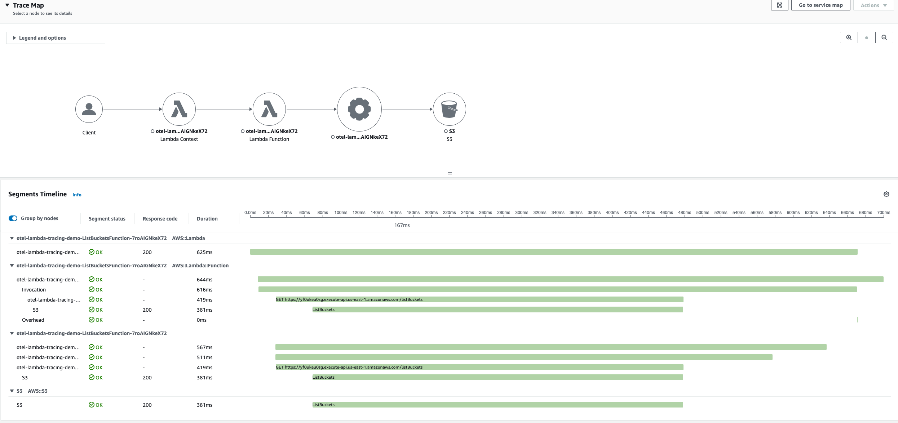

# 基于 AWS Lambda 的无服务器可观测性与 OpenTelemetry

本指南介绍了如何使用托管开源工具和技术与原生 AWS 监控服务（如 AWS X-Ray 和 Amazon CloudWatch）为基于 Lambda 的无服务器应用程序配置可观测性的最佳实践。我们将介绍 [AWS Distro for OpenTelemetry (ADOT)](https://aws-otel.github.io/docs/introduction)、[AWS X-Ray](https://aws.amazon.com/xray) 和 [Amazon Managed Service for Prometheus (AMP)](https://aws.amazon.com/prometheus/) 等工具，以及如何使用这些工具获得对无服务器应用程序的可操作见解、排查问题并优化应用程序性能。

## **涵盖的关键主题**

在本节的可观测性最佳实践指南中，我们将深入探讨以下主题：

* AWS Distro for OpenTelemetry (ADOT) 和 ADOT Lambda 层简介
* 使用 ADOT Lambda 层自动检测 Lambda 函数
* ADOT Collector 的自定义配置支持
* 与 Amazon Managed Service for Prometheus (AMP) 的集成
* 使用 ADOT Lambda 层的优缺点
* 使用 ADOT 时管理冷启动延迟

## **AWS Distro for OpenTelemetry (ADOT) 简介**

[AWS Distro for OpenTelemetry (ADOT)](https://aws-otel.github.io/docs/introduction) 是 Cloud Native Computing Foundation (CNCF) [OpenTelemetry (OTel)](https://opentelemetry.io/) 项目的安全、生产就绪、AWS 支持的分发版。使用 ADOT，您可以仅检测一次应用程序，并将相关的指标和追踪发送到多个监控解决方案。

AWS 托管的 [OpenTelemetry Lambda 层](https://aws-otel.github.io/docs/getting-started/lambda) 利用 [OpenTelemetry Lambda 层](https://github.com/open-telemetry/opentelemetry-lambda) 导出遥测数据。它通过包装 AWS Lambda 函数并提供即插即用的用户体验，打包了 OpenTelemetry 运行时特定的 SDK、精简版的 ADOT Collector 以及用于自动检测 AWS Lambda 函数的开箱即用配置。ADOT Lambda 层的 Collector 组件（如接收器、导出器和扩展）支持与 Amazon CloudWatch、Amazon OpenSearch Service、Amazon Managed Service for Prometheus、AWS X-Ray 等集成。完整列表请参见 [此处](https://github.com/aws-observability/aws-otel-lambda)。ADOT 还支持与 [合作伙伴解决方案](https://aws.amazon.com/otel/partners) 的集成。

ADOT Lambda 层支持自动检测（适用于 Python、NodeJS 和 Java）以及针对任何特定库和 SDK 的自定义检测。对于自动检测，默认情况下，Lambda 层配置为将追踪导出到 AWS X-Ray。对于自定义检测，您需要从相应的 [OpenTelemetry 运行时检测库](https://github.com/open-telemetry) 中包含相应的库检测，并修改代码以在函数中初始化它。

## **使用 ADOT Lambda 层自动检测 AWS Lambda 函数**

您可以轻松启用 Lambda 函数的自动检测，而无需更改代码。让我们以将 ADOT Lambda 层添加到现有的基于 Java 的 Lambda 函数并在 CloudWatch 中查看执行日志和追踪为例。

1. 根据 [文档](https://aws-otel.github.io/docs/getting-started/lambda) 中的 `runtime`、`region` 和 `arch type` 选择 Lambda 层的 ARN。确保您使用的 Lambda 层与 Lambda 函数位于同一区域。例如，Java 自动检测的 Lambda 层为 `arn:aws:lambda:us-east-1:901920570463:layer:aws-otel-java-agent-x86_64-ver-1-28-1:1`。
2. 通过控制台或您选择的基础设施即代码（IaC）将层添加到您的 Lambda 函数。
    * 使用 AWS 控制台，按照 [说明](https://docs.aws.amazon.com/lambda/latest/dg/adding-layers.html) 将层添加到您的 Lambda 函数。在指定 ARN 下粘贴上面选择的层 ARN。
    * 使用 IaC 选项，Lambda 函数的 SAM 模板如下所示：
    ```yaml
    Layers:
    - !Sub arn:aws:lambda:${AWS::Region}:901920570463:layer:aws-otel-java-agent-arm64-ver-1-28-1:1
    ```
3. 为您的 Lambda 函数添加环境变量 `AWS_LAMBDA_EXEC_WRAPPER=/opt/otel-handler`（适用于 Node.js 或 Java）或 `AWS_LAMBDA_EXEC_WRAPPER=/opt/otel-instrument`（适用于 Python）。
4. 为您的 Lambda 函数启用 Active Tracing。**`注意`** 默认情况下，层配置为将追踪导出到 AWS X-Ray。确保您的 Lambda 函数的执行角色具有所需的 AWS X-Ray 权限。有关 AWS Lambda 的 AWS X-Ray 权限的更多信息，请参阅 [AWS Lambda 文档](https://docs.aws.amazon.com/lambda/latest/dg/services-xray.html#services-xray-permissions)。
    * `Tracing: Active`
5. 带有 Lambda 层配置、环境变量和 X-Ray 追踪的示例 SAM 模板如下所示：
```yaml
Resources:
  ListBucketsFunction:
    Type: AWS::Serverless::Function
    Properties:
      Handler: com.example.App::handleRequest
      ...
      ProvisionedConcurrencyConfig:
        ProvisionedConcurrentExecutions: 1
      Policies:
        - AWSXrayWriteOnlyAccess
        - AmazonS3ReadOnlyAccess
      Environment:
        Variables:
          AWS_LAMBDA_EXEC_WRAPPER: /opt/otel-handler
      Tracing: Active
      Layers:
        - !Sub arn:aws:lambda:${AWS::Region}:901920570463:layer:aws-otel-java-agent-amd64-ver-1-28-1:1
      Events:
        HelloWorld:
          Type: Api
          Properties:
            Path: /listBuckets
            Method: get
```
6. 在 AWS X-Ray 中测试和可视化追踪
通过 API 调用您的 Lambda 函数（如果 API 配置为触发器）。例如，通过 API 调用 Lambda 函数（使用 `curl`）将生成如下日志：
```bash
curl -X GET https://XXXXXX.execute-api.us-east-1.amazonaws.com/Prod/listBuckets
```
Lambda 函数日志：
<pre><code>
OpenJDK 64-Bit Server VM warning: Sharing is only supported for boot loader classes because bootstrap classpath has been appended
[otel.javaagent 2023-09-24 15:28:16:862 +0000] [main] INFO io.opentelemetry.javaagent.tooling.VersionLogger - opentelemetry-javaagent - version: 1.28.0-adot-lambda1-aws
EXTENSION Name: collector State: Ready Events: [INVOKE, SHUTDOWN]
START RequestId: ed8f8444-3c29-40fe-a4a1-aca7af8cd940 Version: 3
...
END RequestId: ed8f8444-3c29-40fe-a4a1-aca7af8cd940
REPORT RequestId: ed8f8444-3c29-40fe-a4a1-aca7af8cd940 Duration: 5144.38 ms Billed Duration: 5145 ms Memory Size: 1024 MB Max Memory Used: 345 MB Init Duration: 27769.64 ms
<b>XRAY TraceId: 1-65105691-384f7da75714148655fa631b SegmentId: 2c52a147021ebd20 Sampled: true</b>
</code></pre>

从日志中可以看到，OpenTelemetry Lambda 扩展开始监听并使用 opentelemetry-javaagent 检测 Lambda 函数，并在 AWS X-Ray 中生成追踪。

要查看上述 Lambda 函数调用的追踪，请导航到 AWS X-Ray 控制台并选择追踪 ID。您应该看到追踪图以及分段时间线，如下所示：


## **ADOT Collector 的自定义配置支持**

ADOT Lambda 层结合了 OpenTelemetry SDK 和 ADOT Collector 组件。ADOT Collector 的配置遵循 OpenTelemetry 标准。默认情况下，ADOT Lambda 层使用 [config.yaml](https://github.com/aws-observability/aws-otel-lambda/blob/main/adot/collector/config.yaml)，它将遥测数据导出到 AWS X-Ray。然而，ADOT Lambda 层也支持其他导出器，使您能够将指标和追踪发送到其他目的地。完整列表请参见 [此处](https://github.com/aws-observability/aws-otel-lambda/blob/main/README.md#adot-lambda-layer-available-components)。

## **与 Amazon Managed Service for Prometheus (AMP) 的集成**

您可以使用自定义 Collector 配置将指标从 Lambda 函数导出到 Amazon Managed Prometheus (AMP)。

1. 按照上述自动检测的步骤配置 Lambda 层，设置环境变量 `AWS_LAMBDA_EXEC_WRAPPER`。
2. 按照 [说明](https://docs.aws.amazon.com/prometheus/latest/userguide/AMP-onboard-create-workspace.html) 在您的 AWS 账户中创建 Amazon Managed Prometheus 工作区，您的 Lambda 函数将向该工作区发送指标。记下 AMP 工作区的 `Endpoint - remote write URL`。您需要在 ADOT Collector 配置中配置它。
3. 在 Lambda 函数的根目录中创建一个自定义的 ADOT Collector 配置文件（例如 `collector.yaml`），其中包含上一步中 AMP 端点远程写入 URL 的详细信息。您还可以从 S3 存储桶加载配置文件。
示例 ADOT Collector 配置文件：
```yaml
#collector.yaml 在根目录中
#设置环境变量 'OPENTELEMETRY_COLLECTOR_CONFIG_FILE' 为 '/var/task/collector.yaml'

extensions:
  sigv4auth:
    service: "aps"
    region: "<workspace_region>"

receivers:
  otlp:
    protocols:
      grpc:
      http:

exporters:
  logging:
  prometheusremotewrite:
    endpoint: "<workspace_remote_write_url>"
    namespace: test
    auth:
      authenticator: sigv4auth

service:
  extensions: [sigv4auth]
  pipelines:
    traces:
      receivers: [otlp]
      exporters: [awsxray]
    metrics:
      receivers: [otlp]
      exporters: [logging, prometheusremotewrite]
```
Prometheus Remote Write Exporter 还可以配置重试和超时设置。有关更多信息，请参阅 [文档](https://github.com/open-telemetry/opentelemetry-collector-contrib/blob/main/exporter/prometheusremotewriteexporter/README.md)。**`注意`** `sigv4auth` 扩展的服务值应为 `aps`（Amazon Prometheus Service）。此外，确保您的 Lambda 函数执行角色具有所需的 AMP 权限。有关 AMP 的 AWS Lambda 权限和策略的更多信息，请参阅 AWS Managed Service for Prometheus [文档](https://docs.aws.amazon.com/prometheus/latest/userguide/AMP-and-IAM.html#AMP-IAM-policies-built-in)。

4. 添加环境变量 `OPENTELEMETRY_COLLECTOR_CONFIG_FILE` 并将其值设置为配置文件的路径。例如 `/var/task/`<配置文件路径>`.yaml`。这将告诉 Lambda 层扩展在哪里找到 Collector 配置。
```yaml
Function:
    Type: AWS::Serverless::Function
    Properties:
      ...
      Environment:
        Variables:
          OPENTELEMETRY_COLLECTOR_CONFIG_FILE: /var/task/collector.yaml
```
5. 更新您的 Lambda 函数代码以使用 OpenTelemetry Metrics API 添加指标。请查看此处的示例。
```java
// 获取 meter
Meter meter = GlobalOpenTelemetry.getMeterProvider()
    .meterBuilder("aws-otel")
    .setInstrumentationVersion("1.0")
    .build();

// 构建计数器，例如 LongCounter
LongCounter counter = meter
    .counterBuilder("processed_jobs")
    .setDescription("Processed jobs")
    .setUnit("1")
    .build();

// 建议 API 用户保留他们将记录的属性的引用
Attributes attributes = Attributes.of(stringKey("Key"), "SomeWork");

// 记录数据
counter.add(123, attributes);
```

## **使用 ADOT Lambda 层的优缺点**

如果您打算从 Lambda 函数向 AWS X-Ray 发送追踪，您可以使用 [X-Ray SDK](https://docs.aws.amazon.com/xray/latest/devguide/xray-sdk-nodejs.html) 或 [AWS Distro for OpenTelemetry (ADOT) Lambda 层](https://aws-otel.github.io/docs/getting-started/lambda)。虽然 X-Ray SDK 支持轻松检测各种 AWS 服务，但它只能将追踪发送到 X-Ray。而作为 Lambda 层一部分的 ADOT Collector 支持每种语言的大量库检测。您可以使用它收集并将指标和追踪发送到 AWS X-Ray 和其他监控解决方案，如 Amazon CloudWatch、Amazon OpenSearch Service、Amazon Managed Service for Prometheus 和其他 [合作伙伴](https://aws-otel.github.io/docs/components/otlp-exporter#appdynamics) 解决方案。

然而，由于 ADOT 提供的灵活性，您的 Lambda 函数可能需要额外的内存，并且可能会显著影响冷启动延迟。因此，如果您正在优化 Lambda 函数以实现低延迟，并且不需要 OpenTelemetry 的高级功能，使用 AWS X-Ray SDK 可能比 ADOT 更合适。有关选择正确的追踪工具的详细比较和指导，请参阅 AWS 文档中的 [在 ADOT 和 X-Ray SDK 之间选择](https://docs.aws.amazon.com/xray/latest/devguide/xray-instrumenting-your-app.html#xray-instrumenting-choosing)。

## **使用 ADOT 时管理冷启动延迟**

适用于 Java 的 ADOT Lambda 层是基于代理的，这意味着当您启用自动检测时，Java 代理将尝试检测所有 OTel [支持](https://github.com/open-telemetry/opentelemetry-java-instrumentation/tree/main/instrumentation) 的库。这将显著增加 Lambda 函数的冷启动延迟。因此，我们建议您仅为应用程序使用的库/框架启用自动检测。

要仅启用特定检测，您可以使用以下环境变量：

* `OTEL_INSTRUMENTATION_COMMON_DEFAULT_ENABLED`：设置为 false 时，禁用层中的自动检测，要求单独启用每个检测。
* `OTEL_INSTRUMENTATION_<NAME>_ENABLED`：设置为 true 以启用特定库或框架的自动检测。将 "NAME" 替换为您要启用的检测。有关可用检测的列表，请参阅 [Suppressing specific agent instrumentation](https://github.com/open-telemetry/opentelemetry-java-instrumentation/blob/main/docs/suppressing-instrumentation.md)。

例如，要仅启用 Lambda 和 AWS SDK 的自动检测，您可以设置以下环境变量：
```bash
OTEL_INSTRUMENTATION_COMMON_DEFAULT_ENABLED=false
OTEL_INSTRUMENTATION_AWS_LAMBDA_ENABLED=true
OTEL_INSTRUMENTATION_AWS_SDK_ENABLED=true
```

## **其他资源**

* [OpenTelemetry](https://opentelemetry.io)
* [AWS Distro for OpenTelemetry (ADOT)](https://aws-otel.github.io/docs/introduction)
* [ADOT Lambda 层](https://aws-otel.github.io/docs/getting-started/lambda)

## **总结**

在本使用开源技术的 AWS Lambda 无服务器应用程序可观测性最佳实践指南中，我们介绍了 AWS Distro for OpenTelemetry (ADOT) 和 Lambda 层，以及如何使用它来检测您的 AWS Lambda 函数。我们介绍了如何轻松启用自动检测以及通过简单配置自定义 ADOT Collector 以将可观测性信号发送到多个目的地。我们强调了使用 ADOT 的优缺点以及它如何影响 Lambda 函数的冷启动延迟，并推荐了管理冷启动时间的最佳实践。通过采用这些最佳实践，您可以仅检测一次应用程序，以与供应商无关的方式将日志、指标和追踪发送到多个监控解决方案。

如需进一步深入了解，我们强烈建议您练习 [AWS One Observability Workshop](https://catalog.workshops.aws/observability/en-US) 中的 AWS 托管开源可观测性模块。