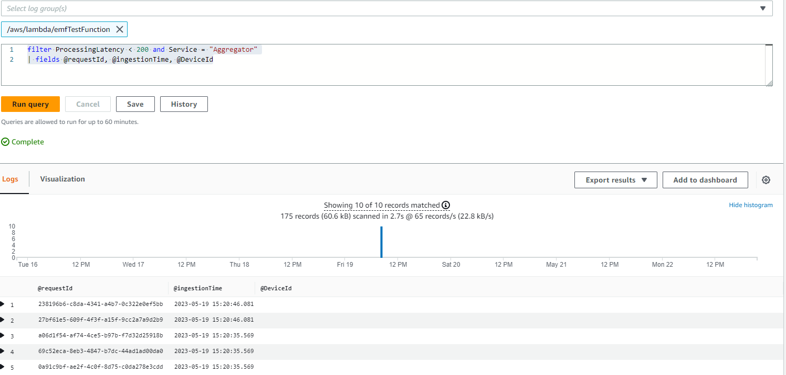
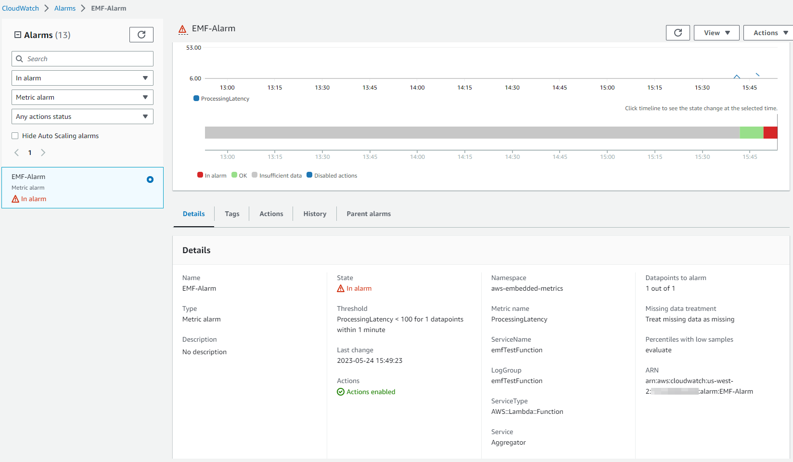

# CloudWatch 嵌入式指标格式 (EMF)

## 简介

CloudWatch 嵌入式指标格式 (EMF) 使客户能够以日志形式将复杂的高基数应用程序数据摄入到 Amazon CloudWatch 中，并生成可操作的指标。通过嵌入式指标格式，客户无需依赖复杂的架构或使用任何第三方工具即可获得对其环境的洞察。虽然此功能可以在所有环境中使用，但在具有临时资源（如 AWS Lambda 函数或 Amazon Elastic Container Service (Amazon ECS)、Amazon Elastic Kubernetes Service (Amazon EKS) 或 EC2 上的 Kubernetes 中的容器）的工作负载中特别有用。嵌入式指标格式让客户可以轻松创建自定义指标，而无需配置或维护单独的代码，同时获得对日志数据的强大分析能力。

## 嵌入式指标格式 (EMF) 日志的工作原理

计算环境（如 Amazon EC2、本地服务器、Amazon Elastic Container Service (Amazon ECS) 中的容器、Amazon Elastic Kubernetes Service (Amazon EKS) 或 EC2 上的 Kubernetes）可以通过 CloudWatch Agent 生成并发送嵌入式指标格式 (EMF) 日志到 Amazon CloudWatch。

AWS Lambda 允许客户轻松生成自定义指标，而无需编写任何自定义代码、进行阻塞式网络调用或依赖任何第三方软件来生成和摄入嵌入式指标格式 (EMF) 日志到 Amazon CloudWatch。

客户可以将自定义指标与详细的日志事件数据异步嵌入，而无需在发布结构化日志时提供特殊的头声明，只需遵循 [EMF 规范](https://docs.aws.amazon.com/AmazonCloudWatch/latest/monitoring/CloudWatch_Embedded_Metric_Format_Specification.html)。CloudWatch 会自动提取自定义指标，以便客户可以可视化并设置警报以进行实时事件检测。与提取的指标相关联的详细日志事件和高基数上下文可以使用 CloudWatch Logs Insights 进行查询，从而深入分析操作事件的根本原因。

[Fluent Bit](https://docs.fluentbit.io/manual/pipeline/outputs/cloudwatch) 的 Amazon CloudWatch 输出插件允许客户将指标和日志数据摄入到 Amazon CloudWatch 服务中，并支持 [嵌入式指标格式](https://github.com/aws/aws-for-fluent-bit) (EMF)。


## 何时使用嵌入式指标格式 (EMF) 日志

传统上，监控分为三类。第一类是应用程序的经典健康检查。第二类是“指标”，客户通过计数器、计时器和仪表等模型来检测其应用程序。第三类是“日志”，它们对应用程序的整体可观测性至关重要。日志为客户提供了关于其应用程序行为的持续信息。现在，客户可以通过嵌入式指标格式 (EMF) 日志统一和简化其应用程序的所有检测，而无需牺牲数据的粒度或丰富性，从而显著改善其应用程序的观测方式，并获得强大的分析能力。

[嵌入式指标格式 (EMF) 日志](https://aws.amazon.com/blogs/mt/enhancing-workload-observability-using-amazon-cloudwatch-embedded-metric-format/) 非常适合生成高基数应用程序数据的环境，这些数据可以成为 EMF 日志的一部分，而无需增加指标维度。这仍然允许客户通过 CloudWatch Logs Insights 和 CloudWatch Metrics Insights 查询 EMF 日志来对应用程序数据进行切片和切块，而无需将每个属性作为指标维度。

从数百万个电信或物联网设备聚合 [遥测数据](https://aws.amazon.com/blogs/mt/how-bt-uses-amazon-cloudwatch-to-monitor-millions-of-devices/) 的客户需要了解其设备性能，并能够快速深入分析设备报告的独特遥测数据。他们还需要更轻松、更快速地解决问题，而无需挖掘大量数据以提供优质服务。通过使用嵌入式指标格式 (EMF) 日志，客户可以将指标和日志结合为单一实体，实现大规模可观测性，并以更高的成本效益和更好的性能改进故障排除。

## 生成嵌入式指标格式 (EMF) 日志

可以使用以下方法生成嵌入式指标格式日志：

1. 通过代理（如 [CloudWatch](https://docs.aws.amazon.com/AmazonCloudWatch/latest/monitoring/CloudWatch_Embedded_Metric_Format_Generation_CloudWatch_Agent.html) 或 Fluent-Bit 或 Firelens）使用开源客户端库生成并发送 EMF 日志。

   - 开源客户端库可用于以下语言，以创建 EMF 日志：
     - [Node.Js](https://github.com/awslabs/aws-embedded-metrics-node)
     - [Python](https://github.com/awslabs/aws-embedded-metrics-python)
     - [Java](https://github.com/awslabs/aws-embedded-metrics-java)
     - [C#](https://github.com/awslabs/aws-embedded-metrics-dotnet)
   - 可以使用 AWS Distro for OpenTelemetry (ADOT) 生成 EMF 日志。ADOT 是 Cloud Native Computing Foundation (CNCF) 的 OpenTelemetry 项目的安全、生产就绪、AWS 支持的分发版。OpenTelemetry 是一个开源项目，提供 API、库和代理来收集分布式跟踪、日志和指标以进行应用程序监控，并消除了供应商特定格式之间的界限和限制。这需要两个组件：一个符合 OpenTelemetry 的数据源和一个启用了 [CloudWatch EMF](https://aws-otel.github.io/docs/getting-started/cloudwatch-metrics#cloudwatch-emf-exporter-awsemf) 日志的 [ADOT Collector](https://github.com/open-telemetry/opentelemetry-collector-contrib/tree/main/exporter/awsemfexporter)。

2. 手动构建符合 [JSON 格式定义规范](https://docs.aws.amazon.com/AmazonCloudWatch/latest/monitoring/CloudWatch_Embedded_Metric_Format_Specification.html) 的日志，可以通过 [CloudWatch 代理](https://docs.aws.amazon.com/AmazonCloudWatch/latest/monitoring/CloudWatch_Embedded_Metric_Format_Generation_CloudWatch_Agent.html) 或 [PutLogEvents API](https://docs.aws.amazon.com/AmazonCloudWatch/latest/monitoring/CloudWatch_Embedded_Metric_Format_Generation_PutLogEvents.html) 发送到 CloudWatch。

## 在 CloudWatch 控制台中查看嵌入式指标格式日志

生成提取指标的嵌入式指标格式 (EMF) 日志后，客户可以在 CloudWatch 控制台的 **Metrics** 下 [查看它们](https://docs.aws.amazon.com/AmazonCloudWatch/latest/monitoring/CloudWatch_Embedded_Metric_Format_View.html)。嵌入式指标具有生成日志时指定的维度。使用客户端库生成的嵌入式指标具有 ServiceType、ServiceName、LogGroup 作为默认维度。

- **ServiceName**：服务名称会被覆盖，但对于无法推断名称的服务（例如在 EC2 上运行的 Java 进程），如果未明确设置，则使用默认值 Unknown。
- **ServiceType**：服务类型会被覆盖，但对于无法推断类型的服务（例如在 EC2 上运行的 Java 进程），如果未明确设置，则使用默认值 Unknown。
- **LogGroupName**：客户可以选择配置指标应传递到的目标日志组，适用于基于代理的平台。此值从库传递到代理的嵌入式指标有效负载中。如果未提供 LogGroup，则默认值将从服务名称派生：-metrics
- **LogStreamName**：客户可以选择配置指标应传递到的目标日志流，适用于基于代理的平台。此值将从库传递到代理的嵌入式指标有效负载中。如果未提供 LogStreamName，则默认值将由代理派生（可能是主机名）。
- **NameSpace**：覆盖 CloudWatch 命名空间。如果未设置，则使用默认值 aws-embedded-metrics。

在 CloudWatch 控制台日志中，示例 EMF 日志如下所示：

```json
2023-05-19T15:20:39.391Z 238196b6-c8da-4341-a4b7-0c322e0ef5bb INFO
{
    "LogGroup": "emfTestFunction",
    "ServiceName": "emfTestFunction",
    "ServiceType": "AWS::Lambda::Function",
    "Service": "Aggregator",
    "AccountId": "XXXXXXXXXXXX",
    "RequestId": "422b1569-16f6-4a03-b8f0-fe3fd9b100f8",
    "DeviceId": "61270781-c6ac-46f1-baf7-22c808af8162",
    "Payload": {
        "sampleTime": 123456789,
        "temperature": 273,
        "pressure": 101.3
    },
    "executionEnvironment": "AWS_Lambda_nodejs18.x",
    "memorySize": "256",
    "functionVersion": "$LATEST",
    "logStreamId": "2023/05/19/[$LATEST]f3377848231140c185570caa9f97abc8",
    "_aws": {
        "Timestamp": 1684509639390,
        "CloudWatchMetrics": [
            {
                "Dimensions": [
                    [
                        "LogGroup",
                        "ServiceName",
                        "ServiceType",
                        "Service"
                    ]
                ],
                "Metrics": [
                    {
                        "Name": "ProcessingLatency",
                        "Unit": "Milliseconds"
                    }
                ],
                "Namespace": "aws-embedded-metrics"
            }
        ]
    },
    "ProcessingLatency": 100
}
```

对于相同的 EMF 日志，提取的指标如下所示，可以在 **CloudWatch Metrics** 中查询。


客户可以使用 **CloudWatch Logs Insights** 查询与提取的指标相关联的详细日志事件，以深入了解操作事件的根本原因。从 EMF 日志中提取指标的一个好处是，客户可以通过唯一的指标（指标名称加上唯一的维度集）和指标值过滤日志，以获取对聚合指标值有贡献的事件的上下文。

对于上面讨论的相同 EMF 日志，以下是一个示例查询，使用 ProcessingLatency 作为指标，Service 作为维度，以获取受影响的请求 ID 或设备 ID。

```json
filter ProcessingLatency < 200 and Service = "Aggregator"
| fields @requestId, @ingestionTime, @DeviceId
```



## 对 EMF 日志生成的指标设置警报

对 [EMF 生成的指标创建警报](https://docs.aws.amazon.com/AmazonCloudWatch/latest/monitoring/CloudWatch_Embedded_Metric_Format_Alarms.html) 与对其他指标创建警报的模式相同。这里需要注意的是，EMF 指标的生成依赖于日志发布流程，因为 CloudWatch Logs 会处理 EMF 日志并转换指标。因此，及时发布日志非常重要，以便在评估警报的时间段内创建指标数据点。

对于上面讨论的相同 EMF 日志，以下是一个示例警报，使用 ProcessingLatency 指标作为数据点并设置阈值。



## EMF 日志的最新功能

客户可以使用 [PutLogEvents API](https://docs.aws.amazon.com/AmazonCloudWatch/latest/monitoring/CloudWatch_Embedded_Metric_Format_Generation_PutLogEvents.html) 将 EMF 日志发送到 CloudWatch Logs，并且可以选择包含 HTTP 头 `x-amzn-logs-format: json/emf` 以指示 CloudWatch Logs 应提取指标，但这不再是必需的。

Amazon CloudWatch 支持 [高分辨率指标提取](https://aws.amazon.com/about-aws/whats-new/2023/02/amazon-cloudwatch-high-resolution-metric-extraction-structured-logs/)，从结构化日志中使用嵌入式指标格式 (EMF) 提取高达 1 秒粒度的指标。客户可以在 EMF 规范日志中提供可选的 [StorageResolution](https://docs.aws.amazon.com/AmazonCloudWatch/latest/monitoring/cloudwatch_concepts.html#Resolution_definition) 参数，值为 1 或 60（默认），以指示所需的指标分辨率（以秒为单位）。客户可以通过 EMF 发布标准分辨率（60 秒）和高分辨率（1 秒）指标，从而更细致地了解其应用程序的健康状况和性能。

Amazon CloudWatch 提供 [增强的错误可见性](https://aws.amazon.com/about-aws/whats-new/2023/01/amazon-cloudwatch-enhanced-error-visibility-embedded-metric-format-emf/)，通过两个错误指标（[EMFValidationErrors 和 EMFParsingErrors](https://docs.aws.amazon.com/AmazonCloudWatch/latest/logs/CloudWatch-Logs-Monitoring-CloudWatch-Metrics.html)）在嵌入式指标格式 (EMF) 中提供。这种增强的可见性帮助客户在使用 EMF 时快速识别和修复错误，从而简化检测过程。

随着现代应用程序管理复杂性的增加，客户在定义和分析自定义指标时需要更多的灵活性。因此，最大指标维度数已从 10 增加到 30。客户可以使用 [最多 30 个维度的 EMF 日志](https://aws.amazon.com/about-aws/whats-new/2022/08/amazon-cloudwatch-metrics-increases-throughput/) 创建自定义指标。

## 其他参考资料：

- One Observability Workshop 中的 [使用 AWS Lambda 函数的嵌入式指标格式](https://catalog.workshops.aws/observability/en-US/aws-native/metrics/emf/clientlibrary) 示例，使用 NodeJS 库。
- Serverless Observability Workshop 中的 [使用嵌入式指标格式 (EMF) 的异步指标](https://serverless-observability.workshop.aws/en/030_cloudwatch/async_metrics_emf.html) (EMF)
- [使用 PutLogEvents API 发送 EMF 日志到 CloudWatch Logs 的 Java 代码示例](https://catalog.workshops.aws/observability/en-US/aws-native/metrics/emf/putlogevents)
- 博客文章：[通过 Amazon CloudWatch 嵌入式自定义指标降低成本并专注于客户](https://aws.amazon.com/blogs/mt/lowering-costs-and-focusing-on-our-customers-with-amazon-cloudwatch-embedded-custom-metrics/)