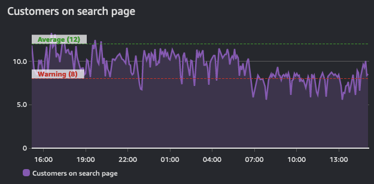

# 告警

告警是指探测器、监控器或值在给定阈值上下变化的状态。一个简单的例子是当磁盘已满或网站宕机时发送电子邮件的告警。更复杂的告警是完全程序化的，用于驱动复杂的交互，如自动扩展或创建整个服务器集群。

无论用例如何，告警都表示指标的当前*状态*。根据系统的不同，这个状态可以是`OK`、`WARNING`、`ALERT`或`NO DATA`。

告警在一段时间内反映这种状态，并建立在时间序列之上。因此，它们是*从*时间序列中派生出来的。下图显示了两个告警：一个具有警告阈值，另一个表示该时间序列的平均值。从这里显示的流量来看，当警告阈值低于定义值时，应该处于违规状态。

:::info
	告警的目的可以是触发行动（人工或程序化），或者是提供信息（表明阈值被突破）。告警提供了对指标性能的洞察。
:::

## 对可操作的事项进行告警

告警疲劳是指人们收到太多告警以至于学会了忽略它们。这并不表示系统被良好监控！相反，这是一种反模式。

:::info
	创建可操作事项的告警，你应该始终从你的[目标](../guides/#monitor-what-matters)反向思考。
:::

例如，如果你运营的网站需要快速响应时间，那么当响应时间超过给定阈值时，就创建一个告警。如果你发现性能不佳与高CPU使用率有关，那么在问题发生之前*主动*对这个数据点发出告警。但是，如果CPU使用率不会*危及你的成果*，那么就没有必要对环境中所有地方的CPU使用率都发出告警。

:::info
	如果一个告警不需要提醒你，或触发自动化流程，那就没有必要让它提醒你。你应该删除多余告警的通知。
:::

## 警惕"一切正常告警"

同样，一个常见的模式是"一切正常告警"，当操作人员习惯于收到持续的告警时，他们只会注意到事情突然变得安静！这是一种非常危险的运营模式，与[卓越运营](../faq/#what-is-operational-excellence)背道而驰。

:::warning
	"一切正常告警"通常需要人工解释！这使得自愈应用程序等模式变得不可能。[^1]
:::

## 通过聚合对抗告警疲劳

可观测性是一个*人的*问题，而不是技术问题。因此，你的告警策略应该专注于减少告警而不是创建更多。当你实施遥测收集时，从你的环境中获得更多告警是很自然的。但要谨慎，只对[可操作的事项进行告警](../signals/alarms/#alert-on-things-that-are-actionable)。如果导致告警的条件不可操作，就没有必要报告。

这通过例子最好说明：如果你有五个使用同一个数据库作为后端的Web服务器，当数据库宕机时你的Web服务器会发生什么？对很多人来说，答案是他们会收到*至少六个*告警 - Web服务器*五个*，数据库*一个*！

但只有两个告警是有意义的：

1. 网站宕机，以及
2. 数据库是原因

:::info
	将告警提炼为聚合形式可以让人们更容易理解，然后更容易创建运行手册和自动化。
:::

## 使用现有的ITSM和支持流程

无论你使用什么监控和可观测性平台，它们都必须集成到你当前的工具链中。

:::info
	使用程序化集成从告警创建故障单和问题到这些工具中，减少人工努力并简化流程。
:::

这允许你获得重要的运营数据，如[DORA指标](https://en.wikipedia.org/wiki/DevOps)。

[^1]: 有关此模式的更多信息，请参见 https://aws.amazon.com/blogs/apn/building-self-healing-infrastructure-as-code-with-dynatrace-aws-lambda-and-aws-service-catalog/。