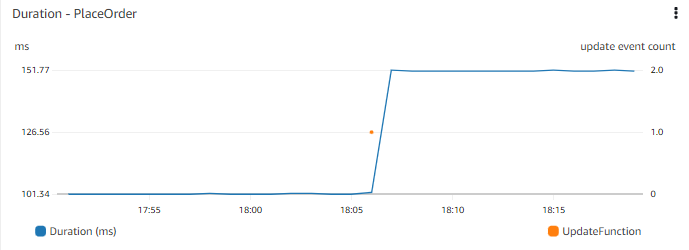
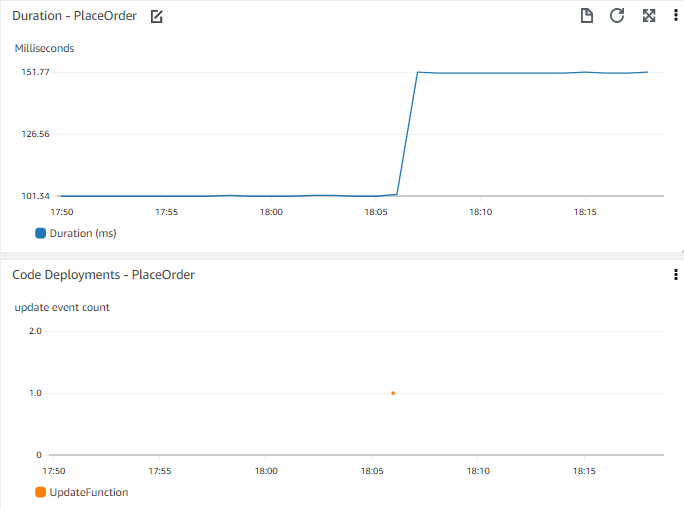

# 事件

## 什么是事件？
如今许多架构都是事件驱动的。在事件驱动架构中，事件是来自不同系统的信号，我们捕获这些信号并传递给其他系统。事件通常是状态的改变或更新。

例如，在电子商务系统中，当商品添加到购物车时可能会产生一个事件。这个事件可以被捕获并传递给系统的购物车部分，以更新商品数量和购物车成本，以及商品详情。

:::info
	对某些客户来说，事件可能是一个*里程碑*，比如完成购买。虽然可以将工作流程结束的聚合时刻视为事件，但就我们的目的而言，我们不认为里程碑本身是一个事件。
:::

## 事件为什么有用？
事件在可观测性解决方案中主要有两种用途。一是在其他数据的上下文中可视化事件，二是基于事件采取行动。

:::info
	事件旨在为人或机器提供有关工作负载中的变化和行动的有价值信息。
:::

## 可视化事件
有许多事件信号并非直接来自您的应用程序，但可能会影响您的应用程序性能，或提供额外的根本原因洞察。仪表板是可视化事件最常见的机制，尽管一些分析或商业智能工具在这方面也很有效。甚至电子邮件或即时通讯应用程序也可以轻松接收可视化内容。

考虑一个应用程序性能的时间图表，例如在网站前端下单所需的时间。时间图表让您看到几天前响应时间发生了阶跃式变化。了解最近是否有任何部署可能会很有用。考虑是否可以在同一图表上查看或叠加显示最近部署的时间图表？

:::tip
	考虑哪些事件对于理解更广泛的上下文可能有用。对您重要的事件可能是代码部署、基础设施变更事件、添加新数据（如发布新商品或批量添加新用户），或修改或添加功能（如更改人们添加商品到购物车的方式）。
:::

:::info
	将事件与其他重要的指标数据一起可视化，以便您可以[关联事件](../signals/metrics/#correlate-with-operational-metric-data)。
:::

## 基于事件采取行动
在可观测性领域，触发的告警是一个常见的事件。这个事件通常包含告警的标识符、告警状态（如`告警中`或`正常`），以及触发原因的详细信息。在许多情况下，这个告警事件会被检测到并发送电子邮件通知。这是一个基于告警采取行动的例子。

告警通知在可观测性中至关重要。这是我们让合适的人知道有问题的方式。然而，当事件行动在您的可观测性解决方案中成熟时，它可以自动修复问题，无需人工干预。

### 但该采取什么行动？
如果不首先了解什么行动能缓解检测到的问题，我们就无法实现自动化。在可观测性之旅的开始，这往往并不明显。但是，随着您在修复问题方面积累的经验越多，您就能更好地调整告警，以捕捉那些已知解决方案的领域。告警服务中可能内置了一些操作，或者您可能需要自己捕获告警事件并编写解决脚本。

:::info
	自动扩展系统，如[水平 Pod 自动扩展](https://kubernetes.io/docs/tasks/run-application/horizontal-pod-autoscale/)就是这个原则的一个实现。Kubernetes 只是为您抽象了这种自动化。
:::

获取告警频率和解决方案的数据将帮助您决定是否有自动化的可能。虽然基于问题症状的广泛范围告警很适合捕获问题，但您可能需要更具体的条件来与自动修复联系起来。

在这样做时，请考虑与您的事件管理/工单/ITSM工具集成。许多组织都会跟踪事件，以及相关的解决方案和指标，如平均修复时间（MTTR）。如果您这样做，也请考虑以类似方式记录您的*自动化*解决方案。这让您能够了解自动修复的问题类型和比例，同时也允许您查找潜在的模式和问题。

:::tip
	即使没有人需要手动修复问题，也不意味着您不应该查看根本原因。
:::

例如，考虑在服务器每次无响应时重启它。重启允许系统继续运行，但是什么导致了无响应？这种情况发生的频率，以及是否存在模式（例如与报告生成、高用户量或系统备份相匹配），将决定您投入多少优先级和资源来理解和修复根本原因。

:::info
	考虑将与您的[关键性能指标](../signals/metrics/#know-your-key-performance-indicatorskpis-and-measure-them)相关的*每个*事件传递到消息总线以供消费。请注意，一些可观测性解决方案会在无需显式配置的情况下透明地完成这项工作。
:::

## 将事件接入您的可观测性平台
一旦确定了对您重要的事件，您需要考虑如何最好地将它们接入您的可观测性平台。
您的平台可能有特定的方式来捕获事件，或者您可能需要将它们作为日志或指标数据引入。

:::note
	一个简单的方法是将事件写入日志文件，并以与其他日志事件相同的方式摄入它们。
:::

探索您的系统如何让您可视化这些事件。您能识别与您的应用程序相关的事件吗？您能将数据合并到单个图表中吗？即使没有特定的功能，您至少应该能够创建一个与其他数据并列的时间图表来进行视觉关联。保持时间轴相同，并考虑将这些垂直堆叠以便于比较。

