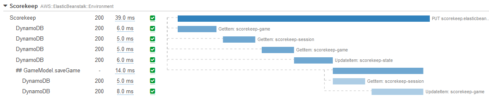

# 追踪

追踪表示请求在应用程序不同组件中传递的整个过程。

与日志或指标不同，*追踪*由来自多个应用程序或服务的事件组成，并包含有关服务之间连接的上下文信息，如响应延迟、服务故障、请求参数和元数据。

:::tip
    [日志](../signals/logs/)和追踪之间存在概念上的相似性，但追踪旨在跨服务上下文中考虑，而日志通常仅限于单个服务或应用程序的执行。
:::

当今的开发人员倾向于构建模块化和分布式应用程序。有些人称之为[面向服务架构](https://en.wikipedia.org/wiki/Service-oriented_architecture)，其他人则称之为[微服务](https://aws.amazon.com/microservices/)。无论名称如何，当这些松耦合应用程序出现问题时，仅查看日志或事件可能不足以追查事件的根本原因。完全掌握请求流程的可见性至关重要，这就是追踪增加价值的地方。通过描述端到端请求流程的一系列因果相关事件，追踪帮助您获得这种可见性。

追踪是可观测性的重要支柱，因为它们提供了请求进入和离开系统时的基本信息。

:::tip
    追踪的常见用例包括性能分析、调试生产问题和故障根本原因分析。
:::

## 对所有集成点进行检测

当您的所有工作负载功能和代码都在一个地方时，查看源代码以了解请求如何在不同功能之间传递很容易。在系统层面，您知道应用程序在哪台机器上运行，如果出现问题，您可以快速找到根本原因。想象一下在基于微服务的架构中执行此操作，其中不同组件松散耦合并在分布式环境中运行。登录到众多系统以查看每个互连请求的日志将是不切实际的，甚至是不可能的。

这就是可观测性可以提供帮助的地方。检测是提高可观测性的关键步骤。广义上讲，检测是使用代码测量应用程序中的事件。

典型的检测方法是为进入系统的每个请求分配一个唯一的追踪标识符，并在请求通过不同组件时携带该追踪ID，同时添加额外的元数据。

:::info
    每个从一个服务到另一个服务的连接都应该进行检测，以向中央收集器发出追踪。这种方法帮助您查看工作负载中原本不透明的方面。
:::
:::info
    使用自动检测代理或库时，应用程序的检测可以在很大程度上实现自动化。
:::

## 交易时间和状态很重要，所以要测量它们！

一个经过良好检测的应用程序可以生成端到端追踪，可以以瀑布图的形式查看：

或服务地图形式：

测量每个交互的交易时间和响应代码很重要。这将有助于计算总体处理时间，并根据您的SLA、SLO或业务KPI进行跟踪。

:::info
    只有通过理解和记录交互的响应时间和状态码，您才能看到影响整体请求模式和工作负载健康的因素。
:::

## 元数据、注释和标签是您最好的朋友

追踪被持久化并分配唯一ID，每个追踪被分解成*spans*或*segments*（取决于您的工具），记录请求路径中的每个步骤。span表示追踪与之交互的实体，和父追踪一样，每个span都被分配唯一ID和时间戳，还可以包含额外的数据和元数据。这些信息对调试很有用，因为它给出了问题发生的确切时间和位置。

这通过一个实际例子最容易解释。电子商务应用程序可能分为多个领域：身份验证、授权、配送、库存、支付处理、履行、产品搜索、推荐等等。与其搜索所有这些相互关联领域的追踪，不如用客户ID标记您的追踪，这样您就可以只搜索特定于这个人的交互。在诊断操作问题时，这有助于您立即缩小搜索范围。

:::info
    虽然命名约定可能因供应商而异，但每个追踪都可以用元数据、标签或注释进行增强，这些在整个工作负载中都是可搜索的。添加它们确实需要您编写代码，但大大增加了工作负载的可观测性。
:::
:::warning
    追踪不是日志，所以要谨慎使用在追踪中包含的元数据。即使采样率很高，追踪数据也不适用于取证和审计。
:::